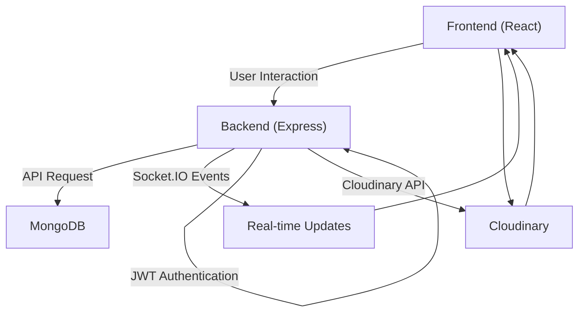
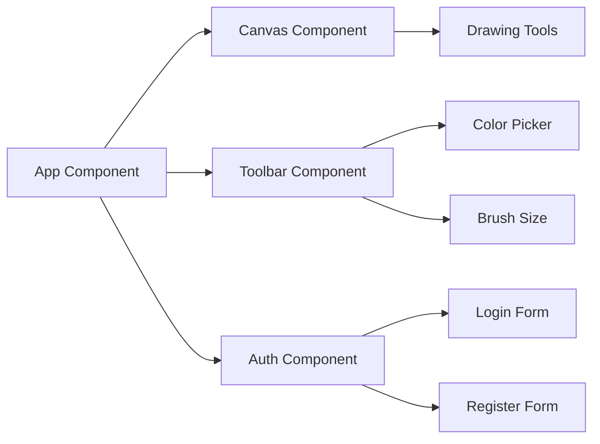

# Project Overview

This document provides an overview of the collaborative whiteboard application, a real-time platform built using the MERN (MongoDB, Express.js, React.js, Node.js) stack. It allows multiple users to draw, share images, and collaborate on a shared canvas simultaneously. The application leverages Socket.io for real-time communication, JWT for secure user authentication, and Cloudinary for image storage.

## Key Features

*   **Real-time Drawing:** Enables multiple users to draw collaboratively on a shared canvas.
*   **Image Upload:** Allows users to upload and share images, utilizing Cloudinary for storage.
*   **User Authentication:** Implements secure user registration and login using JWT.
*   **Drawing Tools:** Offers various drawing tools, including pens, erasers, shapes, colors, and brush sizes.
*   **Board Saving:** Allows users to save and retrieve whiteboard sessions.

## Technologies Used

The application utilizes the following technologies:

| Technology    | Description                                         |
| :------------ | :-------------------------------------------------- |
| React.js      | Frontend UI library                                 |
| Node.js       | Backend runtime environment                         |
| Express.js    | Backend web framework                               |
| MongoDB       | Database for storing user and board data            |
| Socket.io     | Real-time communication for drawing and updates      |
| JWT           | Authentication and authorization                    |
| Cloudinary    | Image storage and hosting                           |

## Getting Started

To run the collaborative whiteboard project locally, follow these steps:

1.  **Clone the repository:**

    ```bash
    git clone https://github.com/kalpm1110/whiteboard-project.git
    cd whiteboard-project
    ```

2.  **Configure environment variables:**

    Create a `.env` file in the root directory with the necessary environment variables:

    ```plaintext
    MONGODB_URI=mongodb://localhost:27017/whiteboard
    JWT_SECRET=your_super_secret_jwt_key_here
    CLOUDINARY_CLOUD_NAME=your_cloudinary_cloud_name
    CLOUDINARY_API_KEY=your_cloudinary_api_key
    CLOUDINARY_API_SECRET=your_cloudinary_api_secret
    PORT=5000
    NODE_ENV=development
    CLIENT_URL=http://localhost:3000
    ```

    [View on GitHub](https://github.com/sumedhcharjan/white-board-project/blob/main/.env.example)

3.  **Install dependencies:**

    ```bash
    npm install
    cd client
    npm install
    cd ..
    ```

4.  **Run the application:**

    ```bash
    npm run dev
    ```

    This will start both the backend and frontend concurrently. The frontend will be available at `http://localhost:3000`, and the backend at `http://localhost:5000`.

## Backend Structure

The backend, built with Node.js and Express.js, handles API requests, database interactions, and real-time communication. Key components include:

*   **`src/index.js`:** The main entry point for the backend server.
*   **`routes/`:** Contains route definitions for user authentication, board management, and image uploads.
*   **`models/`:** Defines the data models for users and boards using Mongoose.
*   **`controllers/`:** Implements the logic for handling API requests.
*   **`socket/`:** Configures the Socket.io server for real-time communication.

## Frontend Structure

The frontend, built with React.js, provides the user interface for interacting with the whiteboard application. Key components include:

*   **`src/App.jsx`:** The main application component.
*   **`components/`:** Contains reusable UI components, such as the canvas, drawing tools, and authentication forms.
*   **`context/`:** Manages application state using React Context.
*   **`hooks/`:** Custom React hooks for handling socket events and drawing logic.

## API Endpoints

The backend exposes the following API endpoints:

*   `POST /api/auth/register`: Registers a new user.
*   `POST /api/auth/login`: Authenticates an existing user.
*   `GET /api/auth/verify`: Verifies a user's JWT token.
*   `POST /api/boards`: Creates a new whiteboard.
*   `GET /api/boards/:id`: Retrieves a whiteboard by its ID.
*   `PUT /api/boards/:id`: Updates a whiteboard's data.
*   `POST /api/upload`: Uploads an image to Cloudinary.

## Real-time Communication with Socket.io

Socket.io is used for real-time communication between the client and server. The following events are defined:

*   `join-room`: Joins a specific whiteboard room.
*   `drawing`: Sends drawing data to other users in the room.
*   `clear-canvas`: Clears the entire canvas for all users in the room.
*   `image-upload`: Shares an uploaded image with all users in the room.
*   `cursor-position`: Shares the cursor position of a user with other users in the room.

Here's an example of how Socket.io is used in the backend to handle drawing events:

```javascript
// src/index.js
import { Server } from "socket.io";

const io = new Server(server, {
  cors: {
    origin: "*",
    methods: ["GET", "POST"],
  },
});

io.on("connection", (socket) => {
  socket.on("join-room", (roomId) => {
    socket.join(roomId);
  });

  socket.on("drawing", (data) => {
    socket.broadcast.to(data.roomId).emit("drawing", data);
  });

  socket.on("clear-canvas", (roomId) => {
    socket.broadcast.to(roomId).emit("clear-canvas");
  });
});

```
[View on GitHub](https://github.com/sumedhcharjan/white-board-project/blob/main/src/index.js)

This snippet shows how the backend listens for `drawing` events and broadcasts the drawing data to all other users in the same room, enabling real-time collaborative drawing.

## User Authentication Flow

The application uses JWT for user authentication. The flow is as follows:

1.  The user registers or logs in, providing their credentials.
2.  The backend verifies the credentials and generates a JWT.
3.  The JWT is sent back to the client.
4.  The client stores the JWT (e.g., in local storage or a cookie).
5.  For subsequent requests, the client includes the JWT in the `Authorization` header.
6.  The backend verifies the JWT and authorizes the request.

Here's an example of how the backend handles user registration:

```javascript
// routes/auth.js
import express from 'express';
import bcrypt from 'bcrypt';
import jwt from 'jsonwebtoken';
import User from '../models/User.js';

const router = express.Router();

router.post('/register', async (req, res) => {
  try {
    const { username, email, password } = req.body;
    const hashedPassword = await bcrypt.hash(password, 10);
    const newUser = new User({ username, email, password: hashedPassword });
    const savedUser = await newUser.save();
    const token = jwt.sign({ id: savedUser._id }, process.env.JWT_SECRET);
    res.status(201).json({ message: "User registered successfully", token, user: { id: savedUser._id, username: savedUser.username, email: savedUser.email } });
  } catch (err) {
    res.status(500).json({ error: err.message });
  }
});

export default router;

```
[View on GitHub](https://github.com/sumedhcharjan/white-board-project/blob/main/routes/auth.js)

## Image Upload using Cloudinary

The application uses Cloudinary for storing and serving images. The following steps are involved:

1.  The client uploads an image to the backend.
2.  The backend uploads the image to Cloudinary using the Cloudinary API.
3.  Cloudinary returns a URL for the uploaded image.
4.  The backend stores the image URL in the database.
5.  The backend sends the image URL to the client.

Here's an example of how the backend handles image uploads:

```javascript
// routes/upload.js
import express from 'express';
import cloudinary from 'cloudinary';
import multer from 'multer';
import dotenv from 'dotenv';

dotenv.config();

cloudinary.config({
  cloud_name: process.env.CLOUDINARY_CLOUD_NAME,
  api_key: process.env.CLOUDINARY_API_KEY,
  api_secret: process.env.CLOUDINARY_API_SECRET,
});

const router = express.Router();
const storage = multer.memoryStorage();
const upload = multer({ storage: storage });

router.post('/', upload.single('image'), async (req, res) => {
  try {
    const file = req.file;
    if (!file) {
      return res.status(400).json({ message: 'No image file provided' });
    }

    const result = await cloudinary.uploader.upload(file.buffer.toString('base64'), {
      resource_type: 'image',
      folder: 'whiteboard-images'
    });

    res.status(200).json({
      message: 'Image uploaded successfully',
      imageUrl: result.secure_url,
      publicId: result.public_id
    });
  } catch (error) {
    console.error('Error uploading image:', error);
    res.status(500).json({ message: 'Failed to upload image', error: error.message });
  }
});

export default router;

```
[View on GitHub](https://github.com/sumedhcharjan/white-board-project/blob/main/routes/upload.js)

This route uses multer to handle the file upload, and then uploads the image to Cloudinary using the Cloudinary API. The URL of the uploaded image is then returned to the client.

## Drawing on the Canvas

The frontend uses the HTML5 Canvas API to implement the drawing functionality. Users can select different drawing tools, colors, and brush sizes. The drawing data is then sent to the backend using Socket.io, which broadcasts it to all other users in the room.

Here's an example of how the frontend handles drawing events:

```javascript
// src/components/Canvas.jsx
import React, { useRef, useEffect, useContext } from 'react';
import { SocketContext } from '../context/SocketContext';

const Canvas = () => {
  const canvasRef = useRef(null);
  const socket = useContext(SocketContext);

  useEffect(() => {
    const canvas = canvasRef.current;
    const context = canvas.getContext('2d');

    socket.on('drawing', (data) => {
      const { x0, y0, x1, y1, color, width } = data;
      drawLine(x0, y0, x1, y1, color, width);
    });

    const drawLine = (x0, y0, x1, y1, color, width) => {
      context.beginPath();
      context.moveTo(x0, y0);
      context.lineTo(x1, y1);
      context.strokeStyle = color;
      context.lineWidth = width;
      context.stroke();
      context.closePath();
    };

  }, [socket]);

  return <canvas ref={canvasRef} width={800} height={600} />;
};

export default Canvas;

```
[View on GitHub](https://github.com/sumedhcharjan/white-board-project/blob/main/src/components/Canvas.jsx)

This component sets up a canvas and listens for `drawing` events from the server. When a `drawing` event is received, it draws a line on the canvas using the provided data.

## Mermaid Diagram: Data Flow

This diagram illustrates the flow of data between the frontend, backend, and database.





## Mermaid Diagram: Component Diagram





## Key Integration Points

The collaborative whiteboard application integrates several key technologies to provide a seamless real-time collaboration experience. The integration of Socket.io enables real-time drawing and updates, while JWT ensures secure user authentication. Cloudinary provides a scalable solution for storing and serving images.

## Development Best Practices

When contributing to this project, consider the following best practices:

*   Follow React best practices for frontend components.
*   Use meaningful variable and function names.
*   Add comments for complex drawing algorithms.
*   Test real-time functionality with multiple browser tabs.
*   Ensure mobile responsiveness for touch drawing.
```