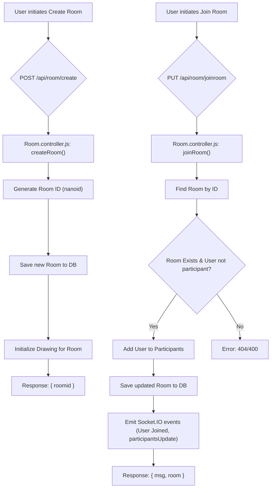

# API Endpoints & Controllers

This section provides an in-depth look at the RESTful API routes and the corresponding controller logic that powers the backend of the Whiteboard Project. It covers the creation, management, and interaction with user profiles, rooms, and drawing data, including real-time updates via Socket.IO where applicable.

## Room Management Endpoints

The `backend/routes/Room.routes.js` file defines the API endpoints for managing rooms, including creating, joining, leaving, and retrieving room details. These routes are handled by functions within `backend/controllers/Room.controller.js`.

### Create Room

-   **Endpoint**: `POST /api/room/create`
-   **Description**: Creates a new whiteboard room. A unique 6-character room ID is generated, and the user initiating the request is set as the host. An initial drawing state for the room is also created.
-   **Request Body**:
    ```json
    {
        "user": {
            "sub": "auth0|user123",
            "name": "User Name"
        }
    }
    ```
-   **Response**: Returns the newly created `roomid`.
    ```json
    {
        "roomid": "abcdef"
    }
    ```
-   **Controller Logic**: The `createRoom` function generates a `nanoid` for the room, saves the room to the database, and initializes a drawing space for it.

```javascript
export const createRoom = async (req, res) => {
    try {
        const { user } = req.body;
        if (!user || !user.sub) {
            return res.status(400).json({ msg: "Invalid user data" });
        }
        const roomid = nanoid(6);
        const room = new Room({
            roomid,
            hostuser: user.sub,
            participants: [],
            messages:[]
        });
        await room.save();
        await createRoomDrawing({roomid});
        res.status(200).json({ roomid });
    } catch (error) {
        console.error("Create room error:", error);
        res.status(500).json({ msg: "Server error", error });
    }
};
```

### Join Room

-   **Endpoint**: `PUT /api/room/joinroom`
-   **Description**: Allows a user to join an existing room. The user is added to the room's participant list. Real-time updates are broadcasted to all participants via Socket.IO.
-   **Request Body**:
    ```json
    {
        "user": {
            "sub": "auth0|user456",
            "name": "Participant Name"
        },
        "Rid": "abcdef"
    }
    ```
-   **Response**: Confirmation of joining and the updated room object.
    ```json
    {
        "msg": "Joined room",
        "room": { ... }
    }
    ```
-   **Controller Logic**: The `joinRoom` function fetches the room, adds the user as a participant if they are not already in the room, saves the updated room, and emits Socket.IO events for "User Joined", "participantsUpdate", and "joinroom".

```javascript
export const joinRoom = async (req, res) => {
    try {
        const { user, Rid } = req.body;
        const userId = user.sub;
        const userName = user.name || user.nickname || "Anonymous";

        const room = await Room.findOne({ roomid: Rid });
        if (!room) return res.status(404).json({ msg: 'Room not found' });

        const isAlreadyParticipant = room.participants.some(p => p.id === userId);
        if (isAlreadyParticipant) return res.status(400).json({ msg: 'Already in room' });
        const cd=(userId===room.hostuser);
        console.log(cd);
        room.participants.push({ id: userId, name: userName,candraw:cd});
        await room.save();
        io.to(Rid).emit('User Joined', { name: userName, userId });
        io.to(Rid).emit('participantsUpdate', room.participants)
        io.to(Rid).emit('joinroom', {
            name: userName,
            roomid: Rid,
            userid: userId,
        })
        res.status(200).json({ msg: 'Joined room', room });
    } catch (error) {
        console.error("Join room error:", error);
        res.status(500).json({ msg: "Server error", error });
    }
};
```

### Leave Room

-   **Endpoint**: `PUT /api/room/leave`
-   **Description**: Allows a user to leave a room. If the host leaves, the room is deleted, and all participants are notified. Otherwise, the participant is simply removed from the list. Socket.IO events update all remaining participants.
-   **Request Body**:
    ```json
    {
        "roomid": "abcdef",
        "user": {
            "sub": "auth0|user456",
            "name": "Participant Name"
        }
    }
    ```

### Get Room Details

-   **Endpoint**: `GET /api/room/roomdetails/:roomid`
-   **Description**: Retrieves the full details of a specific room, including its participants, host, and messages.
-   **Request Params**: `roomid` (e.g., `/api/room/roomdetails/abcdef`)
-   **Response**: The room object if found.

```javascript
export const SendRoomdetails = async (req, res) => {
    try {
        const { roomid } = req.params;
        console.log(roomid);
        const room = await Room.findOne({ roomid: roomid });
        if (!room) return res.status(404).json({ msg: "Room not found" });

        res.json(room);
    } catch (error) {
        res.status(500).json({ msg: "Server error", error });
    }

}
```

### Kick User

-   **Endpoint**: `PUT /api/room/kickout`
-   **Description**: Allows the host of a room to remove another participant. Broadcasts real-time updates via Socket.IO to notify other participants and the kicked user.
-   **Request Body**:
    ```json
    {
        "userid": "auth0|user789",
        "hostid": "auth0|user123",
        "roomid": "abcdef"
    }
    ```

### Save Drawing to User Profile

-   **Endpoint**: `POST /api/room/savedrawing`
-   **Description**: Saves a whiteboard drawing as an image URL to the user's profile. Uses Cloudinary for image hosting.
-   **Request Body**:
    ```json
    {
        "userid": "auth0|user123",
        "title": "My Awesome Drawing",
        "imgurl": "data:image/png;base64,...", // Base64 encoded image
        "roomid": "abcdef"
    }
    ```
-   **Response**: Confirmation of success and the secure URL of the saved image.
-   **Controller Logic**: The `saveDrawing` function (from `Users.controller.js`) uploads the base64 image to Cloudinary, then finds or creates a user document to store the drawing's metadata and URL.

```javascript
export const saveDrawing = async (req, res) => {
    const { userid, title, imgurl, roomid } = req.body;
    try {
        const result = await cloudinary.uploader.upload(imgurl);
        const iurl = result.secure_url;
        const user = await User.findOne({ userid });
        if (!user) {
            const newuser = new User({
                userid,
                savedDrawings: [
                    {
                        roomid,
                        title,
                        url: iurl,
                        date: new Date()
                    }
                ]
            });
            await newuser.save();
        } else {
            user.savedDrawings.push({
                roomid,
                title,
                url: iurl,
                date: new Date()
            });
            await user.save();
            console.log(user.savedDrawings);
        }
        res.status(201).json({ success: true, image: iurl });
    } catch (error) {
        res.status(500).json({ success: false, error: error.message });
    }
};
```

Here's a simplified flow diagram for room creation and joining:





## User Profile & Saved Drawings Endpoints

The `backend/routes/Profile.routes.js` file handles operations related to a user's saved drawings. These routes are processed by functions in `backend/controllers/Users.controller.js`.

### Get Saved Drawings

-   **Endpoint**: `GET /api/profile/:userid/savedDrawings`
-   **Description**: Retrieves all drawings saved by a specific user.
-   **Request Params**: `userid` (e.g., `/api/profile/auth0|user123/savedDrawings`)
-   **Response**: An array of saved drawing objects.
    ```json
    {
        "success": true,
        "drawings": [
            {
                "_id": "65123...",
                "roomid": "abcdef",
                "title": "My Awesome Drawing",
                "url": "https://res.cloudinary.com/...",
                "date": "2023-10-20T10:00:00.000Z"
            }
        ]
    }
    ```
-   **Controller Logic**: The `sendSavedDrawings` function fetches the user document and returns its `savedDrawings` array.

```javascript
export const sendSavedDrawings = async (req, res) => {
    try {
        const { userid } = req.params;
        const user = await User.findOne({ userid });
        if (!user) return res.status(404).json({ success: false, message: "No Saved Drawings" });
        res.status(200).json({ success: true, drawings: user.savedDrawings });
    } catch (error) {
        res.status(500).json({ success: false, error: error.message });
    }
}
```

### Delete Saved Drawing

-   **Endpoint**: `DELETE /api/profile/:userid/deleteDrawing`
-   **Description**: Deletes a specific drawing from a user's saved drawings based on its ID and associated room ID.
-   **Request Params**: `userid` (e.g., `/api/profile/auth0|user123/deleteDrawing`)
-   **Request Query**: `id` (drawing's unique ID), `roomid` (room associated with the drawing).
    Example: `DELETE /api/profile/auth0|user123/deleteDrawing?id=65123...&roomid=abcdef`
-   **Response**: The updated list of saved drawings for the user.
    ```json
    {
        "success": true,
        "drawings": [ /* remaining drawings */ ]
    }
    ```
-   **Controller Logic**: The `deleteDrawing` function filters the `savedDrawings` array to remove the matching entry and then saves the updated user document.

```javascript
export const deleteDrawing = async (req, res) => {
    try {
        const { id, roomid } = req.query;
        const { userid } = req.params;
        console.log('ddd',id);
        const user = await User.findOne({ userid });
        if (!user) return res.status(404).json({ success: false, message: "User not found" });
        user.savedDrawings = user.savedDrawings.filter(drawing => !(drawing._id.toString() === id && drawing.roomid===roomid));
        await user.save();
        console.log(user.savedDrawings);
        res.status(200).json({ success: true, drawings: user.savedDrawings });
    } catch (error) {
        res.status(500).json({ success: false, error: error.message });
    }

}
```

## Key Takeaways

The API is designed with a clear separation of concerns, routing requests to specific controllers for user, room, and drawing management. Key features include:

*   **RESTful Design**: Adheres to REST principles for clear and predictable API interactions.
*   **Real-time Capabilities**: Integrates Socket.IO for immediate updates on participant changes, host actions, and user joining/leaving rooms, enhancing the collaborative experience.
*   **Secure Storage**: Utilizes Cloudinary for external storage of drawing images, reducing server load and providing robust media management.
*   **Error Handling**: Comprehensive error handling ensures robust and informative responses for various failure scenarios.
*   **User-Centric Drawing Management**: Allows users to save and manage their whiteboard drawings persistently within their profiles.