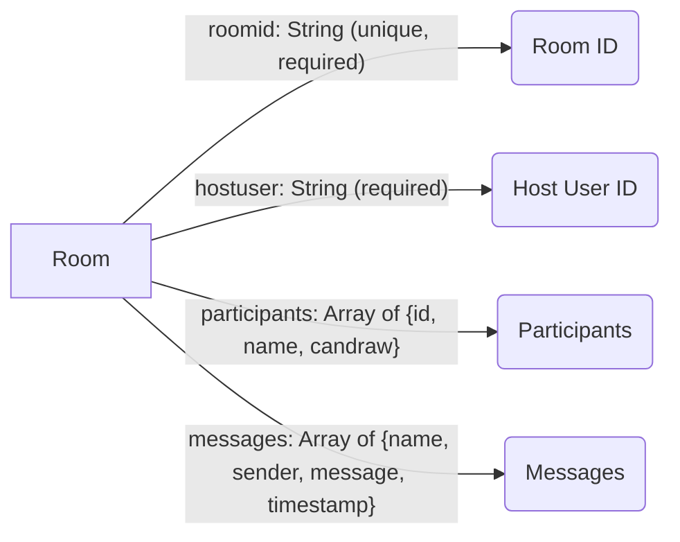
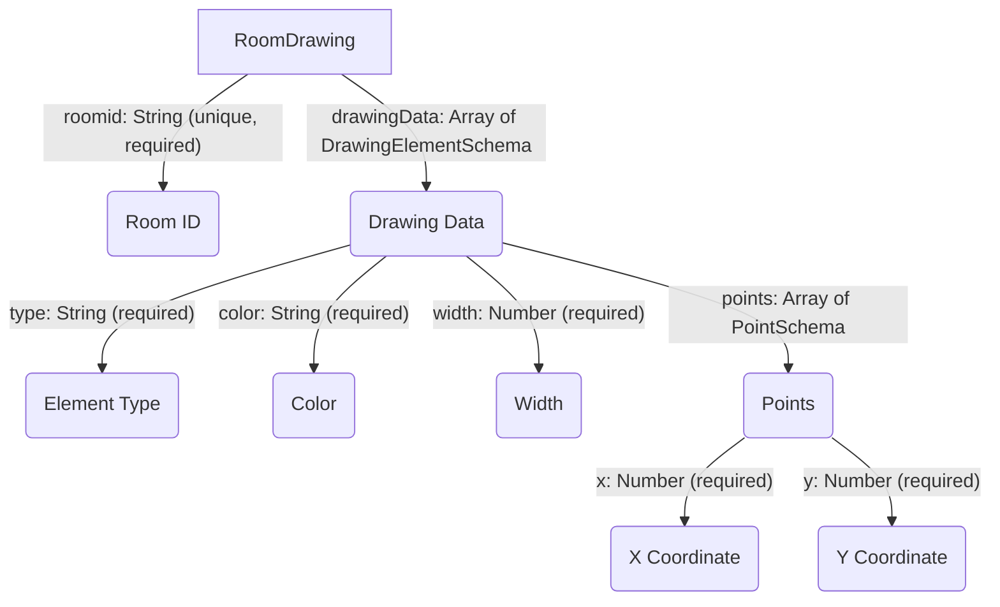

# Data Models

This section describes the database models used in the white-board-project, focusing on users, rooms, and drawing data. These models are defined using Mongoose, an Object Data Modeling (ODM) library for MongoDB and Node.js. Understanding these models is crucial for comprehending how data is structured and persisted within the application.

## Room Model

The `Room` model, defined in `backend/models/Room.model.js`, represents a collaborative whiteboard space. It stores information about the room's unique identifier, host user, participants, and messages exchanged within the room.

```javascript title="backend/models/Room.model.js"
import mongoose from 'mongoose'

const RoomSchema = new mongoose.Schema({
  roomid: {
    type: String,
    unique: true,
    required: true,
  },
  hostuser: {
    type: String,
    required: true,
  },
  participants: [
    {
      id: { type: String, required: true },
      name: { type: String, required: true },
      candraw:{type:Boolean,required:true,default:false}
    }
  ],
  messages: [
    {
      name: { type: String, required: true },
      sender: { type: String, required: true },
      message: { type: String, required: true },
      timestamp: { type: Date, required: true,default:Date.now()},
    }
  ]
}, { timestamps: true });

const Room = mongoose.model("Room", RoomSchema);
export default Room;
```

[View on GitHub](https://github.com/sumedhcharjan/white-board-project/blob/main/backend/models/Room.model.js)

The `RoomSchema` defines the structure of the `Room` document. Here's a breakdown:

*   `roomid`: A unique string identifying the room. This field is required and must be unique across all rooms.
*   `hostuser`: The user ID of the room's host.  This field is required.
*   `participants`: An array of objects, each representing a participant in the room. Each participant object includes the user's `id`, `name`, and `candraw` (a boolean indicating whether the participant can draw).
*   `messages`: An array of message objects containing the `name` of the sender, `sender` ID, `message` content, and a `timestamp`.
*   `timestamps`: Mongoose's built-in option to automatically add `createdAt` and `updatedAt` fields to the document.





## User Model

The `User` model, located in `backend/models/Users.model.js`, stores information about users and their saved drawings.

```javascript title="backend/models/Users.model.js"
import mongoose from 'mongoose';
const UserSchema=new mongoose.Schema({
    userid:{
        type:String,
        required:true,
    },
    savedDrawings:[
        {
            title:String,
            url:String,
            roomid:String,
            date:Date
        }
    ]
});

const User=mongoose.model('User',UserSchema);
export default User;
```

[View on GitHub](https://github.com/sumedhcharjan/white-board-project/blob/main/backend/models/Users.model.js)

The `UserSchema` includes:

*   `userid`: A unique string representing the user's ID. This field is required.
*   `savedDrawings`: An array of objects, each representing a saved drawing.  Each saved drawing object includes the drawing's `title`, `url`, the `roomid` it belongs to, and the `date` it was saved.

## Drawing Data Model

The `RoomDrawing` model, defined in `backend/models/drawingData.js`, stores the drawing data associated with each room. It contains the drawing elements, such as lines, shapes, and text, that make up the whiteboard content.

```javascript title="backend/models/drawingData.js"
import mongoose from "mongoose";

const PointSchema = new mongoose.Schema({
  x: { type: Number, required: true ,default:0},
  y: { type: Number, required: true ,default:0}
});

const DrawingElementSchema = new mongoose.Schema({
  type: { type: String, required: true },  
  color: { type: String, required: true },
  width: { type: Number, required: true },
  points: {
    type: [PointSchema],
    required: true,
    
  },
});

const RoomDrawingSchema = new mongoose.Schema({
  roomid: {
    type: String,
    unique: true,
    required: true
  },
  drawingData: {
    type: [DrawingElementSchema],  
    default: []
  }
});

const RoomDrawing = mongoose.model('RoomDrawing', RoomDrawingSchema);
export default RoomDrawing
```

[View on GitHub](https://github.com/sumedhcharjan/white-board-project/blob/main/backend/models/drawingData.js)

This model uses sub-schemas to define the structure of drawing elements:

*   `PointSchema`: Represents a single point with `x` and `y` coordinates (both numbers). These points will constitute lines, shapes etc.
*   `DrawingElementSchema`: Represents a single drawing element (e.g., a line, circle, or rectangle). It contains the `type` of element, `color`, `width`, and an array of `points` that define the element's geometry.
*   `RoomDrawingSchema`: The main schema for storing drawing data. It contains the `roomid` (unique and required) and `drawingData`, which is an array of `DrawingElementSchema` objects.





## Model Usage Example

Here's an example of how these models might be used to create a new room and add a participant:

```javascript title="Example Usage (Hypothetical)"
import Room from './models/Room.model.js';

async function createRoom(roomid, hostuser) {
  try {
    const newRoom = new Room({
      roomid: roomid,
      hostuser: hostuser,
      participants: [],
      messages: [],
    });
    await newRoom.save();
    console.log('Room created successfully!');
  } catch (error) {
    console.error('Error creating room:', error);
  }
}

async function addParticipant(roomid, userId, userName) {
  try {
    const room = await Room.findOne({ roomid: roomid });
    if (room) {
      room.participants.push({ id: userId, name: userName,candraw:false });
      await room.save();
      console.log('Participant added successfully!');
    } else {
      console.log('Room not found.');
    }
  } catch (error) {
    console.error('Error adding participant:', error);
  }
}
```

This code snippet demonstrates how to create a new `Room` instance and save it to the database, and also adds a participant to a room.

## Key Integration Points

These data models are central to the application's functionality. The `Room` model manages the collaborative environment, the `User` model handles user data and saved drawings, and the `RoomDrawing` model persists the actual whiteboard drawings.

The flow typically involves:

1.  A user creates or joins a room (using `Room` model).
2.  Their actions on the whiteboard are captured and stored as `DrawingElementSchema` objects within the `RoomDrawing` model.
3.  Messages are stored within the `messages` array of the `Room` model.
4.  Users can save drawings, which are then associated with their user ID in the `User` model, referencing both title and the room where it happened.

**Best Practices:**

*   **Validation:** Ensure proper validation of data before saving it to the database. Mongoose provides built-in validation features that can be leveraged.
*   **Error Handling:** Implement robust error handling to catch and log any errors that occur during database operations.
*   **Data Consistency:** Maintain data consistency across models. For example, when a user leaves a room, update the `participants` array in the `Room` model accordingly.
*   **Indexing:** Use appropriate indexes on fields that are frequently queried to improve database performance. Specifically, consider indexing `roomid` in both `Room` and `RoomDrawing` models.
*   **Security:** Sanitize user inputs to prevent injection attacks and protect sensitive data.
```