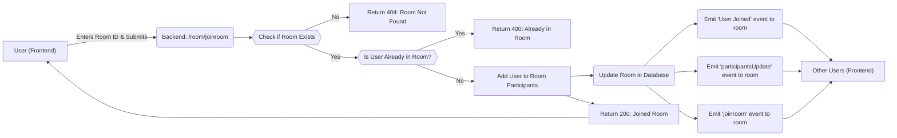
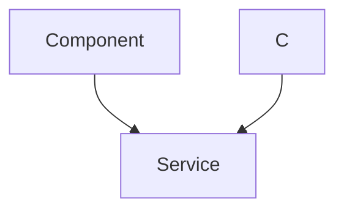

# API Endpoints

This document outlines the API endpoints available for the white-board-project, covering user authentication, room management, and whiteboard operations.

## User Authentication

These endpoints manage user-related operations such as creating users, authenticating users and managing user profiles.

## Room Management

These endpoints facilitate the creation, joining, and management of whiteboard rooms.

### Create Room

*   **Endpoint:** `POST /room/create`
*   **Description:** Creates a new whiteboard room. Requires user information in the request body.
*   **Request Body:**

    ```json
    {
      "user": {
        "sub": "user_id"
      }
    }
    ```
*   **Response:** Returns the `roomid` of the newly created room.
*   **Code Snippet:**

    ```javascript
    // File: backend/controllers/Room.controller.js
    export const createRoom = async (req, res) => {
        try {
            const { user } = req.body;

            if (!user || !user.sub) {
                return res.status(400).json({ msg: "Invalid user data" });
            }

            const roomid = nanoid(6);

            const room = new Room({
                roomid,
                hostuser: user.sub,
                participants: [],
                messages:[]
            });

            await room.save();
            await createRoomDrawing({roomid});
            res.status(200).json({ roomid });
        } catch (error) {
            console.error("Create room error:", error);
            res.status(500).json({ msg: "Server error", error });
        }
    };
    ```

    This function generates a unique `roomid` using `nanoid`, creates a new `Room` document in the database, and associates the creator as the `hostuser`.  [View on GitHub](https://github.com/sumedhcharjan/white-board-project/blob/main/backend/controllers/Room.controller.js)

### Join Room

*   **Endpoint:** `PUT /room/joinroom`
*   **Description:** Allows a user to join an existing whiteboard room.
*   **Request Body:**

    ```json
    {
      "user": {
        "sub": "user_id",
        "name": "user_name"
      },
      "Rid": "room_id"
    }
    ```
*   **Response:** Returns a success message and the updated room details.
*   **Code Snippet:**

    ```javascript
    // File: backend/controllers/Room.controller.js
    export const joinRoom = async (req, res) => {
        try {
            const { user, Rid } = req.body;
            const userId = user.sub;
            const userName = user.name || user.nickname || "Anonymous";

            const room = await Room.findOne({ roomid: Rid });
            if (!room) return res.status(404).json({ msg: 'Room not found' });

            const isAlreadyParticipant = room.participants.some(p => p.id === userId);
            if (isAlreadyParticipant) return res.status(400).json({ msg: 'Already in room' });
            const cd=(userId===room.hostuser);
            console.log(cd);
            room.participants.push({ id: userId, name: userName,candraw:cd});
            await room.save();
            io.to(Rid).emit('User Joined', { name: userName, userId });
            io.to(Rid).emit('participantsUpdate', room.participants)
            io.to(Rid).emit('joinroom', {
                name: userName,
                roomid: Rid,
                userid: userId,
            })
            res.status(200).json({ msg: 'Joined room', room });
        } catch (error) {
            console.error("Join room error:", error);
            res.status(500).json({ msg: "Server error", error });
        }
    };
    ```

    This function adds a user to the `participants` array of a specific room document. It also emits socket events to notify other users in the room about the new participant. [View on GitHub](https://github.com/sumedhcharjan/white-board-project/blob/main/backend/controllers/Room.controller.js)

### Leave Room

*   **Endpoint:** `PUT /room/leave`
*   **Description:** Allows a user to leave a whiteboard room. If the host leaves, the room is deleted.
*   **Request Body:**

    ```json
    {
      "roomid": "room_id",
      "user": {
        "sub": "user_id"
      }
    }
    ```
*   **Response:** Returns a success message and the updated list of participants.
*   **Code Snippet:**

    ```javascript
    // File: backend/controllers/Room.controller.js
    export const LeaveRoom = async (req, res) => {
        const { roomid, user } = req.body;
        try {
            const room = await Room.findOne({ roomid });
            if (!room) {
                return res.status(404).json({ error: 'Room not found' });
            }

            const userId = user.sub;
            const userName = user.name || user.nickname || 'Anonymous';

            if (userId === room.hostuser) {
                await Room.findOneAndDelete({ roomid });
                io.to(roomid).emit('hostEndedMeeting', { message: 'Host ended the meeting' });
                io.to(roomid).emit('participantsUpdate', []); // Empty array for consistency
                return res.status(200).json({ msg: 'Host ended the meeting' });
            }
            const participant = room.participants.find(p => p.id === userId);
            if (!participant) {
                return res.status(404).json({ error: 'Participant not found' });
            }
            room.participants = room.participants.filter(p => p.id !== userId);
            await room.save();

            io.to(roomid).emit('participantsUpdate', room.participants);
            io.to(roomid).emit('User Left', { name: userName, userId });
            res.json({ msg: 'Left the room successfully', participants: room.participants });
        } catch (error) {
            console.error('Error leaving room:', error.message, error.stack);
            res.status(500).json({ error: 'Server error' });
        }
    };
    ```

    This function removes a user from the `participants` array. If the leaving user is the host, the entire room is deleted, and corresponding socket events are emitted. [View on GitHub](https://github.com/sumedhcharjan/white-board-project/blob/main/backend/controllers/Room.controller.js)

### Get Room Details

*   **Endpoint:** `GET /room/roomdetails/:roomid`
*   **Description:** Retrieves details of a specific whiteboard room.
*   **Parameters:**
    *   `roomid`: The ID of the room to retrieve.
*   **Response:** Returns the room object.

### Kick User

*   **Endpoint:** `PUT /room/kickout`
*   **Description:** Allows the host to kick a user from the whiteboard room.
*   **Request Body:**

    ```json
    {
      "userid": "user_id_to_kick",
      "hostid": "host_user_id",
      "roomid": "room_id"
    }
    ```
*   **Response:** Returns a success message and the updated list of participants.

## Whiteboard Operations

These endpoints handle operations related to the whiteboard itself, such as saving drawings, retrieving drawings, and clearing the whiteboard.

### Save Drawing

*   **Endpoint:** `POST /room/savedrawing`
*   **Description:** Saves a drawing made in a whiteboard room, associating it with a user.
*   **Request Body:**

    ```json
    {
      "userid": "user_id",
      "title": "drawing_title",
      "imgurl": "image_data_url",
      "roomid": "room_id"
    }
    ```
*   **Response:** Returns a success status and the URL of the saved image.
*   **Code Snippet:**

    ```javascript
    // File: backend/controllers/Users.controller.js
    export const saveDrawing = async (req, res) => {
        const { userid, title, imgurl, roomid } = req.body;
        try {
            const result = await cloudinary.uploader.upload(imgurl);
            const iurl = result.secure_url;
            const user = await User.findOne({ userid });
            if (!user) {
                const newuser = new User({
                    userid,
                    savedDrawings: [
                        {
                            roomid,
                            title,
                            url: iurl,
                            date: new Date()
                        }
                    ]
                });
                await newuser.save();
            } else {
                user.savedDrawings.push({
                    roomid,
                    title,
                    url: iurl,
                    date: new Date()
                });
                await user.save();
                console.log(user.savedDrawings);
            }

            res.status(201).json({ success: true, image: iurl });
        } catch (error) {
            res.status(500).json({ success: false, error: error.message });
        }
    };
    ```

    This function uploads the drawing to Cloudinary, retrieves the secure URL, and saves the drawing details in the user's document. If the user doesn't exist, a new user document is created.  [View on GitHub](https://github.com/sumedhcharjan/white-board-project/blob/main/backend/controllers/Users.controller.js)

### Send Saved Drawings

*   **Endpoint:** `GET /profile/:userid/savedDrawings`
*   **Description:** Retrieves saved drawings for a specific user.
*   **Parameters:**
    *   `userid`: The ID of the user whose drawings are to be retrieved.
*   **Response:** Returns a success status and an array of saved drawing objects.

### Delete Drawing

*   **Endpoint:** `DELETE /profile/:userid/deleteDrawing`
*   **Description:** Deletes a specific saved drawing for a user.
*   **Parameters:**
    *   `userid`: The ID of the user.
    *   `id`: (Query Parameter) The ID of the drawing to delete.
    *   `roomid`: (Query Parameter) The ID of the room where the drawing was created.
*   **Response:** Returns a success status and the updated array of saved drawing objects.

## Drawing elements

These endpoints handle getting and clearing the drawing elements

### Get Elements

*   **Endpoint:** `GET /room/getelements`
*   **Description:** gets drawing elements in the whiteboard.
*   **Response:** Returns all elements

### Clear elements

*   **Endpoint:** `DELETE /room/clearelements`
*   **Description:** Deletes all elements in the whiteboard.
*   **Response:** Returns message successfully cleared the elements

## Data Flow

The following diagram illustrates the flow of data when a user joins a room:





## Key Integration Points

*   **Socket.IO Integration:**  Real-time updates for participants, drawing changes, and chat messages are handled using Socket.IO.  Ensure proper setup and error handling for Socket.IO connections on both the client and server sides.
*   **Cloudinary Integration:**  Drawings are stored using Cloudinary.  Make sure your Cloudinary credentials are secure and that you handle potential upload errors gracefully.

## Sequence Diagram for Saving a Drawing





```