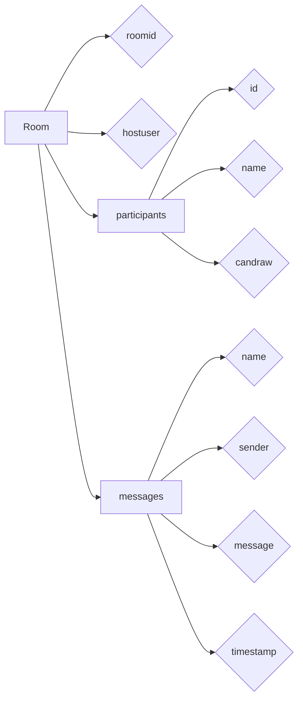
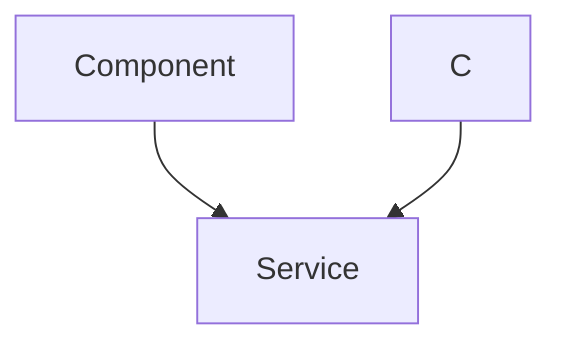

# Data Models and Persistence

This document outlines the data models used in the white-board-project and explains how the application persists data using MongoDB. Understanding these models and persistence mechanisms is crucial for contributing to the backend development and ensuring data integrity.

## Database Connection

The application uses Mongoose to interact with a MongoDB database. The connection is established in `backend/lib/db.js`.

```javascript title="backend/lib/db.js"
import { config } from 'dotenv';
import mongoose from 'mongoose';
config();
export const connectDb=async()=>{
    try {
        const conn=await mongoose.connect(process.env.MONGO_URL);
        console.log("Connected to DataBase:"+conn.connection.host);
    } catch (error) {
        console.log("Enable To connect DataBase",error)
    }

}
```

This code snippet first loads environment variables using `dotenv`, which allows configuring the database connection string (`MONGO_URL`) outside of the code. Then, it uses `mongoose.connect()` to establish a connection to the MongoDB database specified by the `MONGO_URL`.  Error handling is included to catch and log any connection errors.

[View on GitHub](https://github.com/sumedhcharjan/white-board-project/blob/main/backend/lib/db.js)

## Room Data Model

The `Room` model, defined in `backend/models/Room.model.js`, represents a whiteboard room where users can collaborate.

```javascript title="backend/models/Room.model.js"
import mongoose from 'mongoose'

const RoomSchema = new mongoose.Schema({
  roomid: {
    type: String,
    unique: true,
    required: true,
  },
  hostuser: {
    type: String,
    required: true,
  },
  participants: [
    {
      id: { type: String, required: true },
      name: { type: String, required: true },
      candraw:{type:Boolean,required:true,default:false}
    }
  ],
  messages: [
    {
      name: { type: String, required: true },
      sender: { type: String, required: true },
      message: { type: String, required: true },
      timestamp: { type: Date, required: true,default:Date.now()},
    }
  ]
}, { timestamps: true });

const Room = mongoose.model("Room", RoomSchema);
export default Room;
```

Key attributes of the `Room` model:

*   `roomid`: A unique identifier for the room.
*   `hostuser`: The user ID of the room's host.
*   `participants`: An array of objects, each representing a participant in the room, including their ID, name, and whether they are allowed to draw (`candraw`).
*   `messages`: An array of message objects, each containing the sender's name and ID, the message content, and a timestamp.
*   `timestamps`: Automatically adds `createdAt` and `updatedAt` fields.

[View on GitHub](https://github.com/sumedhcharjan/white-board-project/blob/main/backend/models/Room.model.js)

The `participants` array stores information about each user within a room, including a boolean value, `candraw`. This field is useful for controlling which users have drawing permissions within the room, a key feature for managing collaboration.





## User Data Model

The `User` model, defined in `backend/models/Users.model.js`, stores information about each user, specifically their saved drawings.

```javascript title="backend/models/Users.model.js"
import mongoose from 'mongoose';
const UserSchema=new mongoose.Schema({
    userid:{
        type:String,
        required:true,
    },
    savedDrawings:[
        {
            title:String,
            url:String,
            roomid:String,
            date:Date
        }
    ]
});

const User=mongoose.model('User',UserSchema);
export default User;
```

Key attributes of the `User` model:

*   `userid`: A unique identifier for the user.
*   `savedDrawings`: An array of objects, each representing a saved drawing. Each drawing includes a title, a URL (presumably to an image or data representation of the drawing), the room ID where the drawing originated, and the date it was saved.

[View on GitHub](https://github.com/sumedhcharjan/white-board-project/blob/main/backend/models/Users.model.js)

This model allows users to persist their work, linking drawings to specific rooms and providing a means to retrieve them later. The `url` field is crucial as it defines where the drawing data is stored, allowing for flexible implementations like storing drawings as images, JSON data, or SVG files.





## Environment Variables

The application uses environment variables, managed via the `dotenv` package, to store sensitive information like the MongoDB connection string. A `.env` file (which should be excluded from version control) is used in development. An example `.env` file might look like this:

```bash title=".env"
MONGO_URL=mongodb://localhost:27017/whiteboard
```

This is a crucial security practice, preventing sensitive data from being exposed in the codebase.

## Mongoose Schema Options

The RoomSchema leverages the `timestamps` option. This automatically adds two fields to the schema:

* `createdAt`: A timestamp indicating when the document was created.
* `updatedAt`: A timestamp indicating when the document was last updated.

These timestamps are invaluable for tracking data changes and can be useful for debugging and auditing purposes.

## Key Integration Points

1.  **Room Creation**: When a new room is created, a new `Room` document is saved to the database. The `roomid` must be unique to prevent conflicts. The user creating the room is designated as the `hostuser`.

2.  **Participant Management**: When a user joins a room, a new entry is added to the `participants` array in the `Room` document. When a user leaves, the corresponding entry is removed. The `candraw` property is managed to control drawing permissions.

3.  **Message Handling**: As users send messages, new message objects are pushed into the `messages` array of the `Room` document. The `timestamp` field ensures messages are ordered correctly.

4.  **Saving Drawings**: When a user saves a drawing, a new object is added to the `savedDrawings` array in the `User` document. This object includes the drawing's title, URL, and the ID of the room where it was created.

## Best Practices

*   **Data Validation:** Implement robust data validation on both the client and server sides to ensure data integrity. Mongoose provides built-in validation features that can be used to enforce constraints on the data being stored.
*   **Error Handling:** Implement comprehensive error handling to gracefully handle database connection errors, query errors, and validation errors.
*   **Data Sanitization:** Sanitize user inputs to prevent injection attacks. Use Mongoose's built-in sanitization methods or dedicated sanitization libraries.
*   **Indexing:** Ensure appropriate indexes are created on frequently queried fields to optimize query performance.
*   **Environment Variables:** Always store sensitive information like database credentials in environment variables and avoid committing them to version control.
*   **Asynchronous Operations:** Use `async/await` syntax for database operations to ensure code readability and prevent blocking the main thread.
*   **Data Backup:** Implement regular database backups to prevent data loss in case of system failures.
*   **Data Security:** Implement appropriate security measures to protect data at rest and in transit. Consider using encryption, access controls, and other security best practices.