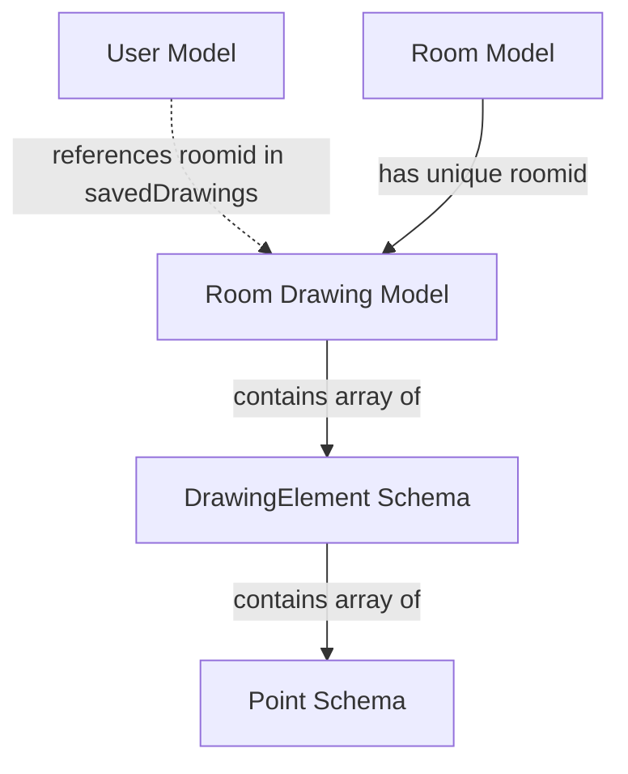

# Data Models & Schemas

This section details the Mongoose schemas used to define the structure of data within the application's MongoDB database. These schemas ensure data consistency and facilitate interactions with users, collaborative rooms, and real-time drawing information.

## User Model

The `User` model (`Users.model.js`) represents an individual user of the whiteboard application. It primarily stores a unique user identifier and a list of drawings they have saved.

```javascript
import mongoose from 'mongoose';

const UserSchema = new mongoose.Schema({
    userid: {
        type: String,
        required: true,
    },
    savedDrawings: [
        {
            title: String,
            url: String,
            roomid: String,
            date: Date
        }
    ]
});

const User = mongoose.model('User', UserSchema);
export default User;
```

*   `userid`: A unique string identifier for the user.
*   `savedDrawings`: An array of objects, where each object represents a saved drawing.
    *   `title`: The name given to the saved drawing.
    *   `url`: A URL associated with the drawing (e.g., a shareable link or image URL).
    *   `roomid`: The ID of the room where the drawing originated.
    *   `date`: The timestamp when the drawing was saved.

## Room Model

The `Room` model (`Room.model.js`) defines the structure for collaborative whiteboard rooms, including participants and chat messages.

```javascript
import mongoose from 'mongoose'

const RoomSchema = new mongoose.Schema({
  roomid: {
    type: String,
    unique: true,
    required: true,
  },
  hostuser: {
    type: String,
    required: true,
  },
  participants: [
    {
      id: { type: String, required: true },
      name: { type: String, required: true },
      candraw:{type:Boolean,required:true,default:false}
    }
  ],
  messages: [
    {
      name: { type: String, required: true },
      sender: { type: String, required: true },
      message: { type: String, required: true },
      timestamp: { type: Date, required: true,default:Date.now()},
    }
  ]
}, { timestamps: true });

const Room = mongoose.model("Room", RoomSchema);
export default Room;
```

*   `roomid`: A unique string identifier for the whiteboard room.
*   `hostuser`: The `userid` of the user who created and hosts the room.
*   `participants`: An array of objects, each representing a user currently in the room.
    *   `id`: The unique identifier of the participant.
    *   `name`: The display name of the participant.
    *   `candraw`: A boolean indicating if the participant has drawing permissions.
*   `messages`: An array of objects, each representing a chat message sent within the room.
    *   `name`: The display name of the message sender.
    *   `sender`: The unique identifier of the message sender.
    *   `message`: The content of the chat message.
    *   `timestamp`: The date and time the message was sent.
*   `timestamps`: Mongoose option to automatically add `createdAt` and `updatedAt` fields.

## Drawing Data Models

The drawing data is structured across three interconnected schemas (`drawingData.js`) to efficiently store and retrieve individual drawing elements and their associated points.

### Point Schema

The `PointSchema` defines the structure for a single coordinate point used in drawing elements.

```javascript
const PointSchema = new mongoose.Schema({
  x: { type: Number, required: true ,default:0},
  y: { type: Number, required: true ,default:0}
});
```

*   `x`: The x-coordinate of the point.
*   `y`: The y-coordinate of the point.

### Drawing Element Schema

The `DrawingElementSchema` represents a single drawn object on the whiteboard (e.g., a line, shape).

```javascript
const DrawingElementSchema = new mongoose.Schema({
  type: { type: String, required: true },  
  color: { type: String, required: true },
  width: { type: Number, required: true },
  points: {
    type: [PointSchema],
    required: true,
  },
});
```

*   `type`: The type of drawing element (e.g., "line", "rectangle").
*   `color`: The color of the drawing element.
*   `width`: The stroke width of the drawing element.
*   `points`: An array of `PointSchema` objects, defining the path or shape of the drawing element.

### Room Drawing Schema

The `RoomDrawingSchema` aggregates all `DrawingElementSchema` objects for a specific room, allowing the entire drawing state of a room to be stored and retrieved.

```javascript
import mongoose from "mongoose";
// ... PointSchema and DrawingElementSchema definitions ...

const RoomDrawingSchema = new mongoose.Schema({
  roomid: {
    type: String,
    unique: true,
    required: true
  },
  drawingData: {
    type: [DrawingElementSchema],  
    default: []
  }
});

const RoomDrawing = mongoose.model('RoomDrawing', RoomDrawingSchema);
export default RoomDrawing
```

*   `roomid`: The unique string identifier for the room associated with this drawing data. This ensures a one-to-one relationship between a room and its drawing state.
*   `drawingData`: An array of `DrawingElementSchema` objects, representing all the drawn components in the room.

## Data Model Relationships

The following diagram illustrates the relationships between the different data models based on shared identifiers and embedded schemas.





## Key Takeaways

The application utilizes a normalized approach for room and user data, while drawing data is embedded within a `RoomDrawing` document for efficient retrieval of a room's entire canvas state. The `roomid` serves as a crucial identifier, linking collaborative sessions to their respective drawing content and allowing users to save and reference specific whiteboard sessions. The clear separation of concerns in these schemas ensures maintainability and scalability for the application's data layer.