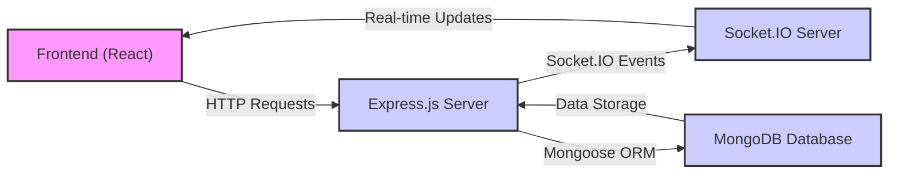
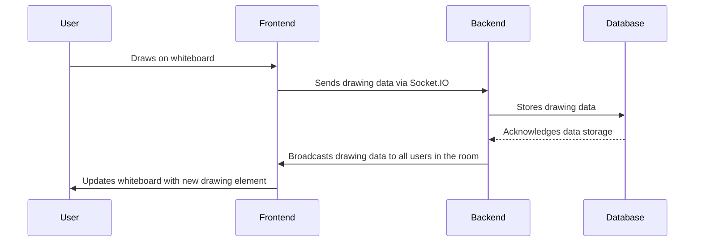

# Backend Architecture

This section details the backend structure of the collaborative whiteboard project, focusing on its database, server-side logic for real-time collaboration, and key components.

## Core Technologies

The backend is built using Node.js with Express.js, leveraging Socket.IO for real-time communication. MongoDB serves as the database.

*   **Node.js:** The runtime environment for executing JavaScript on the server.
*   **Express.js:** A web application framework for Node.js, simplifying the creation of robust APIs and handling HTTP requests.
*   **Socket.IO:** A library enabling real-time, bidirectional, and event-based communication between web clients and servers.
*   **MongoDB:** A NoSQL database used to store application data, including room configurations, user information, and drawing data.

## Database Configuration

The project uses Mongoose to interact with MongoDB. The `backend/lib/db.js` file handles the database connection.

```javascript title="backend/lib/db.js"
import { config } from 'dotenv';
import mongoose from 'mongoose';
config();
export const connectDb=async()=>{
    try {
        const conn=await mongoose.connect(process.env.MONGO_URL);
        console.log("Connected to DataBase:"+conn.connection.host);
    } catch (error) {
        console.log("Enable To connect DataBase",error)
    }

}
```

This snippet connects to the MongoDB database using the connection string stored in the `MONGO_URL` environment variable.  It uses `dotenv` to load environment variables from a `.env` file, keeping sensitive information separate from the codebase.
[View on GitHub](https://github.com/sumedhcharjan/white-board-project/blob/main/backend/lib/db.js)

## Real-time Communication with Socket.IO

The `backend/lib/socket.js` file manages real-time communication using Socket.IO.  This file handles user connections, disconnections, room joining, and the exchange of drawing data.

```javascript title="backend/lib/socket.js"
import express from 'express'
import { Server } from 'socket.io'
import http from 'http'
import Room from '../models/Room.model.js';
import RoomDrawing from '../models/drawingData.js';
const app = express();
const server = http.createServer(app);
const io = new Server(server, {
    cors: { origin: ['http://localhost:5173'] }
})

io.on('connection', (socket) => {
    console.log('🟢 User Connected:', socket.id);

    socket.on('disconnect', () => {
        console.log('🔴 User Disconnected:', socket.id);
    })

    socket.on('joinroom', ({ roomid, name, userid }) => {
        socket.join(roomid);
        console.log("Join Room");
        // socket.id = userid;
        socket.to(roomid).emit('User Joined', socket.id);
    });
    // ... other event handlers ...
})
export { io, server, app };
```

This code initializes a Socket.IO server and listens for incoming connections. It defines event handlers for various client-side actions, such as joining a room (`joinroom`), sending offers/answers for WebRTC connections (`offer`, `answer`), and transmitting ICE candidates (`ice-candidate`).
[View on GitHub](https://github.com/sumedhcharjan/white-board-project/blob/main/backend/lib/socket.js)

### Handling Drawing Events

The backend efficiently manages and distributes drawing events to all connected clients in a room.

```javascript title="backend/lib/socket.js"
 socket.on('newElement', async ({ element, roomid }) => {
        await RoomDrawing.updateOne(
            { roomid: `${roomid}` },
            { $push: { drawingData: element } },
            { upsert: true }
        );
        io.to(roomid).emit('drawElement', element);
    });
```

When a new drawing element is received from a client, this code updates the drawing data in the database using `RoomDrawing.updateOne` and then emits the `drawElement` event to all other clients in the same room. The `upsert: true` option ensures that a new document is created if one doesn't already exist for the given `roomid`.
[View on GitHub](https://github.com/sumedhcharjan/white-board-project/blob/main/backend/lib/socket.js)

### Message Handling
The backend manages the incoming messages to be stored in the database and emitted to the other user

```javascript title = "backend/lib/socket.js"
 socket.on('sendChat', async ({ roomid, name, sender, message }) => {
        try {

            if (!message.trim()) return; // Ignore empty messages
            // console.log(message);
            const timestamps = new Date().toISOString();
            console.log(typeof (name), typeof (sender), typeof (message), typeof (timestamps));
            const room = await Room.findOne({ roomid });
            if (!room) console.log("Room Not Found!");
            // console.log(room.messages.size());
            room.messages.push({ name, sender, message });
            await room.save();
            console.log('saved Room Success!');
            // console.log(room.messages);
            const umessages = room.messages;
            // console.log(umessages);
            io.to(roomid).emit('receiveChat', umessages);
        } catch (error) {
            console.error("saving messages error:", error);
        }
    })
```
This code defines the socket event handler to receive the message from the frontend to store it in the database and then emit it to the other user .
[View on GitHub](https://github.com/sumedhcharjan/white-board-project/blob/main/backend/lib/socket.js)

### Permission Handling
The backend manages drawing permissions to allow the host to grant permission to other participant .
```javascript title = "backend/lib/socket.js"
 socket.on('grantDrawP', async ({ hostid, userid, granted, roomid }) => {
        try {
            console.log(5, granted, roomid, userid, hostid);
            const room = await Room.findOne({ roomid });
            if (!room) console.log("Room Not Found!");
            const p = room.participants.find(x => x.id === userid);
            console.log(p);
            if (!p) console.log("Participant Not Found!");
            p.candraw = granted;
            await room.save();
            console.log(room.participants);
            io.to(roomid).emit('participantsUpdate', room.participants);
            console.log('After participantUpdate');
            io.to(roomid).emit('PermissionResult', ({ userid: p.id, granted }));
        } catch (error) {
            console.error("Request error:", error);
        }

    })
```
This code defines the socket event handler to receive request from the host to grant or revoke the permission to other participants and stores it in the database.
[View on GitHub](https://github.com/sumedhcharjan/white-board-project/blob/main/backend/lib/socket.js)

## Express.js Server Setup

The `backend/server.js` file sets up the Express.js server, configures middleware, defines routes, and starts the server.

```javascript title="backend/server.js"
import { config } from 'dotenv';
import express from 'express'
import cors from 'cors'
import { connectDb } from './lib/db.js';
import RoomRoutes from './routes/Room.routes.js';
import ProfileRoutes from './routes/Profile.routes.js'
import { app, server } from './lib/socket.js';
config();
const P = process.env.port;
app.use(cors({
    origin: ["http://localhost:5173", "https://collabboard-cyan.vercel.app"],
    credentials: true,
}));
app.use(express.json());

app.use('/api/room', RoomRoutes);
app.use('/api/profile',ProfileRoutes);

server.listen(P, () => {
    console.log(`Server is running on ${P}`);
    connectDb();
})
```

This code initializes an Express application, configures CORS to allow requests from specific origins (frontend URLs), and uses middleware to parse JSON request bodies. It also defines API routes for room management (`RoomRoutes`) and profile management (`ProfileRoutes`). The server then starts listening on the port specified in the environment variables.
[View on GitHub](https://github.com/sumedhcharjan/white-board-project/blob/main/backend/server.js)

## Package Dependencies

The `backend/package.json` file lists the dependencies required by the backend application.

```json title="backend/package.json"
{
  "dependencies": {
    "cloudinary": "^2.6.0",
    "cors": "^2.8.5",
    "dotenv": "^16.5.0",
    "express": "^5.1.0",
    "mongoose": "^8.13.2",
    "nanoid": "^5.1.5",
    "nodemon": "^3.1.9",
    "socket.io": "^4.8.1"
  },
  "name": "backend",
  "version": "1.0.0",
  "main": "server.js",
  "directories": {
    "lib": "lib"
  },
  "scripts": {
    "start": "nodemon src/index.js"
  },
  "keywords": [],
  "author": "",
  "type": "module",
  "license": "ISC",
  "description": ""
}
```

This file lists essential packages like `express`, `socket.io`, `mongoose`, `cors`, and `dotenv`, along with their respective versions.  It also defines the `start` script for running the server using Nodemon for automatic restarts during development.
[View on GitHub](https://github.com/sumedhcharjan/white-board-project/blob/main/backend/package.json)

## Backend Architecture Diagram





This diagram illustrates the high-level architecture of the backend, showing the interaction between the frontend, Express.js server, Socket.IO server, and MongoDB database.

## Key Integration Points

*   **Real-time Drawing Collaboration:** The Socket.IO integration is crucial for enabling real-time drawing collaboration. When a user draws on the whiteboard, the drawing data is immediately broadcast to all other users in the same room, creating a seamless collaborative experience.

*   **Database Persistence:**  Mongoose provides a clean and efficient way to interact with MongoDB, allowing for easy storage and retrieval of drawing data, room configurations, and user information.

*   **API Endpoints:** Express.js provides the framework for defining API endpoints that handle user authentication, room creation, and other application-level tasks.

## Best Practices

*   **Environment Variables:**  Storing configuration settings, such as database connection strings and API keys, in environment variables helps to improve security and portability.

*   **Error Handling:** Implementing robust error handling is essential for ensuring the stability and reliability of the backend application.

*   **Data Validation:**  Validating data on both the client and server sides helps to prevent errors and security vulnerabilities.

## Sequence Diagram for Real-Time Drawing





This sequence diagram illustrates the flow of data when a user draws on the whiteboard, from the initial drawing action to the update of the whiteboard for all users in the room.
```