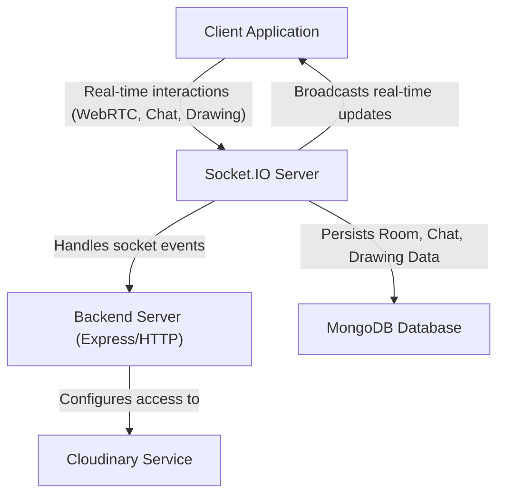

# Backend Architecture

The backend of the Whiteboard project is engineered to provide robust real-time collaboration, secure data persistence, and seamless media handling. It is built upon a Node.js and Express foundation, leveraging Socket.IO for real-time communication, MongoDB for data storage, and Cloudinary for media asset management. This architecture ensures high responsiveness for interactive whiteboard features and efficient management of user data and shared content.

## Core Services

The backend is composed of several key modules, each responsible for a specific aspect of the application's functionality.

### Database Connection

The application connects to a MongoDB database using Mongoose, an ODM (Object Data Modeling) library for Node.js. The connection details are securely managed through environment variables. This setup provides a structured way to interact with the database, handling schema definitions and data persistence for rooms, messages, and drawing elements.

```javascript
import { config } from 'dotenv';
import mongoose from 'mongoose';

config();

export const connectDb = async () => {
    try {
        const conn = await mongoose.connect(process.env.MONGO_URL);
        console.log("Connected to DataBase:" + conn.connection.host);
    } catch (error) {
        console.log("Enable To connect DataBase", error)
    }
}
```

### Real-time Communication (Socket.IO)

The heart of the collaborative functionality lies in the Socket.IO server. It manages all real-time interactions, including user connections, room management, chat messages, WebRTC signaling for audio/video, and whiteboard drawing updates. The server is configured to allow connections from the frontend application, ensuring cross-origin compatibility.

```javascript
import express from 'express'
import { Server } from 'socket.io'
import http from 'http'
import Room from '../models/Room.model.js';
import RoomDrawing from '../models/drawingData.js';

const app = express();
const server = http.createServer(app);
const io = new Server(server, {
    cors: { origin: ['http://localhost:5173'] }
})

io.on('connection', (socket) => {
    console.log('🟢 User Connected:', socket.id);

    socket.on('disconnect', () => {
        console.log('🔴 User Disconnected:', socket.id);
    })

    // ... other socket handlers
})

export { io, server, app };
```

#### Room Management and User Interactions

Users can join and leave specific rooms, enabling isolated collaborative sessions. The Socket.IO server broadcasts events within these rooms to keep all participants synchronized. This includes notifications for users joining or leaving, and real-time updates for participant actions.

```javascript
socket.on('joinroom', ({ roomid, name, userid }) => {
    socket.join(roomid);
    console.log("Join Room");
    socket.to(roomid).emit('User Joined', socket.id);
});

socket.on('leaveroom', ({ roomid, name }) => {
    socket.leave(roomid);
    console.log("uioii");
    socket.to(roomid).emit('User Left', { name });
});
```

#### Real-time Chat

The chat feature allows participants to send and receive messages instantly within a room. Messages are persisted in the database, ensuring that chat history is maintained across sessions.

```javascript
socket.on('sendChat', async ({ roomid, name, sender, message }) => {
    try {
        if (!message.trim()) return;
        const room = await Room.findOne({ roomid });
        if (!room) console.log("Room Not Found!");
        room.messages.push({ name, sender, message });
        await room.save();
        console.log('saved Room Success!');
        const umessages = room.messages;
        io.to(roomid).emit('receiveChat', umessages);
    } catch (error) {
        console.error("saving messages error:", error);
    }
})
```

#### Whiteboard Drawing Updates

All drawing actions performed by users are captured as individual elements. These elements are then broadcasted to all participants in the room and simultaneously stored in the database, allowing for real-time visualization and persistence of the whiteboard content.

```javascript
socket.on('newElement', async ({ element, roomid }) => {
    await RoomDrawing.updateOne(
        { roomid: `${roomid}` },
        { $push: { drawingData: element } },
        { upsert: true }
    );
    io.to(roomid).emit('drawElement', element);
});
```

### Cloudinary Integration

Cloudinary is integrated for cloud-based image and video management. This service handles the storage, manipulation, and delivery of media assets, offloading these tasks from the primary application server. The configuration uses environment variables to securely store API keys and cloud names.

```javascript
import {v2 as cloudinary} from "cloudinary"
import {config} from "dotenv"

config()
cloudinary.config({
    cloud_name:process.env.CLOUDINARY_CLOUD_NAME,
    api_key:process.env.CLOUDINARY_APIKEY,
    api_secret:process.env.CLOUDINARY_APISECRET,
})

export default cloudinary;
```

## Backend Architecture Diagram





## Key Takeaways

The backend architecture is designed for a highly interactive and collaborative application. It achieves this through:
*   **Real-time Synchronization**: Socket.IO facilitates instant updates for drawing, chat, and user presence.
*   **Data Persistence**: MongoDB ensures that all room data, messages, and drawing elements are securely stored and retrievable.
*   **Scalable Media Management**: Cloudinary offloads media handling, providing robust storage and delivery for any uploaded content (if implemented).
*   **Modular Design**: Separation of concerns into `db.js`, `socket.js`, and `cloudinary.js` promotes maintainability and easier debugging.