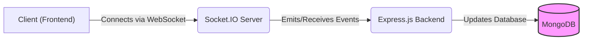
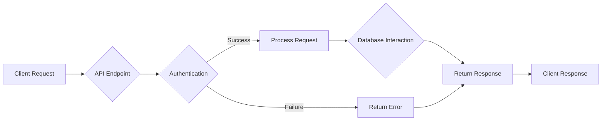

# Backend Architecture

This document details the backend architecture of the white-board-project, covering the server-side structure, API endpoints, and database interactions. The backend is built using Node.js, Express.js, and Mongoose, with a MongoDB database.

## Overview

The backend is responsible for handling user authentication, managing whiteboard rooms, and facilitating real-time collaboration through WebSockets. It provides API endpoints for creating, retrieving, and updating rooms and user profiles.

### Key Features

*   **Real-time Collaboration:** Utilizes Socket.IO for real-time whiteboard updates.
*   **User Authentication:**  (Implementation details not fully provided but assumed through ProfileRoutes) Securely manages user profiles and authentication.
*   **Data Persistence:** Leverages MongoDB to store whiteboard data and user information.
*   **API Endpoints:** Provides RESTful APIs for managing rooms and profiles.

### Technology Stack

| Technology   | Purpose                                  | Version   |
| :----------- | :--------------------------------------- | :-------- |
| Node.js      | Server-side runtime environment          | (Implied) |
| Express.js   | Web application framework                | ^5.1.0    |
| Mongoose     | MongoDB object modeling tool             | ^8.1.3    |
| MongoDB      | NoSQL database                           | (Implied) |
| Socket.IO    | Real-time communication library          | ^4.8.1    |
| CORS         | Cross-Origin Resource Sharing middleware | ^2.8.5    |
| Dotenv       | Load environment variables               | ^16.5.0   |
| Cloudinary   | Image and video management               | ^2.6.0    |
| Nanoid       | Unique string ID generator               | ^5.1.5    |
| Nodemon      | Development tool to automatically restart the server upon file changes | ^3.1.9    |

## Database Connection

The `backend/lib/db.js` file handles the connection to the MongoDB database. It uses the `mongoose` library to establish a connection based on the `MONGO_URL` environment variable.

```javascript title="backend/lib/db.js"
import { config } from 'dotenv';
import mongoose from 'mongoose';
config();
export const connectDb=async()=>{
    try {
        const conn=await mongoose.connect(process.env.MONGO_URL);
        console.log("Connected to DataBase:"+conn.connection.host);
    } catch (error) {
        console.log("Enable To connect DataBase",error)
    }

}
```

[View on GitHub](https://github.com/sumedhcharjan/white-board-project/blob/main/backend/lib/db.js)

This snippet demonstrates the use of `dotenv` to load environment variables and `mongoose` to connect to the MongoDB database.  A successful connection logs the database host to the console.

## Server Setup

The `backend/server.js` file sets up the Express.js server, configures middleware, defines API routes, and starts the server.

```javascript title="backend/server.js"
import { config } from 'dotenv';
import express from 'express'
import cors from 'cors'
import { connectDb } from './lib/db.js';
import RoomRoutes from './routes/Room.routes.js';
import ProfileRoutes from './routes/Profile.routes.js'
import { app, server } from './lib/socket.js';
config();
const P = process.env.port;
app.use(cors({
    origin: ["http://localhost:5173", "https://collabboard-cyan.vercel.app"],
    credentials: true,
}));
app.use(express.json());

app.use('/api/room', RoomRoutes);
app.use('/api/profile',ProfileRoutes);

server.listen(P, () => {
    console.log(`Server is running on ${P}`);
    connectDb();
})
```

[View on GitHub](https://github.com/sumedhcharjan/white-board-project/blob/main/backend/server.js)

This code snippet illustrates the basic setup of the Express server. It imports necessary modules, configures CORS, parses JSON request bodies, defines API routes, and starts the server on the specified port. The `connectDb` function is called to establish the database connection.

## Package Dependencies

The `backend/package.json` file lists all the dependencies required for the backend application.

```json title="backend/package.json"
{
  "dependencies": {
    "cloudinary": "^2.6.0",
    "cors": "^2.8.5",
    "dotenv": "^16.5.0",
    "express": "^5.1.0",
    "mongoose": "^8.13.2",
    "nanoid": "^5.1.5",
    "nodemon": "^3.1.9",
    "socket.io": "^4.8.1"
  },
  "name": "backend",
  "version": "1.0.0",
  "main": "server.js",
  "directories": {
    "lib": "lib"
  },
  "scripts": {
    "start": "nodemon src/index.js"
  },
  "keywords": [],
  "author": "",
  "type": "module",
  "license": "ISC",
  "description": ""
}
```

[View on GitHub](https://github.com/sumedhcharjan/white-board-project/blob/main/backend/package.json)

This file provides a comprehensive list of the backend's dependencies, including `express`, `mongoose`, `socket.io`, and other utility libraries.

## CORS Configuration

CORS (Cross-Origin Resource Sharing) is configured to allow requests from specific origins.

```javascript
app.use(cors({
    origin: ["http://localhost:5173", "https://collabboard-cyan.vercel.app"],
    credentials: true,
}));
```

This configuration allows requests from the local development environment (`http://localhost:5173`) and the production environment (`https://collabboard-cyan.vercel.app`). The `credentials: true` option allows cookies to be sent in cross-origin requests.

## API Routes

The backend defines two main API routes: `/api/room` and `/api/profile`. These routes are handled by the `RoomRoutes` and `ProfileRoutes` modules, respectively.

```javascript
app.use('/api/room', RoomRoutes);
app.use('/api/profile',ProfileRoutes);
```

These routes likely handle operations related to creating, retrieving, updating, and deleting whiteboard rooms and user profiles. The exact implementation details of these routes are not provided in the given files but can be found in the corresponding route modules (`./routes/Room.routes.js` and `./routes/Profile.routes.js`).

## Socket.IO Integration

The backend uses Socket.IO for real-time communication between clients and the server. The `app` and `server` objects are imported from `./lib/socket.js`, which likely contains the Socket.IO initialization code.

```javascript
import { app, server } from './lib/socket.js';
```

While the exact implementation is not shown, Socket.IO is typically used to handle real-time events such as whiteboard drawing updates, user presence, and chat messages.





## Backend Workflow

Here’s a high-level overview of the backend workflow using a flowchart:





## Key Integration Points

The backend integrates several key components:

*   **Frontend (React):** The frontend interacts with the backend through API calls and WebSocket connections.
*   **MongoDB:** The database stores whiteboard data and user information.
*   **Socket.IO:** Facilitates real-time communication between clients and the server.

The flow typically involves the frontend making API requests to the backend, which then interacts with the database to retrieve or update data. Socket.IO is used to push real-time updates to connected clients.

### Best Practices

*   **Error Handling:** Implement robust error handling to gracefully handle unexpected situations.
*   **Security:** Secure API endpoints and protect against common web vulnerabilities.
*   **Scalability:** Design the backend with scalability in mind to handle increasing traffic and data volume.
*   **Logging:** Implement comprehensive logging to track application behavior and diagnose issues.
*   **Environment Variables:** Utilize environment variables for configuration to avoid hardcoding sensitive information.
```