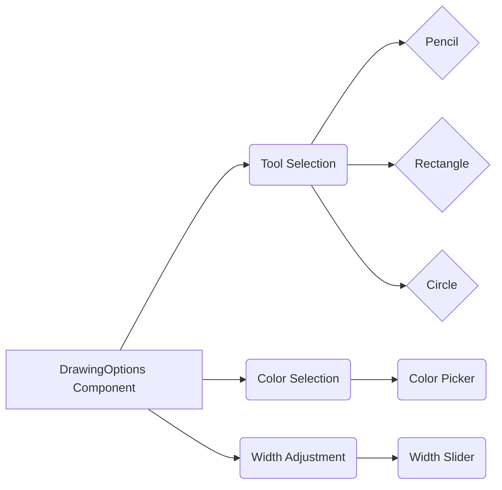
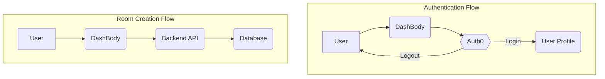

# Core Components

This section details the core UI components of the white-board-project, providing insights into their functionality and integration within the application. We will explore the `DrawingOptions` component responsible for canvas tools, the `DashBody` component that constitutes the dashboard, and the `ProfilePage` component displaying user profile information and saved drawings.

## DrawingOptions

The `DrawingOptions` component (`frontend/src/components/Canvas/DrawingOptions.jsx`) provides a set of tools for drawing on the canvas. It includes options for selecting different drawing tools (pencil, rectangle, circle, line, ellipse), choosing a color, and setting the line width.

### Features

-   **Tool Selection:** Enables users to select different drawing tools.
-   **Color Selection:** Allows users to pick a drawing color from a color picker.
-   **Width Adjustment:** Offers a slider to adjust the line width.
-   **Visual Feedback:** Highlights the selected tool and displays the current color and width.

```javascript title="frontend/src/components/Canvas/DrawingOptions.jsx - Tool Selection"
import { FaPencilAlt, FaSquare, FaCircle, FaMinus, FaEllipsisH } from 'react-icons/fa';
import { useState } from 'react';

const DrawingOptions = ({ selectedColor, selectedTool, setSelectedColor, setSelectedTool, width, setWidth }) => {
  const handleToolChange = (tool) => {
    setSelectedTool(`${tool}`);
  };

  // ... other code ...

  return (
    // ... other JSX ...
    <div className="grid grid-cols-5 gap-2">
      <button
        onClick={() => handleToolChange('pencil')}
        className={`aspect-square bg-[#14B8A6] text-white rounded-md flex items-center justify-center hover:bg-[#FBBF24] transition-all duration-200 transform hover:scale-105 ${
          selectedTool === 'pencil' ? 'ring-2 ring-[#7C3AED]' : ''
        }`}
      >
        <FaPencilAlt size={20} />
      </button>
      {/* ... other tool buttons ... */}
    </div>
    // ... other JSX ...
  );
};

export default DrawingOptions;
```

This code snippet demonstrates how the component renders buttons for different drawing tools and uses the `selectedTool` state to highlight the currently selected tool. When a tool button is clicked, the `handleToolChange` function updates the `selectedTool` state, which triggers a re-render of the component with the updated visual feedback. [View on GitHub](https://github.com/sumedhcharjan/white-board-project/blob/main/frontend/src/components/Canvas/DrawingOptions.jsx)

```javascript title="frontend/src/components/Canvas/DrawingOptions.jsx - Color Selection"
// ... imports and component definition ...

  const handleColorChange = (e) => {
    setSelectedColor(e.target.value);
  };

  return (
    // ... other JSX ...
    <label className="aspect-square bg-[#14B8A6] rounded-md cursor-pointer overflow-hidden relative hover:ring-2 ring-offset-2 ring-[#7C3AED]">
      <input
        type="color"
        value={selectedColor}
        onChange={handleColorChange}
        className="absolute top-0 left-0 opacity-0 w-full h-full cursor-pointer"
      />
      <div
        className="w-full h-full"
        style={{ backgroundColor: selectedColor }}
      />
    </label>
    // ... other JSX ...
  );
```

This snippet shows the color selection functionality. An input element of type "color" is used, which provides a color picker. When the user selects a color, the `handleColorChange` function updates the `selectedColor` state, and the selected color is reflected visually. [View on GitHub](https://github.com/sumedhcharjan/white-board-project/blob/main/frontend/src/components/Canvas/DrawingOptions.jsx)

```javascript title="frontend/src/components/Canvas/DrawingOptions.jsx - Width Adjustment"
// ... imports and component definition ...

  return (
    // ... other JSX ...
    <input
      type="range"
      min="1"
      max="30"
      value={width}
      onChange={(e) => setWidth(Number(e.target.value))}
      className="col-span-3 h-2 bg-[#7C3AED] rounded-lg appearance-none cursor-pointer [&::-webkit-slider-thumb]:bg-[#14B8A6] [&::-webkit-slider-thumb]:appearance-none [&::-webkit-slider-thumb]:w-4 [&::-webkit-slider-thumb]:h-4 [&::-webkit-slider-thumb]:rounded-full [&::-webkit-slider-thumb]:hover:bg-[#FBBF24]"
    />
    // ... other JSX ...
  );
```

Here, a range input is used to allow users to adjust the line width. The `onChange` event handler updates the `width` state, which is then used to determine the line width on the canvas. [View on GitHub](https://github.com/sumedhcharjan/white-board-project/blob/main/frontend/src/components/Canvas/DrawingOptions.jsx)

## DashBody

The `DashBody` component (`frontend/src/components/DashBoard/DashBody.jsx`) serves as the main dashboard for the application. It provides functionality for creating and joining whiteboard sessions.

### Features

-   **Session Creation:** Allows users to create new whiteboard sessions.
-   **Session Joining:** Enables users to join existing sessions using a room ID.
-   **User Authentication:** Integrates with Auth0 for user authentication.
-   **Navigation:** Uses `react-router-dom` for navigation between different routes.

```javascript title="frontend/src/components/DashBoard/DashBody.jsx - Creating a Room"
import { useNavigate } from 'react-router-dom';
import { useState } from 'react';
import { useAuth0 } from "@auth0/auth0-react";
import axios from '/src/lib/axios.js';
import socket from '/src/lib/socket.js';
import toast from 'react-hot-toast';

const DashBody = () => {
  const { user, logout } = useAuth0();
  const navigate = useNavigate();
  const [joinid, setjoinid] = useState("");
  const [joining, setjoining] = useState(false);
  const [join, setjoin] = useState(false);
  const [creating, setcreating] = useState(false);
  const [roomid, setroomid] = useState(null);

  const handleCreateRoom = async () => {
    setcreating(true);
    try {
      const res = await axios.post('/room/create', { user });
      console.log(res);
      if (res?.data?.roomid) setroomid(res?.data?.roomid);
    } catch (error) {
      console.log(error);
    }
  };

  // ... other code ...
}

export default DashBody;
```

This code demonstrates the session creation process. When a user clicks the "Create Room" button, the `handleCreateRoom` function is called. This function makes an API request to the backend to create a new room and retrieves the room ID. [View on GitHub](https://github.com/sumedhcharjan/white-board-project/blob/main/frontend/src/components/DashBoard/DashBody.jsx)

```javascript title="frontend/src/components/DashBoard/DashBody.jsx - Joining a Room"
// ... imports and component definition ...

  const handleJoinRoom = async () => {
    try {
      setjoin(true)
      const res = await axios.put('/room/joinroom', { user, Rid: joinid });
      if (res?.data?.msg === 'Joined room') {
        setjoin(false)
        navigate(`/room/${joinid}`);
        socket.emit('joinroom', {
          name: user.name || user.nickname || "Anonymous",
          roomid: joinid,
        });
      }
    } catch (error) {
      console.log(error);
      setjoin(false)
    }
  };

// ... other code ...
```

This snippet shows the session joining functionality. The `handleJoinRoom` function is called when a user enters a room ID and clicks the "Join Room" button. This function makes an API request to the backend to join the specified room. If successful, the user is navigated to the whiteboard session. [View on GitHub](https://github.com/sumedhcharjan/white-board-project/blob/main/frontend/src/components/DashBoard/DashBody.jsx)

```javascript title="frontend/src/components/DashBoard/DashBody.jsx - Auth0 Logout"
// ... imports and component definition ...

<button
  className="p-2 rounded-full bg-[#14B8A6] text-white hover:bg-[#FBBF24] transition transform hover:scale-105 border border-white"
  onClick={() =>
    logout({
      logoutParams: {
        returnTo: window.location.origin, // Corrected location
      },
    })
  }
  title="Logout"
  aria-label="Log out"
>
  <svg className="w-5 h-5" fill="none" stroke="currentColor" viewBox="0 0 24 24" xmlns="http://www.w3.org/2000/svg">
    <path strokeLinecap="round" strokeLinejoin="round" strokeWidth="2" d="M17 16l4-4m0 0l-4-4m4 4H7m6 4v1a3 3 0 01-3 3H6a3 3 0 01-3-3V7a3 3 0 013-3h4a3 3 0 013 3v1"></path>
  </svg>
</button>

// ... other code ...
```

This code shows the integration with Auth0 to handle the logout functionality. When the logout button is clicked, the `logout` function is called, and the user is redirected to the specified return URL. [View on GitHub](https://github.com/sumedhcharjan/white-board-project/blob/main/frontend/src/components/DashBoard/DashBody.jsx)

## ProfilePage

The `ProfilePage` component (`frontend/src/components/Profile/ProfilePage.jsx`) displays the user's profile information and allows them to view and manage their saved drawings.

### Features

-   **User Profile Display:** Shows the user's profile information obtained from Auth0.
-   **Saved Drawings Management:** Allows users to view, download, and delete their saved drawings.
-   **Data Loading:** Displays a loading indicator while fetching data.
-   **Authentication Check:** Ensures that only authenticated users can access the profile page.

```javascript title="frontend/src/components/Profile/ProfilePage.jsx - Fetching Saved Drawings"
import React, { useEffect, useState } from 'react';
import { useAuth0 } from '@auth0/auth0-react';
import axios from '/src/lib/axios.js';
import { FiEye, FiDownload, FiTrash2 } from 'react-icons/fi';
import UserInfo from '../../pages/UserInfo.jsx';
import HeaderDash from '../DashBoard/HeaderDash.jsx';
import { useNavigate } from 'react-router-dom';

const ProfilePage = () => {
    const { user, isLoading, isAuthenticated, logout } = useAuth0();
    const [savedD, setsavedD] = useState([]);
    const [isDataLoading, setIsDataLoading] = useState(false); // New state for data loading
    const navigate = useNavigate();

    useEffect(() => {
        const getDrawings = async () => {
            setIsDataLoading(true); // Start loading
            try {
                const res = await axios.get(`/profile/${user?.sub}/savedDrawings`);
                setsavedD(res.data.drawings);
            } catch (error) {
                console.error(error);
            } finally {
                setIsDataLoading(false); // Stop loading
            }
        };

        if (user) getDrawings();
    }, [user]);

  // ... other code ...
}
```

This code snippet demonstrates how the component fetches the user's saved drawings from the backend. The `useEffect` hook is used to call the `getDrawings` function when the component mounts. The `getDrawings` function makes an API request to retrieve the saved drawings and updates the `savedD` state.  [View on GitHub](https://github.com/sumedhcharjan/white-board-project/blob/main/frontend/src/components/Profile/ProfilePage.jsx)

```javascript title="frontend/src/components/Profile/ProfilePage.jsx - Deleting a Drawing"
// ... imports and component definition ...

    const handleDelete = async (drawing) => {
        const confirm = window.confirm(`Are you sure you want to delete "${drawing.title}"?`);
        if (!confirm) return;

        try {
            await axios.delete(`/profile/${user.sub}/deleteDrawing`, {
                params: { roomid: drawing.roomid, id: drawing._id }
            });
            setsavedD(prev => prev.filter(d => !(d._id === drawing._id && d.roomid === drawing.roomid)));
        } catch (err) {
            console.error("Error deleting drawing:", err);
        }
    };

  // ... other code ...
```

Here, the `handleDelete` function handles the deletion of a saved drawing. It first confirms with the user and then makes an API request to the backend to delete the drawing. If successful, the `savedD` state is updated to remove the deleted drawing. [View on GitHub](https://github.com/sumedhcharjan/white-board-project/blob/main/frontend/src/components/Profile/ProfilePage.jsx)

```javascript title="frontend/src/components/Profile/ProfilePage.jsx - Downloading Drawing"
// ... imports and component definition ...

<a
  href={`${drawing.url.replace("/upload/", "/upload/fl_attachment:" + drawing.title + "/")}`}
  download
  className="text-[#14B8A6] hover:text-[#FBBF24] transform hover:scale-105 transition-all duration-200"
  title="Download Drawing"
>
  <FiDownload />
</a>

  // ... other code ...
```

This code displays how the user can download the saved drawing using a URL that triggers a download and names the file.  [View on GitHub](https://github.com/sumedhcharjan/white-board-project/blob/main/frontend/src/components/Profile/ProfilePage.jsx)





This diagram illustrates the different features within the `DrawingOptions` component.

## Key Integration Points

-   The `DrawingOptions` component integrates with the canvas to provide drawing functionalities. Changes in tool, color, and width trigger updates on the canvas in real-time.
-   The `DashBody` component uses Auth0 for user authentication, providing a secure way for users to create and join sessions.
-   The `ProfilePage` component interacts with the backend API to fetch and manage user-specific data such as saved drawings.

Best practices include using clear and concise component names, providing detailed comments in the code, and ensuring that all components are well-tested. When integrating with external services like Auth0, it is important to follow the service's documentation and best practices for secure authentication and authorization.





This diagram shows the Authentication flow and Room creation Flow for the application.
```
```