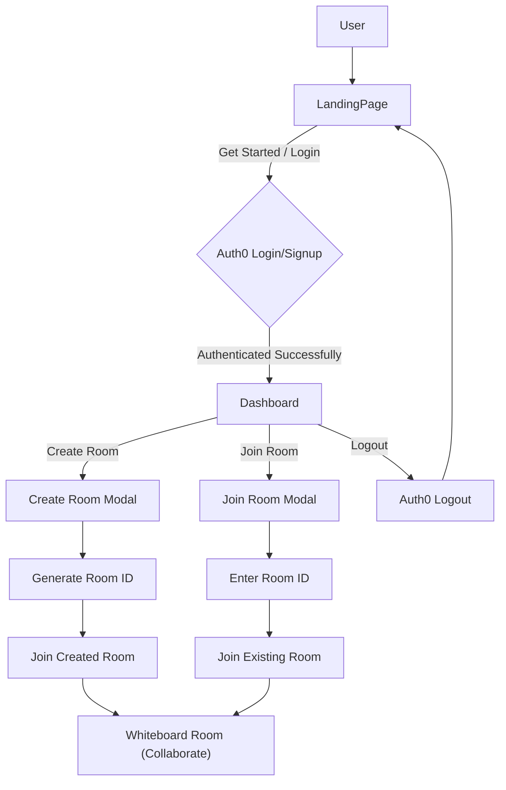

# Core UI Components & Pages

This section details the primary React components and pages that constitute the user interface of CollabBoard. It covers the entry points for users, such as the Landing Page, and the main interaction hub for authenticated users, the Dashboard, along with their respective foundational components. These components are built using React and leverage external libraries like Auth0 for authentication, Axios for API communication, and Socket.IO for real-time updates.

## Landing Page Overview

The landing page (`LandingPage.jsx`) serves as the initial public-facing interface for the application. It provides an introduction to CollabBoard, highlights its key features, and offers calls to action for users to get started. The core logic and structure of the landing page are encapsulated within the `LandingBody` component.

### `LandingBody` Component (`frontend/src/components/landingPage/LandingBody.jsx`)

The `LandingBody` component is responsible for rendering the entire layout of the landing page. It includes:
*   A sticky header with navigation links and a "Get Started" button.
*   A hero section with a compelling headline and a call to action.
*   A "Features" section outlining the benefits of CollabBoard.
*   An "About" section providing more context about the application.
*   A final "Call to Action" section to encourage sign-ups.
*   A footer for copyright and contact information.

Authentication is handled via Auth0, primarily through the `loginWithRedirect` function, which redirects users to the Auth0 universal login page.

```tsx
import { useAuth0 } from "@auth0/auth0-react";

const LandingBody = () => {
  const { loginWithRedirect } = useAuth0();

  return (
    // ... other JSX ...
          <button
            onClick={() => loginWithRedirect()}
            className="bg-[#14B8A6] text-white px-4 py-2 rounded-md font-medium hover:bg-[#FBBF24] transition border border-white"
          >
            Get Started
          </button>
    // ... rest of component ...
  );
};
```

## Dashboard Overview

The dashboard (`Dashboard.jsx`) is the main authenticated area where users can create new whiteboard sessions or join existing ones. It acts as the central hub after a user logs in. The `DashBody` component manages the user's interactions and state within the dashboard.

### `DashBody` Component (`frontend/src/components/DashBoard/DashBody.jsx`)

The `DashBody` component handles all the core functionalities for an authenticated user on the dashboard. It manages state related to joining/creating rooms and interacts with backend services to facilitate these actions.

Key functionalities include:
*   **User Information**: Displays the authenticated user's name.
*   **Navigation**: Buttons for viewing the profile, returning home, and logging out.
*   **Room Creation**: Allows users to create a new whiteboard room, which generates a unique room ID.
*   **Room Joining**: Enables users to join an existing room by entering its ID.
*   **Real-time Communication**: Utilizes Socket.IO to emit `joinroom` events once a user successfully enters a whiteboard session.

#### Room Creation

Users can initiate the creation of a new room. This involves an API call to the backend to generate a unique room identifier. Once generated, the user is presented with the room ID, which they can copy or immediately join.

```tsx
const DashBody = () => {
  // ... state declarations ...
  const { user, logout } = useAuth0();
  // ...

  const handleCreateRoom = async () => {
    setcreating(true);
    try {
      const res = await axios.post('/room/create', { user });
      console.log(res);
      if (res?.data?.roomid) setroomid(res?.data?.roomid);
    } catch (error) {
      console.log(error);
    }
  };

  // ... rest of component ...
};
```

#### Joining a Room

Users can join a room either by entering an existing room ID or by joining a room they just created. This also involves an API call to register the user in the room, followed by navigation to the whiteboard session page and a Socket.IO event emission.

```tsx
const DashBody = () => {
  // ... state declarations ...
  const { user, logout } = useAuth0();
  // ...

  const handleJoinRoom = async () => {
    try {
      setjoin(true)
      const res = await axios.put('/room/joinroom', { user, Rid: joinid });
      if (res?.data?.msg === 'Joined room') {
        setjoin(false)
        navigate(`/room/${joinid}`);
        socket.emit('joinroom', {
          name: user.name || user.nickname || "Anonymous",
          roomid: joinid,
        });
      }
    } catch (error) {
      console.log(error);
      setjoin(false)
    }
  };

  // ... rest of component ...
};
```

The `socket.emit` call is crucial for notifying other participants in the room about the new joiner, facilitating real-time updates within the whiteboard session.

```tsx
socket.emit('joinroom', {
  name: user.name || user.nickname || "Anonymous",
  roomid: roomid, // or joinid
});
```

#### Logout Functionality

The `DashBody` component also provides a logout button which utilizes Auth0's `logout` function to terminate the user's session and redirect them to the landing page.

```tsx
<button
  className="p-2 rounded-full bg-[#14B8A6] text-white hover:bg-[#FBBF24] transition transform hover:scale-105 border border-white"
  onClick={() =>
    logout({
      logoutParams: {
        returnTo: window.location.origin, // Corrected location
      },
    })
  }
  title="Logout"
  aria-label="Log out"
>
  <svg className="w-5 h-5" fill="none" stroke="currentColor" viewBox="0 0 24 24" xmlns="http://www.w3.org/2000/svg">
    <path strokeLinecap="round" strokeLinejoin="round" strokeWidth="2" d="M17 16l4-4m0 0l-4-4m4 4H7m6 4v1a3 3 0 01-3 3H6a3 3 0 01-3-3V7a3 3 0 013-3h4a3 3 0 013 3v1"></path>
  </svg>
</button>
```

## User Journey Flow

The following diagram illustrates the typical user flow through the landing page and dashboard, including authentication and room management.





## Key Takeaways

*   The application uses a clear separation between public-facing content (Landing Page) and authenticated user functionalities (Dashboard).
*   Auth0 provides robust authentication and authorization features.
*   Backend API calls (via Axios) are used for room creation and joining, ensuring data persistence and session management.
*   Socket.IO enables real-time updates and communication necessary for collaborative whiteboard sessions.
*   Components are designed with user experience in mind, providing clear calls to action and feedback mechanisms.