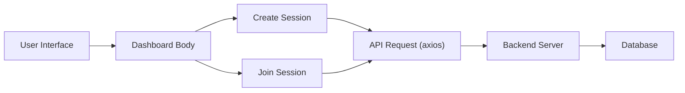
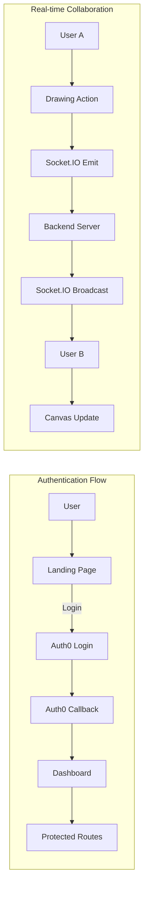

# UI Components

This section describes the key UI components used in the white-board-project for rendering pages, canvas functionality, and user interactions. These components are built primarily with React and utilize libraries such as Material UI and potentially custom styling.

## Drawing Options

The `DrawingOptions.jsx` component provides a user interface for selecting drawing tools, colors, and line widths within the whiteboard application. It utilizes React hooks for state management and various icons from `react-icons/fa` for visual representation.

**Key Features:**

-   Tool selection: Allows users to choose between pencil, rectangle, circle, line, and ellipse drawing tools.
-   Color selection: Provides a color picker for selecting the drawing color.
-   Width adjustment: Enables users to adjust the line width of the drawing tool.

```javascript filename="frontend/src/components/Canvas/DrawingOptions.jsx"
import { FaPencilAlt, FaSquare, FaCircle, FaMinus, FaEllipsisH } from 'react-icons/fa';
import { useState } from 'react';

const DrawingOptions = ({ selectedColor, selectedTool, setSelectedColor, setSelectedTool, width, setWidth }) => {
  const handleToolChange = (tool) => {
    setSelectedTool(`${tool}`);
  };

  const handleColorChange = (e) => {
    setSelectedColor(e.target.value);
  };

  return (
    <div className="bg-[#FAFAFA] p-4 rounded-lg flex flex-col gap-4">
      {/* Tool selection buttons */}
      <div className="grid grid-cols-5 gap-2">
        <button
          onClick={() => handleToolChange('pencil')}
          className={`aspect-square bg-[#14B8A6] text-white rounded-md flex items-center justify-center hover:bg-[#FBBF24] transition-all duration-200 transform hover:scale-105 ${
            selectedTool === 'pencil' ? 'ring-2 ring-[#7C3AED]' : ''
          }`}
        >
          <FaPencilAlt size={20} />
        </button>
        {/* Other tool buttons */}
      </div>

      {/* Color and width selection */}
      <div className="grid grid-cols-5 gap-2 items-center">
        <label className="aspect-square bg-[#14B8A6] rounded-md cursor-pointer overflow-hidden relative hover:ring-2 ring-offset-2 ring-[#7C3AED]">
          <input
            type="color"
            value={selectedColor}
            onChange={handleColorChange}
            className="absolute top-0 left-0 opacity-0 w-full h-full cursor-pointer"
          />
          <div
            className="w-full h-full"
            style={{ backgroundColor: selectedColor }}
          />
        </label>
        {/* Width slider */}
        <input
          type="range"
          min="1"
          max="30"
          value={width}
          onChange={(e) => setWidth(Number(e.target.value))}
          className="col-span-3 h-2 bg-[#7C3AED] rounded-lg appearance-none cursor-pointer [&::-webkit-slider-thumb]:bg-[#14B8A6] [&::-webkit-slider-thumb]:appearance-none [&::-webkit-slider-thumb]:w-4 [&::-webkit-slider-thumb]:h-4 [&::-webkit-slider-thumb]:rounded-full [&::-webkit-slider-thumb]:hover:bg-[#FBBF24]"
        />
        <div
          className="aspect-square flex items-center justify-center rounded-md bg-[#7C3AED]/20 hover:ring-2 ring-offset-2 ring-[#7C3AED]"
        >
          <div
            className="rounded-full"
            style={{
              width: `${width}px`,
              height: `${width}px`,
              backgroundColor: selectedColor,
            }}
          />
        </div>
      </div>
    </div>
  );
};

export default DrawingOptions;
```

[View on GitHub](https://github.com/sumedhcharjan/white-board-project/blob/main/frontend/src/components/Canvas/DrawingOptions.jsx)

## Dashboard Body

The `DashBody.jsx` component serves as the main content area for the dashboard, providing functionalities for creating and joining whiteboard sessions. It leverages `react-router-dom` for navigation, `auth0` for authentication, `axios` for API requests, and `socket.io` for real-time communication.

**Key Features:**

-   Session creation: Allows users to create new whiteboard sessions.
-   Session joining: Enables users to join existing sessions using a room ID.
-   User authentication: Integrates with Auth0 for user authentication and session management.
-   Real-time updates: Utilizes Socket.IO to provide real-time updates and collaboration features.

```javascript filename="frontend/src/components/DashBoard/DashBody.jsx"
import { useNavigate } from 'react-router-dom';
import { useState } from 'react';
import { useAuth0 } from "@auth0/auth0-react";
import axios from '/src/lib/axios.js';
import socket from '/src/lib/socket.js';
import toast from 'react-hot-toast';

const DashBody = () => {
  const { user, logout } = useAuth0();
  const navigate = useNavigate();
  const [joinid, setjoinid] = useState("");
  const [joining, setjoining] = useState(false);
  const [join, setjoin] = useState(false);
  const [creating, setcreating] = useState(false);
  const [roomid, setroomid] = useState(null);

  const handleCreateRoom = async () => {
    setcreating(true);
    try {
      const res = await axios.post('/room/create', { user });
      if (res?.data?.roomid) setroomid(res?.data?.roomid);
    } catch (error) {
      console.log(error);
    }
  };

  const handleJoinRoom = async () => {
    try {
      setjoin(true)
      const res = await axios.put('/room/joinroom', { user, Rid: joinid });
      if (res?.data?.msg === 'Joined room') {
        setjoin(false)
        navigate(`/room/${joinid}`);
        socket.emit('joinroom', {
          name: user.name || user.nickname || "Anonymous",
          roomid: joinid,
        });
      }
    } catch (error) {
      console.log(error);
      setjoin(false)
    }
  };

  return (
    <div className="relative min-h-screen font-sans ">
       {/* rest of the code */}
       <button
          className="bg-[#14B8A6] text-white px-6 py-3 rounded-full hover:bg-[#FBBF24] transition w-full transform hover:scale-105"
          onClick={joinRoom}
          aria-label="Join an existing room"
        >
          Join Room
        </button>
    </div>
  );
};

export default DashBody;
```

[View on GitHub](https://github.com/sumedhcharjan/white-board-project/blob/main/frontend/src/components/DashBoard/DashBody.jsx)





## Dashboard Page

The `Dashboard.jsx` page serves as the main entry point for authenticated users, rendering the `DashBody` component. It utilizes the `useAuth0` hook to manage user authentication state.

```javascript filename="frontend/src/pages/Dashboard.jsx"
import React from 'react'
import { useAuth0 } from "@auth0/auth0-react";
import DashBody from "../components/DashBoard/DashBody";

const Dashboard = () => {
    const { user } = useAuth0();
    console.log(user);

return (
    <>
    <DashBody/>
    </>
)

}

export default Dashboard
```

[View on GitHub](https://github.com/sumedhcharjan/white-board-project/blob/main/frontend/src/pages/Dashboard.jsx)

## Landing Page Body

The `LandingBody.jsx` component represents the main content of the landing page, providing an introduction to the application and encouraging users to sign up or log in. It includes sections for features, about information, and a call to action.

**Key Features:**

-   Hero section: Introduces the application and its key benefits.
-   Features section: Highlights the main features of the application.
-   About section: Provides information about the application and its purpose.
-   Call to action: Encourages users to sign up or log in.

```javascript filename="frontend/src/components/landingPage/LandingBody.jsx"
import React from 'react';
import { useAuth0 } from "@auth0/auth0-react";

const LandingBody = () => {
  const { loginWithRedirect } = useAuth0();

  return (
    <div className="relative min-h-screen font-sans">
       {/* rest of the code */}
       <button
          onClick={() => loginWithRedirect()}
          className="bg-[#14B8A6] text-white px-6 py-3 rounded-md text-lg font-medium hover:bg-[#FBBF24] transition"
        >
          Join Now
        </button>
        {/* Footer */}
      <footer className="bg-[#14B8A6] text-white py-8">
        <div className="max-w-7xl mx-auto px-4 sm:px-6 lg:px-8">
          <div className="grid grid-cols-1 sm:grid-cols-3 gap-8">
            <div>
              <h4 className="text-lg font-semibold mb-4">CollabBoard</h4>
              <p className="text-white">Streamlined tools for professional collaboration.</p>
            </div>
           </div>
           </div>
        </footer>
    </div>
  );
};

export default LandingBody;
```

[View on GitHub](https://github.com/sumedhcharjan/white-board-project/blob/main/frontend/src/components/landingPage/LandingBody.jsx)

## Tailwind CSS Animations

The `DashBody.jsx` and `LandingBody.jsx` use Tailwind CSS and custom CSS animations to enhance the user experience. These animations include fade-in and slide-in effects.

```css
@keyframes fadeIn {
  from { opacity: 0; transform: translateY(20px); }
  to { opacity: 1; transform: translateY(0); }
}
.animate-fade-in {
  animation: fadeIn 1s ease-out;
}
@keyframes slideIn {
  from { opacity: 0; transform: translateY(50px); }
  to { opacity: 1; transform: translateY(0); }
}
.animate-slide-in {
  animation: slideIn 0.5s ease-out;
}
```

## Key Integration Points

1.  **Authentication Flow:** The application uses Auth0 for authentication. The `useAuth0` hook is used in various components to manage user authentication state and perform actions such as login and logout.

2.  **Real-time Collaboration:** Socket.IO is used to provide real-time updates and collaboration features. The `socket.emit` function is used to send messages to the server, and the `socket.on` function is used to receive messages from the server.

3.  **API Communication:** Axios is used to make API requests to the backend server. The `axios.post` and `axios.put` functions are used to send data to the server, and the `axios.get` function is used to retrieve data from the server.





```javascript filename="frontend/src/lib/socket.js"
import { io } from 'socket.io-client';

const socket = io(process.env.REACT_APP_BASE_URL);

export default socket;

```

[View on GitHub](https://github.com/sumedhcharjan/white-board-project/blob/main/frontend/src/lib/socket.js)

## Best Practices

-   **Component Reusability:** Design components to be reusable across different parts of the application. This promotes code maintainability and reduces redundancy.

-   **State Management:** Utilize React hooks such as `useState` and `useEffect` for managing component state and side effects.

-   **Error Handling:** Implement proper error handling for API requests and socket connections to ensure a robust user experience.

-   **Code Readability:** Follow consistent coding conventions and add comments to improve code readability and maintainability.