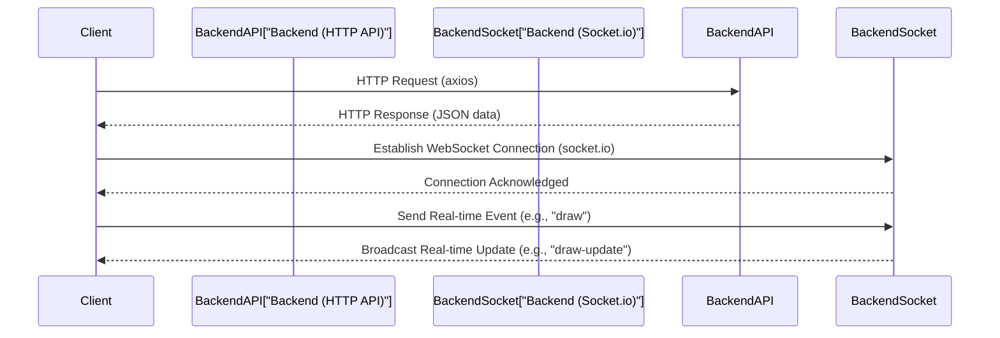

# Client-side Utilities

This section details the foundational client-side utilities responsible for handling API communication, establishing real-time WebSocket connections, and managing global styling for the `white-board-project` frontend. These services ensure seamless interaction with the backend and a consistent visual presentation across the application.

## API Service

The application utilizes `axios` to create a dedicated HTTP client for making API requests to the backend. This configuration centralizes the base URL and ensures that credentials (like cookies) are sent with every request, which is crucial for authenticated sessions. The API client is configured to connect to the deployed backend service.

```js
import axios from "axios";
const instance=axios.create({
    baseURL:'https://collabboard-8o88.onrender.com/api',withCredentials:true
})
export default instance;
```

This `instance` is then imported and used throughout the frontend for all HTTP-based interactions, such as fetching data, submitting forms, and other RESTful operations.

## Real-time Communication

For real-time functionalities, such as collaborative whiteboard updates, the application leverages `socket.io`. A configured socket client establishes a WebSocket connection to the backend, enabling instantaneous, bidirectional communication. Similar to the API service, it's configured with the deployed backend URL and `withCredentials` to maintain session integrity.

```js
import { io } from 'socket.io-client';
const socket = io('https://collabboard-8o88.onrender.com', {
    transports: ['websocket'],
    withCredentials: true,
});
export default socket;
```

The `transports: ['websocket']` option explicitly prioritizes WebSocket connections, ensuring optimal real-time performance. This `socket` instance is central to features requiring live updates and synchronization between clients.

## Global Styling

The `white-board-project` adopts Tailwind CSS for its styling framework. Global styles and the integration of Tailwind are managed through `App.css`, which imports Tailwind's utility classes, making them available throughout the application.

```css
@import "tailwindcss";
```

This simple import ensures that the entire suite of Tailwind CSS utilities is included, allowing for rapid and consistent styling directly within components without needing to write extensive custom CSS.

## Communication Flow

The following diagram illustrates how the client interacts with the backend services for both traditional API calls and real-time WebSocket communication.





## Integration Details

These client-side utilities are designed to be easily pluggable into any React component or service. The `axios` instance provides a consistent way to handle all HTTP requests, centralizing error handling and authentication token management. The `socket.io` instance offers a robust channel for real-time events, enabling features like multi-user collaboration. Finally, the Tailwind CSS integration through `App.css` ensures that the application maintains a cohesive and responsive design with minimal effort. Together, these utilities form the backbone of the client's interaction capabilities and visual presentation.