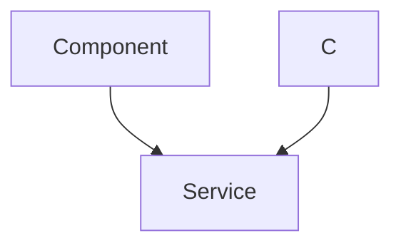

# Real-time Communication

This section details the implementation of real-time features within the white-board-project, focusing on drawing collaboration and chat functionalities using WebSockets. The system is designed to allow multiple users to interact with a shared whiteboard and communicate through text messages in real-time.

## Key Features

*   **Real-time Drawing:** Enables multiple users to draw on the same whiteboard simultaneously.
*   **Text Chat:** Provides a chat interface for users to communicate during collaboration sessions.
*   **User Presence:** Indicates when users join or leave a room.
*   **Permission Management:** Allows hosts to grant or revoke drawing permissions to other participants.

## Technology Stack

| Technology   | Purpose                               |
| :----------- | :------------------------------------ |
| React        | Frontend framework                    |
| Socket.IO    | Real-time communication library     |
| Node.js      | Backend runtime environment           |
| Express.js   | Backend web application framework      |
| MongoDB      | Database for storing room data        |
| Auth0        | Authentication Provider               |

## Backend Implementation (Node.js with Socket.IO)

The backend uses Node.js with Express.js and Socket.IO to manage WebSocket connections and handle real-time events.

### Socket.IO Setup

The `backend/lib/socket.js` file initializes the Socket.IO server and defines event handlers for various client actions.

```javascript title="backend/lib/socket.js"
import express from 'express'
import { Server } from 'socket.io'
import http from 'http'
import Room from '../models/Room.model.js';
import RoomDrawing from '../models/drawingData.js';
const app = express();
const server = http.createServer(app);
const io = new Server(server, {
    cors: { origin: ['http://localhost:5173'] }
})

io.on('connection', (socket) => {
    console.log('🟢 User Connected:', socket.id);

    socket.on('disconnect', () => {
        console.log('🔴 User Disconnected:', socket.id);
    })

    socket.on('joinroom', ({ roomid, name, userid }) => {
        socket.join(roomid);
        console.log("Join Room");
        // socket.id = userid;
        socket.to(roomid).emit('User Joined', socket.id);
    });
    socket.on('offer', (offer, targetId) => {
        socket.to(targetId).emit('offer', offer, socket.id);
    });
    socket.on('answer', (answer, targetId) => {
        socket.to(targetId).emit('answer', answer);
    });

    socket.on('ice-candidate', (candidate, targetId) => {
        socket.to(targetId).emit('ice-candidate', candidate);
    });

    socket.on('toggle-mic', (roomId, micStatus) => {
        socket.to(roomId).emit('mic-status', { userId: socket.id, micStatus });
    });

    socket.on('leaveroom', ({ roomid, name }) => {
        socket.leave(roomid);
        console.log("uioii");
        // socket.broadcast.emit('User Left', socket.id);
        socket.to(roomid).emit('User Left',{name});
    });
    // socket.on('KickOut', ({ roomid, userid, username }) => {
    //     console.log(userid);
    //     socket.to(roomid).emit('User Kicked', username)
    //     socket.broadcast.emit('User Left', userid);
    // })
    socket.on('sendChat', async ({ roomid, name, sender, message }) => {
        try {

            if (!message.trim()) return; // Ignore empty messages
            // console.log(message);
            const timestamps = new Date().toISOString();
            console.log(typeof (name), typeof (sender), typeof (message), typeof (timestamps));
            const room = await Room.findOne({ roomid });
            if (!room) console.log("Room Not Found!");
            // console.log(room.messages.size());
            room.messages.push({ name, sender, message });
            await room.save();
            console.log('saved Room Success!');
            // console.log(room.messages);
            const umessages = room.messages;
            // console.log(umessages);
            io.to(roomid).emit('receiveChat', umessages);
        } catch (error) {
            console.error("saving messages error:", error);
        }
    })
    socket.on('handleReq', async ({ roomid, userid, name }) => {
        try {
            console.log(2, userid, roomid);
            const room = await Room.findOne({ roomid });
            if (!room) console.log("Room Not Found!");
            const p = room.participants.find(x => x.id === userid);
            console.log(p);
            if (!p) console.log("Participant Not Found!");
            io.to(roomid).emit('AskPermission', ({ name, hostid: room.hostuser, userid }));
        } catch (error) {
            console.error("Request error:", error);
        }
    })
    socket.on('grantDrawP', async ({ hostid, userid, granted, roomid }) => {
        try {
            console.log(5, granted, roomid, userid, hostid);
            const room = await Room.findOne({ roomid });
            if (!room) console.log("Room Not Found!");
            const p = room.participants.find(x => x.id === userid);
            console.log(p);
            if (!p) console.log("Participant Not Found!");
            p.candraw = granted;
            await room.save();
            console.log(room.participants);
            io.to(roomid).emit('participantsUpdate', room.participants);
            console.log('After participantUpdate');
            io.to(roomid).emit('PermissionResult', ({ userid: p.id, granted }));
        } catch (error) {
            console.error("Request error:", error);
        }

    })

    socket.on('newElement', async ({ element, roomid }) => {
        await RoomDrawing.updateOne(
            { roomid: `${roomid}` },
            { $push: { drawingData: element } },
            { upsert: true }
        );
        io.to(roomid).emit('drawElement', element);
    });


})
export { io, server, app };
```

This snippet showcases the core of the WebSocket server. It listens for various events:

*   `connection`: Handles new client connections.
*   `disconnect`: Handles client disconnections.
*   `joinroom`: Adds a user to a specific room.
*   `leaveroom`: Remove user to a specific room.
*   `sendChat`: Broadcasts chat messages to all users in a room.
*   `newElement`: Broadcasts drawing data to all users in a room.

[View on GitHub](https://github.com/sumedhcharjan/white-board-project/blob/main/backend/lib/socket.js)

### Joining a Room

When a user joins a room, the `joinroom` event is emitted. The server adds the socket to the specified room and notifies other users in the room about the new user.

```javascript title="backend/lib/socket.js"
 socket.on('joinroom', ({ roomid, name, userid }) => {
        socket.join(roomid);
        console.log("Join Room");
        // socket.id = userid;
        socket.to(roomid).emit('User Joined', socket.id);
    });
```

[View on GitHub](https://github.com/sumedhcharjan/white-board-project/blob/main/backend/lib/socket.js)

### Sending Chat Messages

The `sendChat` event is triggered when a user sends a chat message. The server saves the message to the database and broadcasts it to all users in the room.

```javascript title="backend/lib/socket.js"
 socket.on('sendChat', async ({ roomid, name, sender, message }) => {
        try {

            if (!message.trim()) return; // Ignore empty messages
            // console.log(message);
            const timestamps = new Date().toISOString();
            console.log(typeof (name), typeof (sender), typeof (message), typeof (timestamps));
            const room = await Room.findOne({ roomid });
            if (!room) console.log("Room Not Found!");
            // console.log(room.messages.size());
            room.messages.push({ name, sender, message });
            await room.save();
            console.log('saved Room Success!');
            // console.log(room.messages);
            const umessages = room.messages;
            // console.log(umessages);
            io.to(roomid).emit('receiveChat', umessages);
        } catch (error) {
            console.error("saving messages error:", error);
        }
    })
```

[View on GitHub](https://github.com/sumedhcharjan/white-board-project/blob/main/backend/lib/socket.js)

### Handling Drawing Data

The `newElement` event is emitted when a user draws on the whiteboard. The server saves the drawing element and broadcasts it to all users in the room, ensuring that all clients display the same whiteboard content.

```javascript title="backend/lib/socket.js"
 socket.on('newElement', async ({ element, roomid }) => {
        await RoomDrawing.updateOne(
            { roomid: `${roomid}` },
            { $push: { drawingData: element } },
            { upsert: true }
        );
        io.to(roomid).emit('drawElement', element);
    });
```

[View on GitHub](https://github.com/sumedhcharjan/white-board-project/blob/main/backend/lib/socket.js)

### Permission Management
The server listens for permission request using the `handleReq` and grants it using the `grantDrawP` and emits it to frontend using the `AskPermission` and `PermissionResult` events.

```javascript title="backend/lib/socket.js"
 socket.on('handleReq', async ({ roomid, userid, name }) => {
        try {
            console.log(2, userid, roomid);
            const room = await Room.findOne({ roomid });
            if (!room) console.log("Room Not Found!");
            const p = room.participants.find(x => x.id === userid);
            console.log(p);
            if (!p) console.log("Participant Not Found!");
            io.to(roomid).emit('AskPermission', ({ name, hostid: room.hostuser, userid }));
        } catch (error) {
            console.error("Request error:", error);
        }
    })
    socket.on('grantDrawP', async ({ hostid, userid, granted, roomid }) => {
        try {
            console.log(5, granted, roomid, userid, hostid);
            const room = await Room.findOne({ roomid });
            if (!room) console.log("Room Not Found!");
            const p = room.participants.find(x => x.id === userid);
            console.log(p);
            if (!p) console.log("Participant Not Found!");
            p.candraw = granted;
            await room.save();
            console.log(room.participants);
            io.to(roomid).emit('participantsUpdate', room.participants);
            console.log('After participantUpdate');
            io.to(roomid).emit('PermissionResult', ({ userid: p.id, granted }));
        } catch (error) {
            console.error("Request error:", error);
        }

    })

```

[View on GitHub](https://github.com/sumedhcharjan/white-board-project/blob/main/backend/lib/socket.js)

## Frontend Implementation (React)

The frontend is built with React and uses the `socket.io-client` library to establish WebSocket connections with the backend.

### Establishing a Socket Connection

The `frontend/src/lib/socket.js` file initializes the Socket.IO client and exports it for use in other components.

```javascript title="frontend/src/lib/socket.js"
import { io } from 'socket.io-client';
const socket = io('https://collabboard-8o88.onrender.com', {
    transports: ['websocket'],
    withCredentials: true,
});
export default socket;
```

[View on GitHub](https://github.com/sumedhcharjan/white-board-project/blob/main/frontend/src/lib/socket.js)

### Handling Chat Messages

The `Chats.jsx` component handles the display of chat messages and allows users to send new messages.

```javascript title="frontend/src/pages/Chats.jsx"
import React, { useEffect, useRef, useState } from 'react';
import { useAuth0 } from '@auth0/auth0-react';
import { useNavigate, useParams } from 'react-router-dom';
import socket from '/src/lib/socket.js';

const Chats = ({ msgs, setshowchat }) => {
    const { user } = useAuth0();
    const { roomid } = useParams();
    const navigate = useNavigate();
    const chatRef = useRef(null);
    const [chatinp, setchatinp] = useState('');

    useEffect(() => {
        if (chatRef.current) {
            chatRef.current.scrollTop = chatRef.current.scrollHeight;
        }
    }, [msgs]);

    const handleSendMessage = (e) => {
        e.preventDefault();
        if (!chatinp.trim()) return;
        socket.emit('sendChat', {
            name: user.name || user.nickname || user.email,
            sender: user.sub,
            message: chatinp,
            roomid: roomid,
        });
        setchatinp('');
    };

    return (
        <div className="fixed right-0 top-0 h-full w-full sm:w-[min(90vw,20rem)] md:w-[min(40vw,24rem)] lg:w-[min(30vw,28rem)] bg-white shadow-2xl z-50 p-2 sm:p-3 md:p-4 flex flex-col transition-all duration-300 animate-slide-in">
            <div className="flex justify-between items-center mb-3 sm:mb-4">
                <h2 className="text-base sm:text-lg md:text-xl font-semibold text-[#190482] flex items-center gap-2">
                    <svg className="w-5 h-5 sm:w-6 sm:h-6 text-[#7752FE]" fill="none" stroke="currentColor" viewBox="0 0 24 24" xmlns="http://www.w3.org/2000/svg">
                        <path strokeLinecap="round" strokeLinejoin="round" strokeWidth="2" d="M8 12h.01M12 12h.01M16 12h.01M21 12c0 4.418-4.03 8-9 8a9.863 9.863 0 01-4.255-.949L3 20l1.395-3.72C3.512 15.042 3 13.574 3 12c0-4.418 4.03-8 9-8s9 3.582 9 8z"></path>
                    </svg>
                    Room Chat
                </h2>
                <button
                    onClick={() => setshowchat((prev) => !prev)}
                    className="text-[#7752FE] hover:text-[#8E8FFA] text-lg sm:text-xl md:text-2xl font-bold transition-colors duration-200 p-2"
                    aria-label="Close chat"
                >
                    ×
                </button>
            </div>
            <div
                ref={chatRef}
                className="flex-1 bg-[#C2D9FF]/10 p-2 sm:p-3 rounded-lg overflow-y-auto max-h-[calc(100vh-10rem)] sm:max-h-[calc(100vh-11rem)] md:max-h-[calc(100vh-12rem)] scroll-smooth"
            >
                {msgs && msgs.length > 0 ? (
                    msgs.map((m, index) => (
                        <div
                            key={`${m.sender}-${m.timestamp}-${index}`}
                            className={`mb-2 sm:mb-3 flex ${user.sub === m.sender ? 'justify-end' : 'justify-start'}`}
                        >
                            <div
                                className={`max-w-[80%] sm:max-w-[70%] p-2 sm:p-3 rounded-lg shadow-sm ${user.sub === m.sender
                                    ? 'bg-[#7752FE] text-white'
                                    : 'bg-[#C2D9FF]/30 text-[#190482]'
                                }`}
                            >
                                <div className="flex justify-between items-baseline gap-2">
                                    <span className="text-xs sm:text-sm font-semibold">
                                        {user.sub === m.sender ? 'You' : m.name}
                                    </span>
                                    <span className="text-xs text-gray-400">
                                        {new Date(m.timestamp).toLocaleTimeString([], {
                                            hour: '2-digit',
                                            minute: '2-digit',
                                        })}
                                    </span>
                                </div>
                                <p className="text-sm sm:text-base mt-1">{m.message}</p>
                            </div>
                        </div>
                    ))
                ) : (
                    <p className="text-sm sm:text-base text-gray-500 italic text-center">No messages yet. Start chatting!</p>
                )}
            </div>
            <div className="mt-2 sm:mt-3 flex gap-2">
                <input
                    type="text"
                    value={chatinp}
                    onKeyDown={(e) => e.key === 'Enter' && handleSendMessage(e)}
                    onChange={(e) => setchatinp(e.target.value)}
                    placeholder="Type a message..."
                    className="flex-1 bg-[#C2D9FF]/10 text-[#190482] p-2 sm:p-3 rounded-lg focus:outline-none focus:ring-2 focus:ring-[#7752FE] transition-all duration-200 text-sm sm:text-base"
                />
                <button
                    type="submit"
                    onClick={handleSendMessage}
                    className="bg-[#7752FE] text-white px-3 sm:px-4 py-2 rounded-lg hover:bg-[#8E8FFA] transition-all duration-200 text-sm sm:text-base"
                >
                    Send
                </button>
            </div>
        </div>
    );
};

export default Chats;
```

[View on GitHub](https://github.com/sumedhcharjan/white-board-project/blob/main/frontend/src/pages/Chats.jsx)

### Implementing the Whiteboard

The `JoinWhiteboard.jsx` component manages the whiteboard canvas and handles drawing events.

```javascript title="frontend/src/components/Canvas/JoinWhiteboard.jsx"
import { useAuth0 } from '@auth0/auth0-react';
import React, { useEffect, useRef, useState } from 'react';
import socket from '/src/lib/socket.js';
import { useParams } from 'react-router-dom';
import toast from 'react-hot-toast';
import axios from '/src/lib/axios.js';

const Whiteboard = ({ selectedColor, selectedTool, candraw, elements, width }) => {
    const canvasRef = useRef(null);
    const { roomid } = useParams();
    const { user } = useAuth0();
    const [isDrawing, setIsDrawing] = useState(false);
    const [coordinates, setCoordinates] = useState({ x: 0, y: 0 });
    const [erasing, setErasing] = useState(false);
    const [elementsArray, setElementsArray] = useState([]);

    useEffect(() => {
        setElementsArray(elements);
    }, [elements]);

    useEffect(() => {
        const canvas = canvasRef.current;
        const parent = canvas.parentElement;

        // Function to update canvas size and redraw
        const updateCanvasSize = () => {
            const { width, height } = parent.getBoundingClientRect();
            canvas.width = width;
            canvas.height = height * 0.9;
            redrawAll(elementsArray); // Redraw lines after resizing
        };

        // Initialize canvas size
        updateCanvasSize();

        // Create a ResizeObserver to handle resizing
        const resizeObserver = new ResizeObserver(updateCanvasSize);
        resizeObserver.observe(parent);

        // Cleanup on unmount
        return () => {
            resizeObserver.disconnect();
        };
    }, [elementsArray]);

    useEffect(() => {
        const handleDrawElement = (line) => {
            setElementsArray(prev => [...prev, line]);
        };

        socket.on('drawElement', handleDrawElement);
        socket.on('clearCanvas', () => {
            setElementsArray([]); // Clear local state
            redrawAll([]); // Clear canvas
        });

        return () => {
            socket.off('drawElement', handleDrawElement);
        };
    }, []);

    useEffect(() => {
        redrawAll(elementsArray);
    }, [elementsArray]);

    const redrawAll = (lines) => {
        if (!Array.isArray(lines)) {
            console.warn('Invalid lines:', lines);
            return;
        }

        const canvas = canvasRef.current;
        const ctx = canvas?.getContext('2d');
        ctx.clearRect(0, 0, canvas.width, canvas.height);

        lines.forEach(line => {
            if (!line || !line.points || line.points.length < 2) {
                console.warn('Skipped invalid line:', line);
                return;
            }
            ctx.beginPath();
            ctx.moveTo(line.points[0].x, line.points[0].y);
            ctx.lineTo(line.points[1].x, line.points[1].y);
            ctx.strokeStyle = line.color;
            ctx.lineWidth = line.width;
            ctx.stroke();
        });
    };

    const getCoordinates = (e) => {
        const canvas = canvasRef.current;
        const rect = canvas.getBoundingClientRect();
        if (e.type.includes('touch')) {
            const touch = e.touches[0] || e.changedTouches[0];
            return {
                x: touch.clientX - rect.left,
                y: touch.clientY - rect.top
            };
        }
        return {
            x: e.nativeEvent.offsetX,
            y: e.nativeEvent.offsetY
        };
    };

    const startDraw = (e) => {
        if (!candraw) return;
        e.preventDefault(); // Prevent scrolling
        setIsDrawing(true);
        const coords = getCoordinates(e);
        setCoordinates(coords);
    };

    const handleRequest = async () => {
        try {
            socket.emit('handleReq', { roomid, userid: user?.sub, name: user.name });
            console.log('Sent request to host!');
            toast.success('Draw permission requested!', { id: `request-${user.sub}` });
        } catch (error) {
            console.error('Error requesting permission:', error);
            toast.error('Failed to request permission');
        }
    };

    const draw = (e) => {
        if (!isDrawing || !candraw) return;
        e.preventDefault(); 
        const newCoords = getCoordinates(e);
        const newElement = {
            type: selectedTool,
            color: selectedColor || '#000',
            width: width,
            points: [
                { x: coordinates.x, y: coordinates.y },
                { x: newCoords.x, y: newCoords.x }
            ]
        };
        setElementsArray(prev => [...prev, newElement]);
        setCoordinates(newCoords);
        socket.emit('newElement', { roomid, element: newElement });
    };

    const erase = (e) => {
        if (!isDrawing || !candraw) return;
        e.preventDefault(); // Prevent scrolling
        const canvas = canvasRef.current;
        const ctx = canvas.getContext('2d');
        const coords = getCoordinates(e);
        ctx.clearRect(coords.x - 10, coords.y - 10, 20, 20);
    };

    const clearAll = async () => {
        try {
            const response = await axios.delete(`/room/clearelements`, {
                params: { roomid }
            });
            console.log('Cleared successfully:', response.data);
            setElementsArray([]); // Clear local state
            redrawAll([]); // Clear canvas
        } catch (error) {
            console.error('Error clearing elements:', error);
            toast.error('Failed to clear whiteboard');
        }
    };

    const stopDraw = (e) => {
        if (!candraw) return;
        e.preventDefault(); // Prevent scrolling
        setIsDrawing(false);
    };

    const comingSoon = () => {
        toast.success("Coming Soon");
    };

    return (
        <div className="p-3 w-full h-auto">
            <div className="flex items-center justify-between">
                {candraw ? (
                    <div className='flex w-17 justify-between align-middle p-2'>
                        <button className='p-1 mr-1' onClick={comingSoon}>↶</button>
                        <button className='p-1 ml-1' onClick={comingSoon}>↷</button>
                    </div>
                ) : null}
                {candraw ? (
                    <button
                        className="bg-red-500 mb-2 hover:bg-red-700 text-white font-bold py-2 px-4 rounded-full"
                        onClick={clearAll}
                    >
                        Clear
                    </button>
                ) : null}
                {!candraw ? (
                    <button
                        className="bg-blue-500 mb-2 hover:bg-blue-700 text-white font-bold py-2 px-4 rounded-full"
                        onClick={handleRequest}
                    >
                        Request Permission
                    </button>
                ) : null}
            </div>
            <canvas
                id="Whiteboard"
                ref={canvasRef}
                onMouseDown={candraw ? startDraw : undefined}
                onMouseMove={candraw ? (erasing ? erase : draw) : undefined}
                onMouseUp={candraw ? stopDraw : undefined}
                onMouseLeave={candraw ? stopDraw : undefined}
                onTouchStart={candraw ? startDraw : undefined}
                onTouchMove={candraw ? (erasing ? erase : draw) : undefined}
                onTouchEnd={candraw ? stopDraw : undefined}
                onTouchCancel={candraw ? stopDraw : undefined}
                className={`w-full h-full border-2 border-gray-700 block touch-none ${erasing ? 'cursor-pointer' : 'cursor-crosshair'}`}
            ></canvas>
        </div>
    );
};

export default Whiteboard;
```

This component handles:

*   Drawing lines on the canvas.
*   Receiving drawing data from other users via Socket.IO.
*   Managing the state of the whiteboard elements.
*   Requesting drawing permissions

[View on GitHub](https://github.com/sumedhcharjan/white-board-project/blob/main/frontend/src/components/Canvas/JoinWhiteboard.jsx)

## Real-time Communication Flow

```mermaid
graph LR
    A["User A"] -->|"Draws on Canvas"| B["Frontend (React)"];
    B -->|"Emit 'newElement' event"| C["Socket.IO Client"];
    C -->|"WebSocket"| D["Socket.IO Server (Node.js)"];
    D -->|"Broadcast 'drawElement' event"| E["Socket.IO Clients"];
    E -->|"Update Canvas"| F["Frontend (React)"];
    F --> G["User B, User C, ..."];
    style A fill:#f9f,stroke:#333,stroke-width:2px
    style G fill:#f9f,stroke:#333,stroke-width:2px
```





## Permission Request Flow





## Key Integration Points

*   The `socket.js` file in the frontend is a central point for managing WebSocket connections.
*   The `Chats.jsx` and `JoinWhiteboard.jsx` components integrate with the socket to send and receive real-time data.
*   The backend `socket.js` file handles all WebSocket events and ensures data consistency across clients.

By using WebSockets, the white-board-project enables real-time collaboration, making it a powerful tool for remote teams.
```