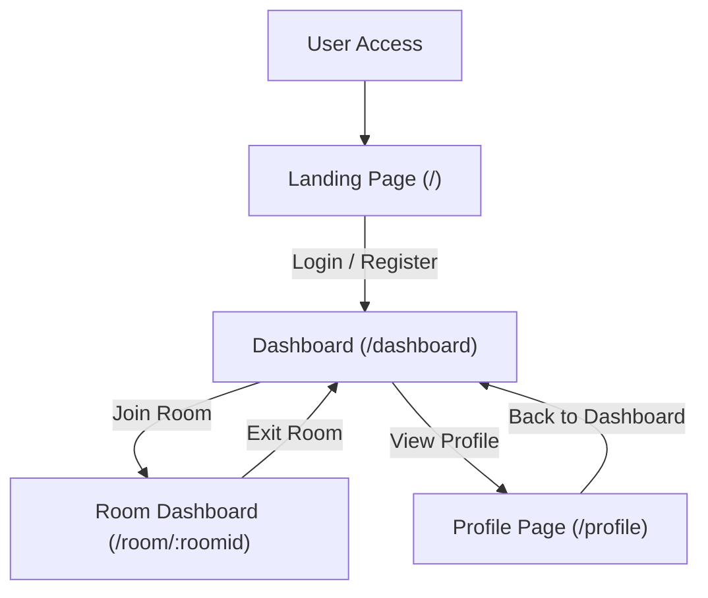

# Frontend Application

The frontend application provides the client-side user interface for the CollabBoard project, built with React and Vite. It offers a responsive and interactive experience for users to create, join, and collaborate on whiteboards. This section outlines the core structure, main application component, and build configuration.

## Application Entry Point

The `index.html` file serves as the single entry point for the client-side application. It defines the root element where the React application will be mounted and includes the main JavaScript bundle.

```html
<!doctype html>
<html lang="en">
  <head>
    <meta charset="UTF-8" />
    <link rel="icon" type="image/svg+xml" href="/download.jpg" />
    <meta name="viewport" content="width=device-width, initial-scale=1.0" />
    <title>CollabBoard</title>
    <link href="./src/style/index.css">
  </head>
  <body>
    <div id="root"></div>
    <script type="module" src="/src/main.jsx"></script>
  </body>
</html>
```

The `<div id="root"></div>` is the DOM node where the React application is rendered. The `<script type="module" src="/src/main.jsx"></script>` tag indicates the main JavaScript file that bootstraps the React application.

## Main Application Component

The `App.jsx` component is the central hub for the frontend application. It sets up client-side routing using `react-router-dom`, defining the various pages and their corresponding paths. It also integrates a global toast notification system.

```jsx
import LandingPage from './pages/LandingPage'
import './style/App.css'
import { RouterProvider, createBrowserRouter } from 'react-router-dom';
import Dashboard from './pages/Dashboard';
import Roomdashboard from './components/JoinRoom/JoinRoomdashboard';
import { Toaster } from 'react-hot-toast';
import ProfilePage from './components/Profile/ProfilePage';


function App() {

  const router = createBrowserRouter([
    {
      path: "/",
      element: <LandingPage />
    },
    {
      path: "/dashboard",
      element: <Dashboard />
    },
    {
      path: '/room/:roomid',
      element: <Roomdashboard />
    },
    {
      path:`/profile`,
      element:<ProfilePage></ProfilePage>
    }
  ])

  return (
    <>
      <Toaster position="top-right" reverseOrder={false} />
      <RouterProvider router={router} />
    </>
  )
}

export default App
```

The `createBrowserRouter` function configures the application's routes:
-   `/`: The initial `LandingPage`.
-   `/dashboard`: The main `Dashboard` after authentication.
-   `/room/:roomid`: A dynamic route for specific whiteboard rooms, rendered by `Roomdashboard`.
-   `/profile`: Displays the `ProfilePage`.

The `RouterProvider` component makes the router available throughout the application. The `Toaster` component from `react-hot-toast` provides a simple way to display transient notifications to the user.

## Styling

The frontend leverages Tailwind CSS for utility-first styling. The main stylesheet `index.css` imports Tailwind CSS, enabling its classes to be used directly within React components.

```css
@import "tailwindcss";
```

This simple import ensures that Tailwind's base styles and utility classes are available globally across the application.

## Build Configuration

The project utilizes Vite as its build tool, configured via `vite.config.js`. Vite provides a fast development experience and optimizes the production build.

```js
import { defineConfig } from 'vite'
import react from '@vitejs/plugin-react-swc'
import tailwindcss from '@tailwindcss/vite'


// https://vite.dev/config/
export default defineConfig({
  plugins: [react() ,    tailwindcss()
  ],
})
```

Key plugins used in the configuration include:
-   `@vitejs/plugin-react-swc`: Provides fast refresh and build optimizations for React applications using SWC (Speedy Web Compiler).
-   `@tailwindcss/vite`: Integrates Tailwind CSS with Vite, enabling features like JIT (Just-In-Time) compilation and ensuring efficient CSS bundling.

## Frontend Application Flow

The following diagram illustrates the high-level navigation flow within the frontend application based on the defined routes.





## Key Takeaways

The frontend application is structured around React and Vite, offering a modern development stack. `react-router-dom` efficiently handles navigation, providing distinct routes for the landing page, user dashboard, individual collaboration rooms, and profile management. Tailwind CSS is integrated for streamlined styling, while Vite, with its `react-swc` and `tailwindcss` plugins, ensures a performant build and development environment.