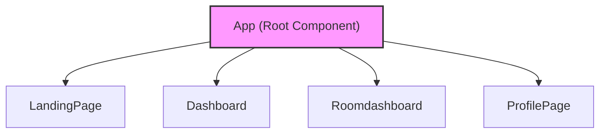
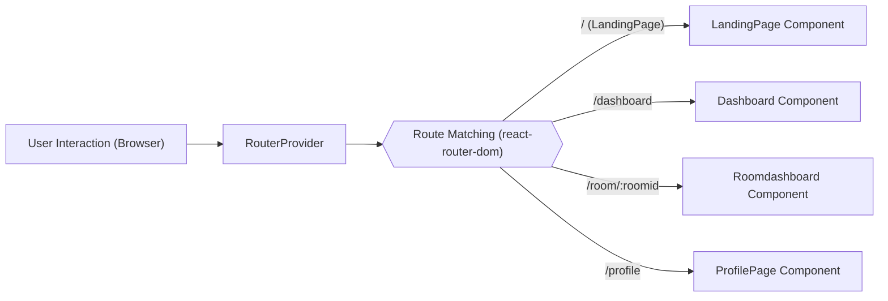

# Frontend Architecture

This document outlines the frontend architecture of the whiteboard project, detailing the component structure, state management approach, and key integration points. The frontend is built using React, leveraging libraries such as Auth0 for authentication, Socket.IO for real-time communication, and React Router for navigation.

## Component Hierarchy

The application follows a component-based architecture, promoting reusability and maintainability. The main components include:

-   `App`: The root component that sets up routing and global providers.
-   `LandingPage`: The initial landing page for the application.
-   `Dashboard`: The main dashboard accessible after authentication.
-   `Roomdashboard`: The interactive whiteboard interface within a specific room.
-   `ProfilePage`: The user's profile page, allowing them to view and manage their information.





## Core Technologies

The frontend utilizes the following core technologies:

-   **React:** A JavaScript library for building user interfaces.
-   **React Router:** For handling navigation between different pages.
-   **Auth0:** For user authentication and authorization.
-   **Socket.IO:** For real-time communication between the client and server.
-   **React Hot Toast:**  For displaying toast notifications.
-   **Axios:** For making HTTP requests to the backend API.

Here's the project's `package.json` file, which lists the project's dependencies and scripts:

```json title="frontend/package.json"
{
  "name": "frontend",
  "private": true,
  "version": "0.0.0",
  "type": "module",
  "scripts": {
    "dev": "vite",
    "build": "node ./node_modules/vite/bin/vite.js build",
    "lint": "eslint .",
    "preview": "vite preview"
  },
  "dependencies": {
    "@auth0/auth0-react": "^2.3.0",
    "@tailwindcss/vite": "^4.0.14",
    "axios": "^1.8.4",
    "dotenv": "^16.4.7",
    "react": "^19.0.0",
    "react-dom": "^19.0.0",
    "react-hot-toast": "^2.5.2",
    "react-icons": "^5.5.0",
    "react-router-dom": "^7.7.1",
    "react-toastify": "^11.0.5",
    "socket.io-client": "^4.8.1",
    "tailwindcss": "^4.0.14"
  },
  "devDependencies": {
    "@eslint/js": "^9.21.0",
    "@types/react": "^19.0.10",
    "@types/react-dom": "^19.0.4",
    "@vitejs/plugin-react-swc": "^3.8.0",
    "eslint": "^9.21.0",
    "eslint-plugin-react-hooks": "^5.1.0",
    "eslint-plugin-react-refresh": "^0.4.19",
    "globals": "^15.15.0",
    "vite": "^6.3.5"
  },
  "description": "white board project frontend",
  "main": "eslint.config.js",
  "author": "sumedh",
  "license": "ISC"
}
```

[View on GitHub](https://github.com/sumedhcharjan/white-board-project/blob/main/frontend/package.json)

## Routing

The `App.jsx` component configures the application's routing using `react-router-dom`.  It defines routes for the landing page, dashboard, room dashboard, and profile page.

```javascript title="frontend/src/App.jsx"
import LandingPage from './pages/LandingPage'
import './style/App.css'
import { RouterProvider, createBrowserRouter } from 'react-router-dom';
import Dashboard from './pages/Dashboard';
import Roomdashboard from './components/JoinRoom/JoinRoomdashboard';
import { Toaster } from 'react-hot-toast';
import ProfilePage from './components/Profile/ProfilePage';


function App() {

  const router = createBrowserRouter([
    {
      path: "/",
      element: <LandingPage />
    },
    {
      path: "/dashboard",
      element: <Dashboard />
    },
    {
      path: '/room/:roomid',
      element: <Roomdashboard />
    },
    {
      path:`/profile`,
      element:<ProfilePage></ProfilePage>
    }
  ])

  return (
    <>
      <Toaster position="top-right" reverseOrder={false} />
      <RouterProvider router={router} />
    </>
  )
}

export default App
```

This code snippet demonstrates how `createBrowserRouter` is used to define the routes and associate them with their respective components. The `RouterProvider` then renders the appropriate component based on the current URL.

[View on GitHub](https://github.com/sumedhcharjan/white-board-project/blob/main/frontend/src/App.jsx)





## Authentication

Auth0 is used to handle user authentication. The `Auth0Provider` wraps the entire application in `main.jsx`, providing authentication context to all components.

```javascript title="frontend/src/main.jsx"
import { StrictMode } from 'react'
import { createRoot } from 'react-dom/client'
import './style/index.css'
import App from './App.jsx'
import { Auth0Provider } from '@auth0/auth0-react';


createRoot(document.getElementById('root')).render(
  <Auth0Provider
    domain="dev-eiqbf3dufeploub7.us.auth0.com"
    clientId="fIIXOxWwmSkOM3N6vrX7Qvt2G88hCbSo"
    authorizationParams={{
      redirect_uri: window.location.origin + "/dashboard"
    }}
    cacheLocation="localstorage"
    useRefreshTokens={true}
  >
    <StrictMode>
      <App />
    </StrictMode>
  </Auth0Provider>
)
```

This code snippet shows the initialization of Auth0 with the necessary configuration, including the domain, client ID, and redirect URI.  The `redirect_uri` ensures that after successful authentication, the user is redirected to the dashboard.

[View on GitHub](https://github.com/sumedhcharjan/white-board-project/blob/main/frontend/src/main.jsx)

## Real-time Communication

Socket.IO is employed for real-time communication, enabling features such as collaborative drawing and chat within the whiteboard rooms.  The client connects to the server upon entering a room, and listens for events such as drawing actions and messages. While no specific code excerpt provided for the integration. The integration generally involves the usage of the library `socket.io-client` in React components (particularly within the `Roomdashboard`) to establish and maintain a WebSocket connection with the backend server.

```javascript title="Example Socket.IO integration (Conceptual)"
import { useEffect } from 'react';
import { io } from 'socket.io-client';

function Whiteboard() {
  useEffect(() => {
    const socket = io('YOUR_BACKEND_URL'); // Replace with your actual backend URL

    socket.on('connect', () => {
      console.log('Connected to server');
    });

    socket.on('drawing', (data) => {
      // Handle drawing data received from the server
      console.log('Drawing data:', data);
    });

    return () => {
      socket.disconnect(); // Clean up on unmount
    };
  }, []);

  return (
    <div>
      {/* Whiteboard UI */}
    </div>
  );
}

export default Whiteboard;
```

This conceptual code provides a blueprint of how to use `Socket.IO` in a react Component.

## State Management

The frontend primarily relies on React's built-in state management capabilities using `useState` and `useContext` hooks. For more complex state management needs, libraries like Redux or Zustand could be integrated in the future.

## Key Integration Points

-   **Authentication Flow:**  Users are authenticated via Auth0. Upon successful authentication, they are redirected to the dashboard.  The `useAuth0` hook provides access to the authentication state and methods for login and logout.

-   **Room Joining:** When a user joins a room, the frontend establishes a Socket.IO connection with the backend, allowing for real-time communication and collaboration within the whiteboard.

-   **Profile Management:** The ProfilePage component allows users to view and manage their profile information, potentially fetching data from a backend API.

-   **Data Fetching:** Axios is used to make API requests to the backend, for example, to retrieve room details, user information, or save whiteboard data.

By adhering to these architectural principles and best practices, the frontend aims to provide a robust, scalable, and maintainable platform for collaborative whiteboarding.
```