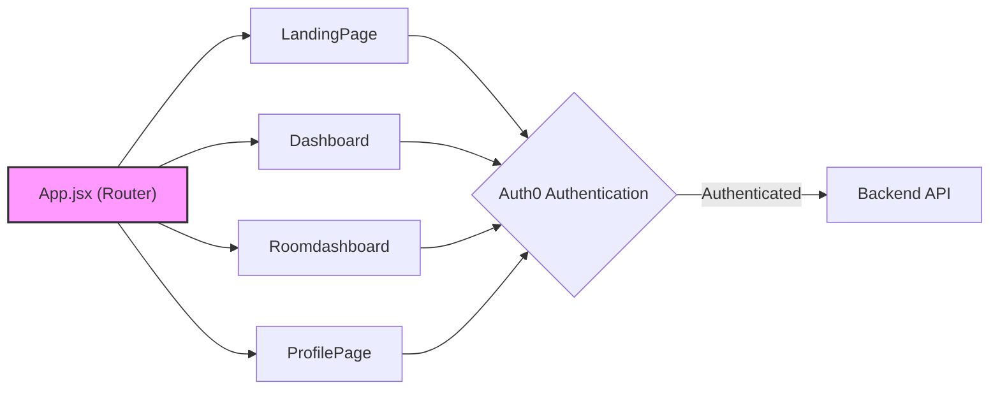
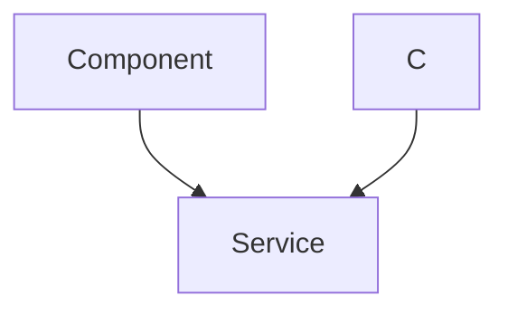

# Frontend Development

This section delves into the frontend architecture of the white-board-project, which is built using React. It covers the key components, state management, and routing implementation that contribute to the user interface and overall application flow.

## Key Features

*   **React-based UI:** Utilizes React components for building a modular and reusable user interface.
*   **Routing:** Employs `react-router-dom` for managing navigation between different pages.
*   **State Management:** React's built-in state management capabilities are used, potentially augmented with context or custom hooks for more complex data flows.
*   **Authentication:** Integrates with Auth0 for user authentication and authorization.
*   **Real-time Communication:** Leverages Socket.IO for real-time communication between the frontend and backend.

## Technologies Used

| Technology        | Version | Description                                              |
| :---------------- | :------ | :------------------------------------------------------- |
| React             | ^19.0.0 | JavaScript library for building user interfaces        |
| React Router DOM  | ^7.7.1  | Library for handling routing in React applications     |
| Auth0 React       | ^2.3.0  | Library for integrating Auth0 authentication into React |
| Socket.IO Client  | ^4.8.1  | Library for establishing real-time WebSocket connections |
| Axios             | ^1.8.4  | Promise based HTTP client for making API requests       |
| Vite              | ^6.3.5  | Frontend build tool                                      |
| Tailwind CSS      | ^4.0.14 | CSS framework for styling components                   |
| React Hot Toast   | ^2.5.2  | Library for displaying toast notifications             |
| React Icons       | ^5.5.0  | Library for using icons in React components            |

## Core Components

*   **App.jsx:** The root component that defines the application's routing configuration.
*   **LandingPage:** The initial landing page for users.
*   **Dashboard:** The main dashboard accessible after authentication.
*   **Roomdashboard:** Component for collaborative whiteboard functionality within a specific room.
*   **ProfilePage:** Component to display User Profile Details

## Routing Configuration

The `App.jsx` file defines the application's routing using `react-router-dom`.

```javascript
// File: frontend/src/App.jsx
import LandingPage from './pages/LandingPage'
import './style/App.css'
import { RouterProvider, createBrowserRouter } from 'react-router-dom';
import Dashboard from './pages/Dashboard';
import Roomdashboard from './components/JoinRoom/JoinRoomdashboard';
import { Toaster } from 'react-hot-toast';
import ProfilePage from './components/Profile/ProfilePage';


function App() {

  const router = createBrowserRouter([
    {
      path: "/",
      element: <LandingPage />
    },
    {
      path: "/dashboard",
      element: <Dashboard />
    },
    {
      path: '/room/:roomid',
      element: <Roomdashboard />
    },
    {
      path:`/profile`,
      element:<ProfilePage></ProfilePage>
    }
  ])

  return (
    <>
      <Toaster position="top-right" reverseOrder={false} />
      <RouterProvider router={router} />
    </>
  )
}

export default App

```

[View on GitHub](https://github.com/sumedhcharjan/white-board-project/blob/main/frontend/src/App.jsx)

The `createBrowserRouter` function is used to define the routes.  Each route object specifies a `path` and the corresponding `element` (React component) to render. The `RouterProvider` component makes the router available to the application.

## Authentication with Auth0

The `main.jsx` file configures Auth0 for authentication.

```javascript
// File: frontend/src/main.jsx
import { StrictMode } from 'react'
import { createRoot } from 'react-dom/client'
import './style/index.css'
import App from './App.jsx'
import { Auth0Provider } from '@auth0/auth0-react';


createRoot(document.getElementById('root')).render(
  <Auth0Provider
    domain="dev-eiqbf3dufeploub7.us.auth0.com"
    clientId="fIIXOxWwmSkOM3N6vrX7Qvt2G88hCbSo"
    authorizationParams={{
      redirect_uri: window.location.origin + "/dashboard"
    }}
    cacheLocation="localstorage"
    useRefreshTokens={true}
  >
    <StrictMode>
      <App />
    </StrictMode>
  </Auth0Provider>
)
```

[View on GitHub](https://github.com/sumedhcharjan/white-board-project/blob/main/frontend/src/main.jsx)

The `Auth0Provider` component wraps the entire application, providing authentication context to all components.  The `domain`, `clientId`, and `redirect_uri` are essential for configuring Auth0. The `cacheLocation` and `useRefreshTokens` are also important settings.

## Vite Configuration

The `vite.config.js` file configures the Vite build tool.

```javascript
// File: frontend/vite.config.js
import { defineConfig } from 'vite'
import react from '@vitejs/plugin-react-swc'
import tailwindcss from '@tailwindcss/vite'


// https://vite.dev/config/
export default defineConfig({
  plugins: [react() ,    tailwindcss()
  ],
})
```

[View on GitHub](https://github.com/sumedhcharjan/white-board-project/blob/main/frontend/vite.config.js)

This configuration specifies the React plugin and Tailwind CSS plugin, enabling JSX transformation and Tailwind CSS support.

## Package Dependencies

The `package.json` file lists the project's dependencies and scripts.

```json
// File: frontend/package.json
{
  "name": "frontend",
  "private": true,
  "version": "0.0.0",
  "type": "module",
  "scripts": {
    "dev": "vite",
    "build": "node ./node_modules/vite/bin/vite.js build",
    "lint": "eslint .",
    "preview": "vite preview"
  },
  "dependencies": {
    "@auth0/auth0-react": "^2.3.0",
    "@tailwindcss/vite": "^4.0.14",
    "axios": "^1.8.4",
    "dotenv": "^16.4.7",
    "react": "^19.0.0",
    "react-dom": "^19.0.0",
    "react-hot-toast": "^2.5.2",
    "react-icons": "^5.5.0",
    "react-router-dom": "^7.7.1",
    "react-toastify": "^11.0.5",
    "socket.io-client": "^4.8.1",
    "tailwindcss": "^4.0.14"
  },
  "devDependencies": {
    "@eslint/js": "^9.21.0",
    "@types/react": "^19.0.10",
    "@types/react-dom": "^19.0.4",
    "@vitejs/plugin-react-swc": "^3.8.0",
    "eslint": "^9.21.0",
    "eslint-plugin-react-hooks": "^5.1.0",
    "eslint-plugin-react-refresh": "^0.4.19",
    "globals": "^15.15.0",
    "vite": "^6.3.5"
  },
  "description": "white board project frontend",
  "main": "eslint.config.js",
  "author": "sumedh",
  "license": "ISC"
}
```

[View on GitHub](https://github.com/sumedhcharjan/white-board-project/blob/main/frontend/package.json)

This file defines the project's dependencies, development dependencies, and scripts for running, building, and linting the application.

## Toast Notifications

React Hot Toast is used for displaying toast notifications.

```javascript
  return (
    <>
      <Toaster position="top-right" reverseOrder={false} />
      <RouterProvider router={router} />
    </>
  )
```

[View on GitHub](https://github.com/sumedhcharjan/white-board-project/blob/main/frontend/src/App.jsx#L30-L34)

The `<Toaster>` component renders the toast notifications.  The `position` and `reverseOrder` props control the placement and stacking order of the toasts.

## Frontend Architecture Diagram





## Key Integration Points

*   **Auth0 Integration:** The frontend relies heavily on Auth0 for managing user authentication. Ensure that the Auth0 configuration in `main.jsx` matches your Auth0 application settings.  Properly handling the `redirect_uri` is critical for a seamless user experience.
*   **Backend API Communication:** The frontend interacts with the backend API using Axios. Establish a clear API contract and handle API errors gracefully.
*   **Real-time Updates:** Socket.IO is used for real-time communication. Implement proper error handling and reconnection logic for WebSocket connections.
*   **Component Structure:** Maintain a modular component structure to improve code maintainability and reusability.
*   **State Management:** Choose a suitable state management approach based on the complexity of the application. React Context or a dedicated state management library like Redux or Zustand may be considered for more complex scenarios.

## Frontend Flow Diagram




