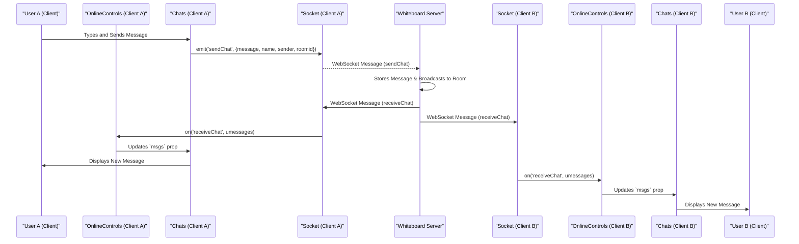

# Collaborative Synchronization

The Whiteboard project provides robust mechanisms for real-time collaboration, allowing multiple users to interact seamlessly within a shared digital space. This section details the core components and processes that enable synchronized drawing data, real-time communication, and dynamic user presence management across all connected clients.

## Real-time Chat Communication

In-room communication is facilitated through a dedicated chat interface, enabling participants to exchange text messages instantaneously. The `Chats` component manages the display of messages and the sending of new ones.

Messages are sent via WebSockets using the `sendChat` event, including the sender's details, message content, and the room ID. Upon receipt, the backend broadcasts these messages to all participants in the specified room.

```tsx
// frontend/src/pages/Chats.jsx
const handleSendMessage = (e) => {
    e.preventDefault();
    if (!chatinp.trim()) return;
    socket.emit('sendChat', {
        name: user.name || user.nickname || user.email,
        sender: user.sub,
        message: chatinp,
        roomid: roomid,
    });
    setchatinp('');
};
```

The `OnlineControls` component listens for incoming chat messages through the `receiveChat` event, updating the local state which is then passed to the `Chats` component to render the latest conversations.

```tsx
// frontend/src/components/JoinRoom/OnlineControls.jsx
useEffect(() => {
    socket.on('receiveChat', (umessages) => {
      setmsgs(umessages);
    });

    return () => {
      socket.off('receiveChat');
    };
  }, []);
```

To enhance user experience, the chat window automatically scrolls to the latest message whenever new messages arrive.

```tsx
// frontend/src/pages/Chats.jsx
useEffect(() => {
    if (chatRef.current) {
        chatRef.current.scrollTop = chatRef.current.scrollHeight;
    }
}, [msgs]);
```

## Participant Management and Presence

The `Participants` component displays a list of all users currently active in the room, providing real-time visibility into who is collaborating. This list updates dynamically as users join or leave the room (the update mechanism for the `participants` prop itself is handled by broader room state management, typically initiated by WebSocket events).

The host of the room has additional capabilities to manage participants, including kicking users and controlling drawing permissions.

### Host Controls

Room hosts can kick out participants using a direct API call to the backend. This action removes the specified user from the room and triggers updates for all remaining participants.

```tsx
// frontend/src/pages/Participants.jsx
const handleKick = async (userid) => {
    if (!isHost) return;
    try {
        const res = await axios.put('/room/kickout', {
            roomid,
            userid,
            hostid
        });
        console.log(res);
    } catch (error) {
        console.log(error);
    }
};
```

Hosts can also dynamically grant or revoke drawing permissions for individual participants. This is achieved by emitting a `grantDrawP` socket event, specifying the user, room, host, and the new permission status.

```tsx
// frontend/src/pages/Participants.jsx
const TakePermission = (userid) => {
    socket.emit('grantDrawP', { userid, roomid, hostid, granted: false });
};
```

## Centralized Collaboration Controls

The `OnlineControls` component serves as the central hub for accessing various real-time collaboration features within the whiteboard interface. It dynamically renders the `Chats` and `Participants` panels based on user interaction, providing a cohesive interface for managing communication and participant visibility.

```tsx
// frontend/src/components/JoinRoom/OnlineControls.jsx
{showparticipants && (
    <Participants
      participants={participants}
      onClose={onClose}
      isHost={isHost}
      hostid={hostid}
    />
)}

{showchat && (
    <Chats
      msgs={msgs}
      setshowchat={setshowchat}
    />
)}
```

## Real-time Chat Synchronization Flow

The following diagram illustrates the sequence of events for sending and receiving chat messages within a collaborative session.





## Key Takeaways

*   **WebSocket-driven Communication**: Real-time chat, user presence updates, and drawing permission management are powered by WebSockets, ensuring low-latency and interactive collaboration.
*   **Modular Component Design**: Core collaboration features are encapsulated in dedicated React components (`Chats`, `Participants`), which are orchestrated by the `OnlineControls` component for a unified user interface.
*   **Host Privileges**: Room hosts are empowered with administrative controls, including the ability to manage participants (kick users) and moderate drawing access, contributing to a controlled collaborative environment.
*   **Enhanced User Experience**: Features like automatic chat scrolling ensure that users always see the latest information without manual intervention.