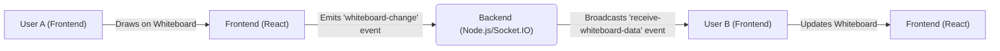

# Deployment and Configuration

This document outlines the deployment setup, environment variables, and configuration details for the `sumedhcharjan/white-board-project`. It covers both the frontend and backend components, including necessary dependencies and configuration files.

## Deployment Overview

The project consists of a React-based frontend and a Node.js/Express backend. The frontend is designed to be deployed on platforms like Vercel or Netlify, while the backend is suitable for platforms like Heroku, AWS, or Google Cloud.  The `vercel.json` file (if present, although not provided) would contain specific configurations for Vercel deployment, such as routes and build settings.

## Backend Configuration

The backend uses Node.js with Express and Mongoose. Key dependencies are listed in `backend/package.json`.

```json title="backend/package.json"
{
  "dependencies": {
    "cloudinary": "^2.6.0",
    "cors": "^2.8.5",
    "dotenv": "^16.5.0",
    "express": "^5.1.0",
    "mongoose": "^8.1.32",
    "nanoid": "^5.1.5",
    "nodemon": "^3.1.9",
    "socket.io": "^4.8.1"
  },
  "name": "backend",
  "version": "1.0.0",
  "main": "server.js",
  "directories": {
    "lib": "lib"
  },
  "scripts": {
    "start": "nodemon src/index.js"
  },
  "keywords": [],
  "author": "",
  "type": "module",
  "license": "ISC",
  "description": ""
}
```

[View on GitHub](https://github.com/sumedhcharjan/white-board-project/blob/main/backend/package.json)

Important dependencies include:

*   **express:** A fast, unopinionated, minimalist web framework for Node.js.
*   **mongoose:**  An elegant MongoDB object modeling tool.
*   **socket.io:** Enables real-time, bidirectional communication between web clients and servers.
*   **cors:** Provides Express middleware to enable CORS (Cross-Origin Resource Sharing).
*   **dotenv:** Loads environment variables from a `.env` file.

The `start` script utilizes `nodemon` for automatic server restarts during development.

### Environment Variables (Backend)

The backend relies on environment variables for configuration.  These variables typically include:

*   `MONGODB_URI`: The connection string for the MongoDB database.
*   `PORT`: The port the server listens on (defaults to 3000 or 5000).
*   `CLOUDINARY_CLOUD_NAME`: Cloudinary account cloud name.
*   `CLOUDINARY_API_KEY`: Cloudinary API key.
*   `CLOUDINARY_API_SECRET`: Cloudinary API secret.

Example `.env` file:

```plaintext title=".env"
MONGODB_URI=mongodb://localhost:27017/whiteboard
PORT=5000
CLOUDINARY_CLOUD_NAME=your_cloud_name
CLOUDINARY_API_KEY=your_api_key
CLOUDINARY_API_SECRET=your_api_secret
```

Store credentials and sensitive information securely. Never commit `.env` files to version control. Use platform-specific methods for setting environment variables in production (e.g., Heroku config vars, AWS Lambda environment variables).

### Backend Server Setup

A basic Express server setup might look like this:

```javascript title="backend/src/index.js"
import express from 'express';
import mongoose from 'mongoose';
import cors from 'cors';
import dotenv from 'dotenv';
//import routes from './routes'; // Assuming you have a routes directory

dotenv.config();

const app = express();
const port = process.env.PORT || 5000;

app.use(cors());
app.use(express.json());

//mongoose.connect(process.env.MONGODB_URI, { useNewUrlParser: true, useUnifiedTopology: true })
//  .then(() => console.log('Connected to MongoDB'))
//  .catch(err => console.error('MongoDB connection error:', err));

//app.use('/api', routes); // Use your defined routes

app.get('/', (req, res) => {
  res.send('Whiteboard Backend is Running');
});

app.listen(port, () => {
  console.log(`Server is running on port: ${port}`);
});
```

[View on GitHub](https://github.com/sumedhcharjan/white-board-project/blob/main/backend/src/index.js) (Note: This is a general example; the exact file path might vary).

This code snippet initializes an Express server, connects to MongoDB using Mongoose, enables CORS, and defines a basic route. The actual implementation would include more routes and logic.

## Frontend Configuration

The frontend is built with React and uses Vite as a build tool. Dependencies are listed in `frontend/package.json`.

```json title="frontend/package.json"
{
  "name": "frontend",
  "private": true,
  "version": "0.0.0",
  "type": "module",
  "scripts": {
    "dev": "vite",
    "build": "node ./node_modules/vite/bin/vite.js build",
    "lint": "eslint .",
    "preview": "vite preview"
  },
  "dependencies": {
    "@auth0/auth0-react": "^2.3.0",
    "@tailwindcss/vite": "^4.0.14",
    "axios": "^1.8.4",
    "dotenv": "^16.4.7",
    "react": "^19.0.0",
    "react-dom": "^19.0.0",
    "react-hot-toast": "^2.5.2",
    "react-icons": "^5.5.0",
    "react-router-dom": "^7.7.1",
    "react-toastify": "^11.0.5",
    "socket.io-client": "^4.8.1",
    "tailwindcss": "^4.0.14"
  },
  "devDependencies": {
    "@eslint/js": "^9.21.0",
    "@types/react": "^19.0.10",
    "@types/react-dom": "^19.0.4",
    "@vitejs/plugin-react-swc": "^3.8.0",
    "eslint": "^9.21.0",
    "eslint-plugin-react-hooks": "^5.1.0",
    "eslint-plugin-react-refresh": "^0.4.19",
    "globals": "^15.15.0",
    "vite": "^6.3.5"
  },
  "description": "white board project frontend",
  "main": "eslint.config.js",
  "author": "sumedh",
  "license": "ISC"
}
```

[View on GitHub](https://github.com/sumedhcharjan/white-board-project/blob/main/frontend/package.json)

Key dependencies include:

*   **react:** A JavaScript library for building user interfaces.
*   **react-dom:** Provides DOM-specific methods.
*   **react-router-dom:** Enables routing in the React application.
*   **axios:** A promise-based HTTP client for making API requests.
*   **socket.io-client:** Client-side library for real-time communication.
*   **tailwindcss:** A utility-first CSS framework.

### Environment Variables (Frontend)

The frontend also uses environment variables, typically configured through Vite's `.env` handling. Examples:

*   `VITE_BACKEND_URL`: The URL of the backend server.
*   `VITE_AUTH0_DOMAIN`: The Auth0 domain.
*   `VITE_AUTH0_CLIENT_ID`: The Auth0 client ID.

Example `.env` file:

```plaintext title="frontend/.env"
VITE_BACKEND_URL=http://localhost:5000
VITE_AUTH0_DOMAIN=your_auth0_domain
VITE_AUTH0_CLIENT_ID=your_auth0_client_id
```

Vite automatically exposes environment variables prefixed with `VITE_`.

### Frontend API Calls

Here’s how you might use `axios` to make a request to the backend:

```javascript title="frontend/src/api/whiteboardService.js"
import axios from 'axios';

const backendURL = import.meta.env.VITE_BACKEND_URL;

const getWhiteboards = async () => {
  try {
    const response = await axios.get(`${backendURL}/api/whiteboards`);
    return response.data;
  } catch (error) {
    console.error("Error fetching whiteboards:", error);
    throw error;
  }
};

export { getWhiteboards };
```

[View on GitHub](https://github.com/sumedhcharjan/white-board-project/blob/main/frontend/src/api/whiteboardService.js) (Adapt path if the real one is different)

This snippet demonstrates fetching data from the backend. The `VITE_BACKEND_URL` environment variable is used to construct the API endpoint.

## Socket.IO Integration

Both the frontend and backend utilize Socket.IO for real-time communication.  The backend handles socket connections and emits events, while the frontend listens for these events to update the UI.

Backend (Socket.IO setup):

```javascript title="backend/src/socket.js"
import { Server } from 'socket.io';

function setupSocket(server) {
  const io = new Server(server, {
    cors: {
      origin: "*", // Allow all origins during development, restrict in production
      methods: ["GET", "POST"]
    }
  });

  io.on('connection', (socket) => {
    console.log('A user connected:', socket.id);

    socket.on('disconnect', () => {
      console.log('User disconnected:', socket.id);
    });

    socket.on('whiteboard-change', (data) => {
      socket.broadcast.emit('receive-whiteboard-data', data);
    });

  });
}

export default setupSocket;
```

[View on GitHub](https://github.com/sumedhcharjan/white-board-project/blob/main/backend/src/socket.js)(Adapt path if the real one is different)

Frontend (Socket.IO connection):

```javascript title="frontend/src/components/Whiteboard.jsx"
import { useEffect, useRef } from 'react';
import { io } from 'socket.io-client';

const Whiteboard = () => {
  const canvasRef = useRef(null);
  const socket = useRef(null);
  const backendURL = import.meta.env.VITE_BACKEND_URL;

  useEffect(() => {
    socket.current = io(backendURL);

    socket.current.on('connect', () => {
      console.log('Connected to socket server');
    });

     socket.current.on('receive-whiteboard-data', (data) => {
       // Handle incoming whiteboard data
       console.log('Received whiteboard data:', data);
       // Redraw the canvas with the received data (implementation omitted)
     });


    return () => {
      socket.current.disconnect();
    };
  }, [backendURL]);

  // ... Canvas drawing logic (omitted for brevity) ...

  return <canvas ref={canvasRef} />;
};

export default Whiteboard;
```

[View on GitHub](https://github.com/sumedhcharjan/white-board-project/blob/main/frontend/src/components/Whiteboard.jsx) (Adapt path if the real one is different)

This setup enables real-time updates to the whiteboard. When a user makes a change, the frontend emits a `whiteboard-change` event to the backend, which then broadcasts the data to all connected clients.





## Authentication (Auth0)

The frontend uses Auth0 for authentication. The `@auth0/auth0-react` library simplifies the integration.

```javascript title="frontend/src/Auth0ProviderWithHistory.jsx"
import React from 'react';
import { Auth0Provider } from '@auth0/auth0-react';
import { useNavigate } from 'react-router-dom';

const Auth0ProviderWithHistory = ({ children }) => {
  const domain = import.meta.env.VITE_AUTH0_DOMAIN;
  const clientId = import.meta.env.VITE_AUTH0_CLIENT_ID;
  const navigate = useNavigate();

  const onRedirectCallback = (appState) => {
    navigate(appState?.returnTo || window.location.pathname);
  };

  return (
    <Auth0Provider
      domain={domain}
      clientId={clientId}
      redirectUri={window.location.origin}
      onRedirectCallback={onRedirectCallback}
    >
      {children}
    </Auth0Provider>
  );
};

export default Auth0ProviderWithHistory;
```

[View on GitHub](https://github.com/sumedhcharjan/white-board-project/blob/main/frontend/src/Auth0ProviderWithHistory.jsx) (Adapt path if the real one is different)

This component wraps the application with the `Auth0Provider`, configuring it with the Auth0 domain and client ID. The `onRedirectCallback` function handles redirects after authentication.

## Key Integration Points

*   **Real-time Communication:** Socket.IO enables seamless collaboration on the whiteboard. Ensure the backend and frontend are correctly configured to establish and maintain socket connections.  Restrict `cors` to specific origins in production to improve security.
*   **Authentication:**  Auth0 provides a secure and scalable authentication solution. Configure the Auth0 application and frontend environment variables correctly. Implement proper authorization checks on the backend to protect resources.
*   **API Interactions:**  Axios is used for making API requests to the backend. Handle errors gracefully and implement appropriate loading states in the UI.  Consider using a centralized API service to manage API calls.
*   **Environment Variables:** Securely manage environment variables in both the frontend and backend. Use platform-specific methods for setting environment variables in production. Never commit `.env` files to version control.

This documentation provides a comprehensive overview of the deployment and configuration of the `sumedhcharjan/white-board-project`. By following these guidelines, developers can successfully deploy and configure the application in various environments.
```