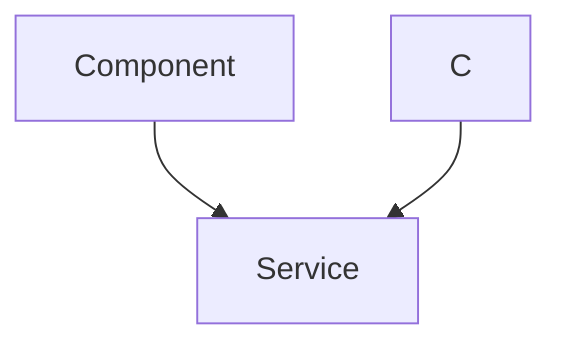

# Real-time Whiteboard Features

This section details the core components and underlying logic that power the real-time whiteboard functionality. It covers how the canvas is rendered, user interactions are handled for various drawing tools, and how these actions are synchronized across multiple participants.

The system relies on a combination of frontend components for user interface and drawing logic, and a backend controller for persistence and real-time communication via WebSockets.

## Whiteboard Canvas and Drawing Mechanics

The primary interface for drawing is managed by the `JoinWhiteboard.jsx` component. This component dynamically renders a HTML5 canvas, adjusting its size to fit the parent container using a `ResizeObserver`.

Drawing interactions are captured through mouse and touch events (`onMouseDown`, `onMouseMove`, `onMouseUp`, `onTouchStart`, `onTouchMove`, `onTouchEnd`). When a user begins to draw, the `startDraw` function initializes the drawing state, capturing the initial coordinates. As the user moves their pointer, the `draw` function continuously captures new coordinates and generates drawing elements, emitting them in real-time.

```jsx
    const draw = (e) => {
        if (!isDrawing || !candraw) return;
        e.preventDefault(); 
        const newCoords = getCoordinates(e);
        const newElement = {
            type: selectedTool,
            color: selectedColor || '#000',
            width: width,
            points: [
                { x: coordinates.x, y: coordinates.y },
                { x: newCoords.x, y: newCoords.y }
            ]
        };
        setElementsArray(prev => [...prev, newElement]);
        setCoordinates(newCoords);
        socket.emit('newElement', { roomid, element: newElement });
    };
```

All drawing elements are stored locally in the `elementsArray` state and are immediately rendered on the canvas by the `redrawAll` function. This function iterates through all elements and draws them based on their type, color, and width.

## Drawing Tools and Customization

The `DrawingOptions.jsx` component provides users with a variety of tools and customization options for their drawing experience. Users can select different drawing tools, change the drawing color, and adjust the line width.

```jsx
const DrawingOptions = ({ selectedColor, selectedTool, setSelectedColor, setSelectedTool, width, setWidth }) => {
  const handleToolChange = (tool) => {
    setSelectedTool(`${tool}`);
  };

  const handleColorChange = (e) => {
    setSelectedColor(e.target.value);
  };

  return (
    <div className="bg-[#FAFAFA] p-4 rounded-lg flex flex-col gap-4">
      {/* ... other elements ... */}
      <div className="grid grid-cols-5 gap-2">
        <button
          onClick={() => handleToolChange('pencil')}
          className={`aspect-square bg-[#14B8A6] text-white rounded-md flex items-center justify-center hover:bg-[#FBBF24] transition-all duration-200 transform hover:scale-105 ${
            selectedTool === 'pencil' ? 'ring-2 ring-[#7C3AED]' : ''
          }`}
        >
          <FaPencilAlt size={20} />
        </button>
        <button
          onClick={() => handleToolChange('rectangle')}
          className={`aspect-square bg-[#14B8A6] text-white rounded-md flex items-center justify-center hover:bg-[#FBBF24] transition-all duration-200 transform hover:scale-105 ${
            selectedTool === 'rectangle' ? 'ring-2 ring-[#7C3AED]' : ''
          }`}
        >
          <FaSquare size={20} />
        </button>
        {/* ... more tool buttons ... */}
      </div>

      <h3 className="font-semibold text-[#2D3748] mt-4 flex items-center gap-2">
        {/* ... icon ... */}
        Colors & Width
      </h3>
      <div className="grid grid-cols-5 gap-2 items-center">
        <label className="aspect-square bg-[#14B8A6] rounded-md cursor-pointer overflow-hidden relative hover:ring-2 ring-offset-2 ring-[#7C3AED]">
          <input
            type="color"
            value={selectedColor}
            onChange={handleColorChange}
            className="absolute top-0 left-0 opacity-0 w-full h-full cursor-pointer"
          />
          <div
            className="w-full h-full"
            style={{ backgroundColor: selectedColor }}
          />
        </label>
        <input
          type="range"
          min="1"
          max="30"
          value={width}
          onChange={(e) => setWidth(Number(e.target.value))}
          className="col-span-3 h-2 bg-[#7C3AED] rounded-lg appearance-none cursor-pointer [&::-webkit-slider-thumb]:bg-[#14B8A6] [&::-webkit-slider-thumb]:appearance-none [&::-webkit-slider-thumb]:w-4 [&::-webkit-slider-thumb]:h-4 [&::-webkit-slider-thumb]:rounded-full [&::-webkit-slider-thumb]:hover:bg-[#FBBF24]"
        />
        {/* ... width indicator ... */}
      </div>
    </div>
  );
};
```

The selected tool, color, and width are passed as props to the `Whiteboard` component, dictating how new drawing elements are created.

## Real-time Synchronization and Persistence

Real-time collaboration is achieved using `socket.io`. When a user draws an `element`, it's immediately emitted to the `socket.io` server via the `newElement` event, along with the `roomid`.

```jsx
    useEffect(() => {
        const handleDrawElement = (line) => {
            setElementsArray(prev => [...prev, line]);
        };

        socket.on('drawElement', handleDrawElement);
        socket.on('clearCanvas', () => {
            setElementsArray([]); // Clear local state
            redrawAll([]); // Clear canvas
        });

        return () => {
            socket.off('drawElement', handleDrawElement);
        };
    }, []);
```

The server then broadcasts this `element` back to all connected clients within the same `roomid` using the `drawElement` event. Each client, upon receiving `drawElement`, updates its local `elementsArray` and redraws the canvas, ensuring that all participants see the changes in real-time.

The `drawingcontroller.js` on the backend handles the persistence of drawing data. It provides API endpoints for:
*   `createRoomDrawing`: Initializes a new room's drawing data.
*   `getElements`: Retrieves all stored drawing elements for a given `roomid`.
*   `clearElements`: Deletes all drawing data for a specific room and broadcasts a `clearCanvas` event to all clients in that room.

```javascript
export const clearElements = async (req, res) => {
  const { roomid } = req.query;
  try {
      const room = await RoomDrawing.findOne({ roomid });
      if (!room) return res.status(404).json({ msg: 'Room not found' });

      room.drawingData = [];
      await room.save();
      io.to(roomid).emit('clearCanvas') // Broadcast clear event

      res.status(200).json({ msg: 'Room cleared successfully!' });
  } catch (error) {
      console.error('Error clearing room:', error);
      res.status(500).json({ msg: 'Server error' });
  }
};
```

### Real-time Drawing Flow





## Saving the Whiteboard as an Image

The `SaveImageModal.jsx` component provides functionality for users to save the current state of the whiteboard as an image. When activated, it accesses the canvas element, converts its content to a `dataURL` (PNG format), and sends this data to the backend API for storage.

```jsx
const SaveImageModal = ({onClose}) => {
    // ... state and hooks ...
    const handleSaveDrawing = async () => {
        try {
            const canvas = document.getElementById('Whiteboard');
            if (!canvas) return alert('No canvas Found!');
            const imgdataUrl = canvas.toDataURL('image/png');
            setSaving(true);
            const res = await axios.post('/room/savedrawing', { userid: user.sub, roomid, imgurl: imgdataUrl,title });
            toast.success("Saved Image Successfully")
            setSaving(false);
            onClose();
        } catch (error) {
            console.log(error);
        }
    }
    return (
        <div className="fixed inset-0 bg-transperent bg-opacity-50 z-50 flex items-center justify-center">
            <div className="bg-white p-6 rounded-2xl shadow-lg w-full max-w-md">
                <h2 className="text-lg font-semibold mb-4 text-gray-800">Add a Title</h2>
                <input
                    type="text"
                    placeholder="Enter a title for the image"
                    className="w-full border px-4 py-2 rounded-md mb-4 focus:outline-none focus:ring-2 focus:ring-blue-400"
                    value={title}
                    onChange={(e) => setTitle(e.target.value)}
                />

                <div className="flex justify-end space-x-3">
                    <button
                        onClick={onClose}
                        className="bg-gray-200 text-gray-700 px-4 py-2 rounded-md hover:bg-gray-300"
                    >
                        Cancel
                    </button>
                    <button
                      onClick={handleSaveDrawing}
                      className="bg-blue-600 text-white px-4 py-2 rounded-md hover:bg-blue-700"
                      disabled={saving}
                    >
                      {saving ? "Saving.." : "Save"}
                    </button>
    
                </div>
            </div>
        </div>
    )
}
```

This feature allows users to archive important whiteboard sessions, converting dynamic drawings into static images for future reference.

## Integration Details

The real-time whiteboard features are tightly integrated across frontend and backend:
*   **Frontend (`JoinWhiteboard.jsx`, `DrawingOptions.jsx`, `SaveImageModal.jsx`):** Manages user interactions, drawing rendering, tool selection, and communication with the backend.
*   **Backend (`drawingcontroller.js`):** Handles data persistence for drawing elements and images, and orchestrates real-time synchronization through `socket.io`.
*   **`socket.io`:** Facilitates low-latency, bidirectional communication between clients and the server for instant updates.

This architecture ensures a seamless and interactive collaborative drawing experience, with robust persistence for whiteboard states.