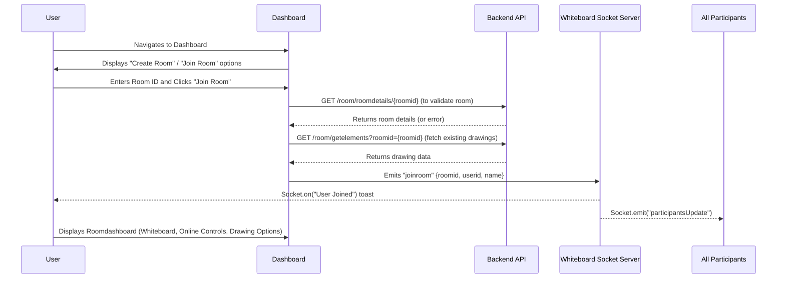

# Room Creation & Joining

The WhiteBoard project facilitates real-time collaborative drawing sessions within distinct digital rooms. Users can either create a new room or join an existing one, providing a flexible environment for teamwork and shared ideation. This section details the process of creating and joining rooms, the dashboard controls available, and the core functionalities within a live whiteboard session.

## Dashboard Overview

Upon successful authentication, users are directed to the main `Dashboard` page. This page serves as the central hub for managing and navigating whiteboard sessions.

```tsx
// frontend/src/pages/Dashboard.jsx
import React from 'react'
import { useAuth0 } from "@auth0/auth0-react";
import HeaderDash from "../components/DashBoard/HeaderDash";
import DashBody from "../components/DashBoard/DashBody";


const Dashboard = () => {
    const { logout ,user, isAuthenticated, isLoading } = useAuth0();
    console.log(user);

return (
    <>
    {/* <HeaderDash/> */}
    <DashBody/>
    </>
)

}

export default Dashboard
```

The `Dashboard` primarily renders the `DashBody` component (not provided in context but inferred to contain room creation/joining UI) and includes `HeaderDash` for global navigation and user actions.

### Global Dashboard Controls

The `HeaderDash` component, present across dashboard views, offers essential user controls:

```tsx
// frontend/src/components/DashBoard/HeaderDash.jsx
import React from 'react'
import { useAuth0 } from '@auth0/auth0-react';
import { FaUserCircle } from 'react-icons/fa';
import { Link, Links } from 'react-router-dom';
import { toast } from 'react-hot-toast';

const HeaderDash = () => {
  const {logout}=useAuth0();
  console.log(logout);
  const handleLogout=()=>{
    logout({
      logoutParams:{
        returnTo:window.location.origin,
      },
    })
    
  }
  return (
    <div className="w-full h-18 bg-[#092635] flex flex-row justify-between items-center px-6 py-3">
      <h1 className="text-3xl text-[#9EC8B9] font-bold"> <Link to='/dashboard'>WhiteBoard</Link></h1>
      <div className='flex gap-2 items-center justify-center'>
        <button className='bg-[#1B4242] hover:bg-[#5C8374] text-white font-semibold py-2 px-4 rounded-lg transition duration-300' onClick={handleLogout}  >
          LogOut
        </button>
        <Link to='/profile'>
          <FaUserCircle size={30} color="#9EC8B9" />
        </Link>

      </div>

    </div>)
}

export default HeaderDash
```

This header provides:
*   **Application Title**: A clickable link back to the main dashboard.
*   **Logout Button**: Allows users to securely sign out of their session.
*   **Profile Link**: Navigates to the user's profile page.

## Room Entry and Collaborative Session

Once a user creates or joins a room, they are redirected to a unique room-specific dashboard, managed by the `Roomdashboard` component. This component orchestrates the entire collaborative experience, including whiteboard rendering, real-time updates, and participant controls.

### Room Data Initialization

Upon entering a room, the `Roomdashboard` fetches necessary information and sets up real-time communication.

```tsx
// frontend/src/components/JoinRoom/JoinRoomdashboard.jsx
  useEffect(() => {
    if (!user) return;

    const fetchData = async () => {
      try {
        setLoading(true); // Set loading to true at the start

        // Fetch room details
        const roomResponse = await axios.get(`/room/roomdetails/${roomid}`);
        const roomData = roomResponse.data;
        setRoomDetails(roomData);
        setIsHost(user.sub === roomData.hostuser);
        const participant = roomData.participants.find(x => x.id === user.sub);
        setCandraw(participant?.candraw ?? false);

        // Fetch drawing data
        const drawingResponse = await axios.get("/room/getelements", { params: { roomid } });
        const drawingData = drawingResponse.data?.drawingData;
        if (Array.isArray(drawingData)) {
          setElements(drawingData);
        } else {
          console.warn('Received invalid drawing data:', drawingData);
          setElements([]);
        }
      } catch (error) {
        console.error("Error fetching data", error);
        toast.error("Failed to load room data. Please try again.");
        navigate('/dashboard'); // Redirect to dashboard on error
      } finally {
        setLoading(false); // Set loading to false when done
      }
    };

    fetchData();

    // Socket setup
    if (!socket.connected) {
      socket.connect();
    }
    socket.emit('joinroom', {
      roomid,
      userid: user.sub,
      name: user.name || user.nickname || 'Anonymous',
    });

    // ... (socket event listeners) ...
  }, [user, roomid, navigate]);
```

This `useEffect` hook ensures:
*   **Room Details**: Fetches details like `hostuser` and `participants` from the backend API.
*   **Drawing Data**: Retrieves any pre-existing drawing elements for the room.
*   **Host Identification**: Determines if the current user is the host.
*   **Drawing Permission**: Checks if the user has drawing privileges.
*   **Socket Connection**: Establishes a WebSocket connection and emits a `joinroom` event to the server, notifying other participants.

### Real-time Collaboration with Sockets

The `Roomdashboard` leverages Socket.io for real-time updates and interactions within the room. Key events handled include:

```tsx
// frontend/src/components/JoinRoom/JoinRoomdashboard.jsx
    // ... (inside useEffect) ...
    socket.on('User Joined', (data) => {
      toast.success(`${data.name} has joined the room!`);
    });
    socket.on('User Left', (data) => {
      toast.success(`${data.name} has left the room!`);
    });
    socket.on('participantsUpdate', (updatedParticipants) => {
      console.log('Participants updated:', updatedParticipants);
      setRoomDetails((prev) => ({ ...prev, participants: updatedParticipants }));
      const participant = updatedParticipants.find(x => x.id === user.sub);
      setCandraw(participant?.candraw ?? false);
    });
    socket.on('Kickout', (data) => {
      if (data.userid !== user.sub) {
        toast.error(`${data.name} was kicked from the room!`);
      } else {
        toast.error("You have been kicked from the room!");
        navigate('/dashboard');
      }
    });
    socket.on('hostEndedMeeting', ({ message }) => {
      toast.error(message);
      navigate('/dashboard');
    });
    socket.on('AskPermission', ({ name, hostid, userid }) => {
      if (user.sub === hostid) {
        showPermissionToast({ name, hostid, userid, roomid });
      }
    });
    socket.on('PermissionResult', ({ userid, granted }) => {
      if (user?.sub === userid) {
        if (granted) {
          toast.success('Host has given you permission to draw!');
          setCandraw(true);
        } else {
          toast.error('Host denied permission!');
          setCandraw(false);
        }
      }
    });
    // ... (return cleanup function) ...
```

These event listeners enable:
*   **User Status**: Notifications when users join or leave.
*   **Participant List Updates**: Real-time updates to the list of participants and their drawing permissions.
*   **Moderation**: Handling `Kickout` events (for both the kicked user and others) and `hostEndedMeeting` events.
*   **Drawing Permissions**: Managing requests and responses for drawing access. Hosts receive a toast to grant/deny permissions from other users.

### In-Room Controls and Layout

The `Roomdashboard` provides a comprehensive UI for interaction:

```tsx
// frontend/src/components/JoinRoom/JoinRoomdashboard.jsx
  return (
    <div className="relative min-h-screen font-sans">
      {/* Background Pattern */}
      <div
        className="absolute inset-0 -z-10 h-full w-full bg-[#FAFAFA] bg-[linear-gradient(to_right,#2D3748_1px,transparent_1px),linear-gradient(to_bottom,#2D3748_1px,transparent_1px)] bg-[size:6rem_4rem] opacity-20"
        style={{
          backgroundAttachment: 'fixed',
          backgroundPosition: 'center',
        }}
      ></div>
      {/* Header */}
      <header className="bg-[#14B8A6] shadow-lg sticky top-0 z-50">
        <div className="max-w-[1920px] mx-auto px-4 sm:px-6 lg:px-8 py-4 flex justify-between items-center">
          <div className="flex items-center space-x-4">
            <h1 className="text-xl sm:text-2xl font-bold text-white">Room:{roomid}</h1>
            <button onClick={()=>handleCopy()} ><FiCopy className="w-4 h-4 text-gray-600 hover:text-[#14B8A6] cursor-pointer" /></button>
            <span className="text-black w-auto text-sm px-3 py-1 bg-[#FAFAFA]/10 rounded-full">
              {user?.name || user?.nickname || "User"}
            </span>
          </div>
          <div className="flex items-center space-x-3">
            <button
              className="bg-[#14B8A6] text-white px-4 py-2 rounded-md hover:bg-[#FBBF24] transition flex items-center gap-2"
              onClick={handleLeave}
            >
              <svg className="w-5 h-5" fill="none" stroke="currentColor" viewBox="0 0 24 24" xmlns="http://www.w3.org/2000/svg">
                <path strokeLinecap="round" strokeLinejoin="round" strokeWidth="2" d="M17 16l4-4m0 0l-4-4m4 4H7m6 4v1a3 3 0 01-3 3H6a3 3 0 01-3-3V7a3 3 0 013-3h4a3 3 0 013 3v1"></path>
              </svg>
              Leave
            </button>
          </div>
        </div>
      </header>

      {/* Main Content */}
      {loading ? (
        <div className="flex justify-center items-center min-h-[calc(100vh-80px)]">
          <div className="animate-spin rounded-full h-16 w-16 border-t-4 border-b-4 border-[#7C3AED]"></div>
        </div>
      ) : (
        <main className="max-w-[1920px] mx-auto px-4 sm:px-6 lg:px-8 py-6 flex flex-col 2xl:flex-row gap-6">
          {/* Whiteboard Section */}
          <section className="flex-1 bg-[#FAFAFA] rounded-xl shadow-2xl p-4 relative overflow-hidden animate-fade-in">
            <div className="absolute inset-0 -z-10 bg-[linear-gradient(to_right,#7C3AED_1px,transparent_1px),linear-gradient(to_bottom,#7C3AED_1px,transparent_1px)] bg-[size:2rem_2rem] opacity-5"></div>
            <Whiteboard
              candraw={candraw}
              elements={elements}
              selectedColor={selectedColor}
              width={width}
              selectedTool={selectedTool}
            />
          </section>

          {/* Right Sidebar: Online Controls & Drawing Options */}
          <aside
            className={`w-full md:w-full 2xl:w-80 flex flex-col gap-6 md:bg-transparent md:shadow-none md:p-0 transition-all duration-300 ease-in-out`}
          >
            {/* Online Controls */}
            <div className="bg-[#FAFAFA] rounded-xl shadow-lg p-6 animate-slide-in md:animate-none">
              <h3 className="text-lg sm:text-xl font-semibold text-[#2D3748] mb-4 flex items-center gap-2">
                <svg className="w-6 h-6 text-[#7C3AED]" fill="none" stroke="currentColor" viewBox="0 0 24 24" xmlns="http://www.w3.org/2000/svg">
                  <path strokeLinecap="round" strokeLinejoin="round" strokeWidth="2" d="M12 4.354a4 4 0 110 5.292M15 21H3v-1a6 6 0 0112 0v1zm0 0h6v-1a6 6 0 00-9-5.197M13 7a4 4 0 11-8 0 4 4 0 018 0z"></path>
                </svg>
                Collaboration
              </h3>
              <OnlineControls
                isHost={isHost}
                hostid={roomDetails?.hostuser}
                participants={roomDetails?.participants}
                messages={roomDetails?.messages}
              />
            </div>
            {/* Drawing Options */}
            <div className="bg-[#FAFAFA] rounded-xl shadow-lg p-6 animate-slide-in md:animate-none mt-3">
              <h3 className="text-lg sm:text-xl font-semibold text-[#2D3748] mb-4 flex items-center gap-2">
                <svg className="w-6 h-6 text-[#7C3AED]" fill="none" stroke="currentColor" viewBox="0 0 24 24" xmlns="http://www.w3.org/2000/svg">
                  <path strokeLinecap="round" strokeLinejoin="round" strokeWidth="2" d="M15.232 5.232l3.536 3.536m-2.036-5.036a2.5 2.5 0 113.536 3.536L6.5 21.036H3v-3.572L16.732 3.732z"></path>
                </svg>
                Drawing Tools
              </h3>
              <DrawingOptions
                setSelectedColor={setSelectedColor}
                selectedColor={selectedColor}
                setSelectedTool={setSelectedTool}
                selectedTool={selectedTool}
                width={width}
                setWidth={setWidth}
              />
            </div>
          </aside>
        </main>
      )}
      {/* ... (styles) ... */}
    </div>
  );
```

Key features of the `Roomdashboard` UI:
*   **Room Header**: Displays the current `roomid`, a button to `handleCopy` the ID to the clipboard, and the current user's name. A `Leave` button initiates `handleLeave`.
*   **Whiteboard Canvas**: The central `Whiteboard` component (`<Whiteboard />`) where all drawing activity occurs. It receives `candraw`, `elements`, `selectedColor`, `width`, and `selectedTool` as props to manage the drawing state.
*   **Online Controls Sidebar**: The `OnlineControls` component displays active participants, chat messages, and host-specific moderation tools.
*   **Drawing Options Sidebar**: The `DrawingOptions` component provides tools for users to select drawing color, tool type (pencil, eraser), and stroke width.

### Leaving a Room

Users can leave a room gracefully, which triggers both an API call and a socket event:

```tsx
// frontend/src/components/JoinRoom/JoinRoomdashboard.jsx
  const handleLeave = async () => {
    try {
      const res = await axios.put('/room/leave', { roomid, user });
      if (res?.data?.msg === 'Left the room successfully' || res?.data?.msg === 'Host ended the meeting!') {
        socket.emit('leaveroom', {
          name: user.name || user.nickname || "Anonymous",
          roomid: roomid,
        });
        navigate('/dashboard');
      }
    } catch (error) {
      console.error("Error leaving room", error);
      toast.error("Failed to leave room. Please try again.");
    }
  };
```

This `handleLeave` function sends a request to the backend to update the user's status and emits a `leaveroom` socket event, ensuring all participants are notified.

## Room Creation & Joining Flow

Here's a sequence diagram illustrating the typical flow for a user joining an existing room:





## Key Takeaways

*   The `Dashboard` page is the entry point for creating or joining whiteboard sessions.
*   The `HeaderDash` component provides consistent navigation and logout functionality across dashboard views.
*   The `Roomdashboard` component dynamically loads room details and drawing data using `axios` and `useParams`.
*   Real-time collaboration, including participant updates, moderation, and drawing permissions, is powered by Socket.io.
*   The UI provides dedicated sections for the collaborative whiteboard, online participants/chat, and drawing tools, ensuring a rich interactive experience.
*   Users can easily copy room IDs and gracefully leave sessions.