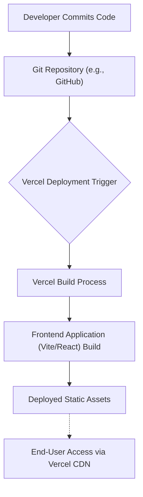

# Deployment & Configuration

This section provides comprehensive guidance for deploying the `white-board-project` application to production environments and managing its configuration. The project's frontend is a React application powered by Vite, and its deployment is streamlined through platforms like Vercel.

## Frontend Build Process

The frontend component of this project is built using React and Vite, offering a fast and efficient development experience. Understanding the build process is crucial for successful deployment, as it transforms the development code into optimized static assets ready for serving.

The foundational setup is described as:
```markdown
# React + Vite
```
This indicates a standard Vite build process for a React application. Vite leverages modern browser capabilities and performs a highly optimized build using Rollup for production.

Key plugins configure how Vite handles React components:
```markdown
- [@vitejs/plugin-react](https://github.com/vitejs/vite-plugin-react/blob/main/packages/vite-plugin-react/README.md) uses [Babel](https://babeljs.io/) for Fast Refresh
```
This particular plugin utilizes Babel for transpilation and Fast Refresh, ensuring efficient development iterations and a robust production build. Alternatively, `plugin-react-swc` can be used for even faster performance due to SWC's speed.

For production applications, it's recommended to enhance the ESLint configuration, particularly when using TypeScript:
```markdown
If you are developing a production application, we recommend using TypeScript and enable type-aware lint rules.
```
While the current project may not strictly adhere to a TypeScript template, this recommendation highlights best practices for ensuring code quality and maintainability in production.

The overall setup provides a minimal yet powerful base:
```plaintext
This template provides a minimal setup to get React working in Vite with HMR and some ESLint rules.
```
This minimal setup translates to a straightforward build command (typically `vite build`) that compiles the React application into a `dist` directory containing static files (HTML, CSS, JavaScript, assets) suitable for deployment.

## Deployment Workflow

The deployment of the `white-board-project` primarily targets cloud platforms, with Vercel being a common choice due to its direct integration with Git repositories and optimized hosting for frontend applications. The `vercel.json` file (though its content is not provided here) typically defines the project's build commands, output directory, and routing rules on the Vercel platform.

A typical deployment process involves pushing code to a Git repository, which triggers an automated build and deployment on Vercel.

Here's a conceptual flow of the deployment process:





During the "Vercel Build Process," Vercel detects the Vite project type and executes the appropriate build command (e.g., `npm run build` or `yarn build`), compiling the frontend code into optimized static files. These files are then served globally via Vercel's CDN.

## Environment Variables

For production deployments, managing environment-specific configurations is critical. Environment variables allow you to adjust settings (such as API endpoints, authentication keys, or feature flags) without modifying the codebase directly.

For Vite applications, environment variables are typically prefixed with `VITE_` to be exposed to the client-side code. For server-side operations (if any were present, not directly applicable to this pure frontend project), standard environment variables are used.

In Vercel, environment variables can be configured directly in the project settings UI or via the Vercel CLI. It's crucial to store sensitive information (like API keys) securely and never commit them directly to your repository.

Example of accessing an environment variable in a Vite React app:
```javascript
// In a React component
const API_URL = import.meta.env.VITE_API_BASE_URL;

function App() {
  // Use API_URL here
  return <div>Connecting to: {API_URL}</div>;
}
```

## Key Takeaways

*   The frontend is a React application built with Vite, utilizing `[@vitejs/plugin-react](https://github.com/vitejs/vite-plugin-react/blob/main/packages/vite-plugin-react/README.md)` for efficient development and production builds.
*   Deployment is streamlined via platforms like Vercel, which automate the build and serving of static frontend assets.
*   Environment variables are essential for managing production configurations and should be securely handled, particularly sensitive keys.
*   Adopting production-ready practices, such as expanding ESLint configurations for type-aware linting, enhances application reliability and maintainability.