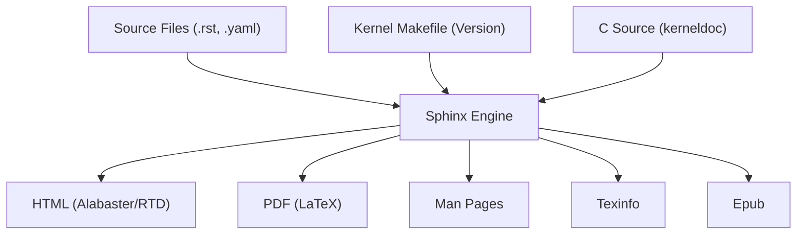

# Documentation Framework

The Linux kernel utilizes a sophisticated documentation system based on **Sphinx**, configured via `Documentation/conf.py`. This framework transforms structured text (reStructuredText) and YAML specifications into multiple output formats, including HTML, PDF (via LaTeX), Man pages, and Texinfo.

## System Architecture

The documentation build process integrates kernel source metadata and specialized parsers to ensure that API documentation remains synchronized with the C source code.

## Core Configuration Components

### 1. Kernel-Specific Extensions
The framework employs a suite of custom extensions to handle the unique requirements of kernel documentation:

| Extension | Purpose |
| :--- | :--- |
| `kerneldoc` | Parses C-style kernel-doc comments from source code. |
| `kernel_abi` | Manages Kernel Application Binary Interface documentation. |
| `parser_yaml` | Enables parsing of YAML files (e.g., Netlink specs, Device Tree bindings). |
| `kfigure` | Specialized handling of kernel-related figures. |
| `maintainers_include` | Automatically includes maintainer information in documents. |

### 2. C Domain Optimization
Sphinx's default C parser often struggles with kernel-specific macros and attributes. To prevent parsing errors and ensure correct indexing, `c_id_attributes` is used to explicitly define macros that the parser should ignore or treat as attributes. This includes:
- **Memory attributes:** `__iomem`, `__percpu`, `__user`.
- **Optimization/Inlining:** `__always_inline`, `noinline`, `__cold`.
- **Initialization:** `__init`, `__init_memblock`.
- **Concurrency/RCU:** `__rcu`.

### 3. Dynamic Versioning
Rather than hardcoding version strings, the framework dynamically extracts the kernel version and patch level directly from the root `Makefile` by parsing the `VERSION` and `PATCHLEVEL` variables. If the Makefile is inaccessible (e.g., during some Read the Docs builds), it falls back to command-line arguments or an "unknown version" string.

## Build Target Settings

### HTML Output
The framework supports multiple themes via the `DOCS_THEME` environment variable:
- **Alabaster:** Default theme for local builds.
- **Sphinx RTD Theme:** Used for official hosted documentation.
- **RTD Dark Mode:** Supported via the `sphinx_rtd_dark_mode` extension.

Custom CSS can be injected using the `DOCS_CSS` environment variable to override default styling.

### LaTeX and PDF
PDF generation is handled via LaTeX with a strict configuration to maintain professional typesetting:
- **Fonts:** Uses `DejaVu Serif`, `DejaVu Sans`, and `DejaVu Sans Mono`.
- **Formatting:** Custom margins (0.5in horizontal, 1in vertical) and a maximum list depth of 10 to accommodate deeply nested kernel hierarchies.
- **Preamble:** Loads `kerneldoc-preamble.sty` for kernel-specific LaTeX macros.

### Manual Pages
The system generates standard Linux man pages using the `man_pages` configuration, mapping the master document to the `thelinuxkernel` man page in section 1.

## Path Management and Initialization

Because Sphinx documentation can be built as a whole or as individual subprojects (using `SPHINXDIRS`), the framework implements a dynamic path resolution system in `config_init`.

1. **Relative Path Resolution:** It calculates paths relative to the `app.srcdir` to ensure that `include_patterns` and `exclude_patterns` function correctly regardless of the build root.
2. **Automatic Indexing:** For subprojects, the `add_subproject_index` function automatically injects a link back to the main documentation index to maintain navigability.
3. **Source Integration:** The system adds `tools/` and `scripts/` to the Python path, allowing `sphinx.ext.autodoc` to extract documentation from kernel helper scripts.