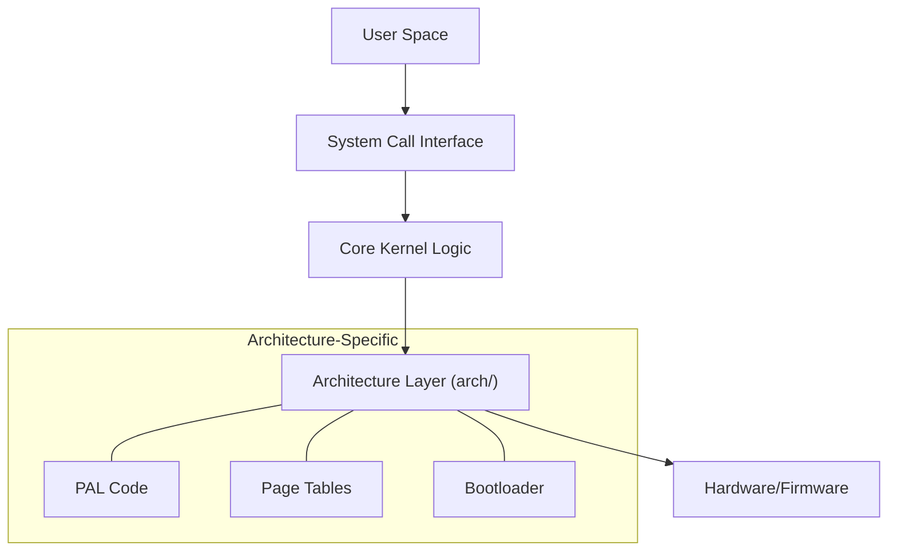
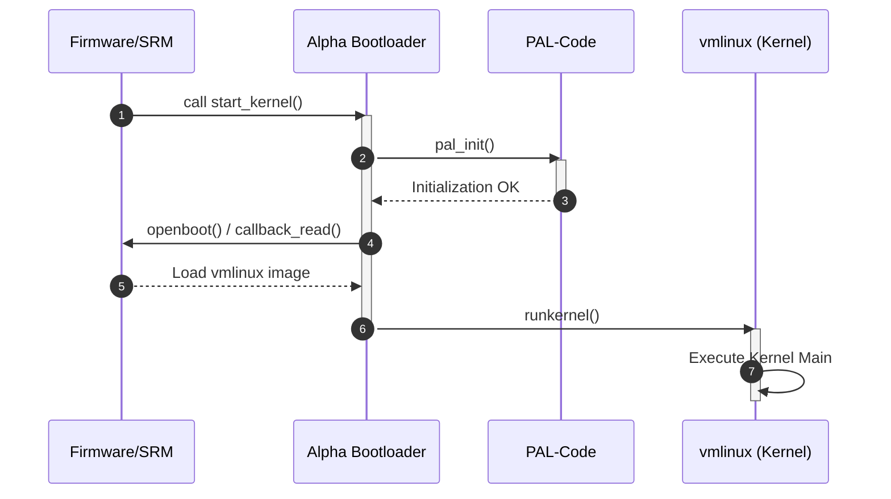

# Kernel Architecture Overview

The Linux kernel employs a layered architecture designed to maintain a strict separation between generic core logic, architecture-specific implementations, and hardware-level interfaces. This design allows the kernel to support a vast array of processor architectures and hardware devices while maintaining a consistent internal API for core subsystems.

## Architectural Layering

The kernel is structured into distinct layers that isolate hardware dependencies from the high-level operating system logic. 

### Core Kernel and Architecture-Specific Code
The relationship between the core kernel and architecture-specific code is a primary pillar of the system's portability. While the core kernel handles generic tasks (such as process management and memory allocation policies), the `arch/` directory contains the implementation details for specific CPUs.

For example, in the Alpha architecture (`arch/alpha`), the kernel must handle specific hardware requirements such as the Platform Architecture Layer (PAL) and unique page table structures before the generic kernel can take control.

### Hardware Abstraction and Drivers
The kernel interacts with hardware through abstraction layers. In the boot sequence, this is evidenced by the use of callback mechanisms to interact with boot devices without requiring the bootloader to know the specific hardware details of the storage medium.



## Boot Sequence and Initialization

The transition from firmware to a running kernel involves a precise sequence of initialization steps. Using the Alpha architecture bootloader (`arch/alpha/boot/main.c`) as a representative example, the process follows a linear path of increasing complexity.

### Boot Flow Execution
The `start_kernel` function coordinates the initial setup before jumping to the main kernel entry point.



### Key Bootloader Operations
The following table details the critical operations performed during the Alpha boot sequence:

| Function | Purpose | Key Dependency |
| :--- | :--- | :--- |
| `pal_init()` | Switches to OSF PAL-code and initializes the dummy PCB | `switch_to_osf_pal` |
| `openboot()` | Retrieves the booted device from the environment | `callback_getenv` |
| `load()` | Reads the `vmlinux` image into memory at `START_ADDR` | `callback_read` |
| `runkernel()` | Sets the stack and jumps to the kernel entry point | `START_ADDR` |

## Memory Mapping and Address Translation

A critical component of the architecture-specific layer is the management of virtual and physical memory during the early boot phase. The Alpha architecture utilizes specific pointers to manage page tables.

### Address Translation Logic
The kernel uses a Virtual Page Table Base (`VPTB`) and Level 1 (`L1`) page tables to translate virtual addresses to physical addresses. The `find_pa` function implements this translation:

```c
static inline void *
find_pa(unsigned long *vptb, void *ptr)
{
	unsigned long address = (unsigned long) ptr;
	unsigned long result;

	result = vptb[address >> 13];
	result >>= 32;
	result <<= 13;
	result |= address & 0x1fff;
	return (void *) result;
}
```

### Memory Constants
| Constant | Value | Description |
| :--- | :--- | :--- |
| `VPTB` | `0x200000000` | Virtual Page Table Base address |
| `L1` | `0x200802000` | L1 Page Table address |
| `PAGE_SIZE` | `8192` (8kB) | Required page size for Alpha boot |

## Documentation and Build Infrastructure

The Linux kernel's architecture is mirrored in its documentation system. The build configuration (`Documentation/conf.py`) utilizes Sphinx to parse the source tree, using specialized extensions to extract technical metadata.

### Documentation Extensions
The kernel uses several custom extensions to ensure the documentation stays in sync with the C source code:

| Extension | Purpose |
| :--- | :--- |
| `kerneldoc` | Parses structured comments in the C source |
| `kernel_abi` | Tracks Application Binary Interface changes |
| `kfigure` | Documents kernel configuration options |
| `parser_yaml` | Parses YAML files (e.g., for Device Tree bindings) |

### Compiler Attributes
To maintain architectural integrity, the kernel uses specific compiler attributes across the codebase to signal memory and execution constraints. These are handled by the documentation system via `c_id_attributes`:

- `__iomem`: Marks pointers to I/O memory.
- `__percpu`: Indicates per-CPU data structures.
- `__rcu`: Marks data protected by Read-Copy-Update.
- `asmlinkage`: Informs the compiler that arguments are passed on the stack (typical for assembly-to-C calls).