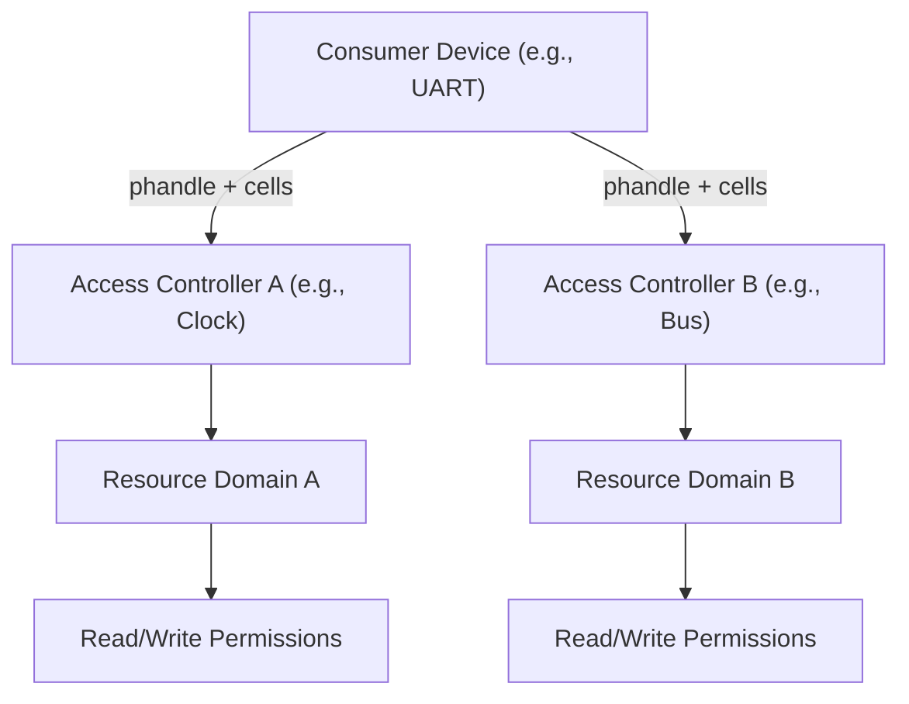

# General Device Tree Bindings

## Generic Domain Access Controllers

The Generic Domain Access Controller bindings define a standardized mechanism for managing hardware access permissions within the device tree. This framework allows the kernel to identify which hardware blocks (consumers) are governed by which access controllers (providers), ensuring that resources are accessed only by authorized compartments (such as CPU clusters or specific hardware ranges).

### Conceptual Overview

An **Access Controller** is responsible for defining the permissions of its associated **domain**. A domain consists of the set of hardware resources covered by that controller. 

In the provider-consumer model:
- **Provider**: A node in the device tree that manages access. It defines the format of the arguments required to configure access using the `#access-controller-cells` property.
- **Consumer**: A hardware device node that requires permission to operate. It references one or more providers via the `access-controllers` property.

### Architecture Workflow

The following diagram illustrates the relationship between a consumer device and its respective access controllers.



### Property Definitions

The following properties are used to implement the access controller pattern:

| Property | Type | Description |
| :--- | :--- | :--- |
| `#access-controller-cells` | `integer` | **Provider property.** Specifies the number of cells used in the specifier for this controller. The exact meaning of these cells is defined by the specific provider's binding. |
| `access-controllers` | `phandle-array` | **Consumer property.** A list of phandles to access controller providers, each followed by the number of cells specified by the provider's `#access-controller-cells`. |
| `access-controller-names` | `string-array` | **Consumer property.** An ordered list of names corresponding to the entries in `access-controllers`. Drivers use these names to look up specific controllers. |

### Implementation Example

Below is a practical application of these bindings. In this scenario, a UART device requires permissions from both a clock controller and a bus controller.

```devicetree
/* Provider 1: Clock Controller */
clock_controller: access-controllers@50000 {
    reg = <0x50000 0x400>;
    #access-controller-cells = <2>; /* Expects 2 arguments */
};

/* Provider 2: Bus Controller */
bus_controller: bus@60000 {
    reg = <0x60000 0x10000>;
    #address-cells = <1>;
    #size-cells = <1>;
    ranges;
    #access-controller-cells = <3>; /* Expects 3 arguments */

    /* Consumer: UART4 */
    uart4: serial@60100 {
        reg = <0x60100 0x400>;
        clocks = <&clk_serial>;
        
        /* Link to providers with their respective arguments */
        access-controllers = <&clock_controller 1 2>,
                             <&bus_controller 1 3 5>;
        
        /* Names used by the driver to distinguish providers */
        access-controller-names = "clock", "bus";
    };
};
```

### Integration Notes

- **Multiple Controllers**: A single device node can be a consumer of multiple access controllers.
- **Driver Responsibility**: The consumer driver is responsible for using `access-controller-names` to match and request the necessary permissions from the provider during the probe sequence.
- **Flexibility**: Because `#access-controller-cells` can vary, the provider has full control over the parameters (e.g., region IDs, permission levels) passed by the consumer.