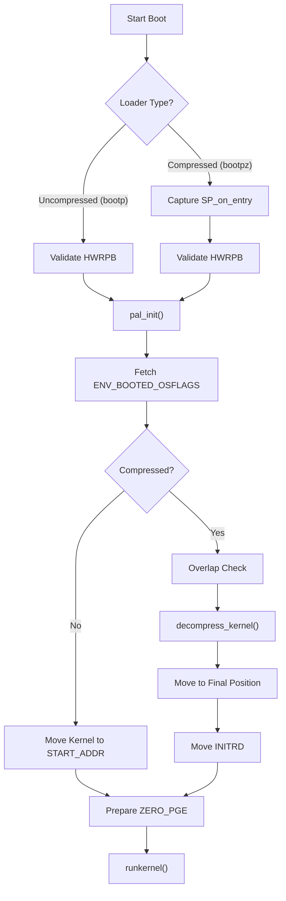
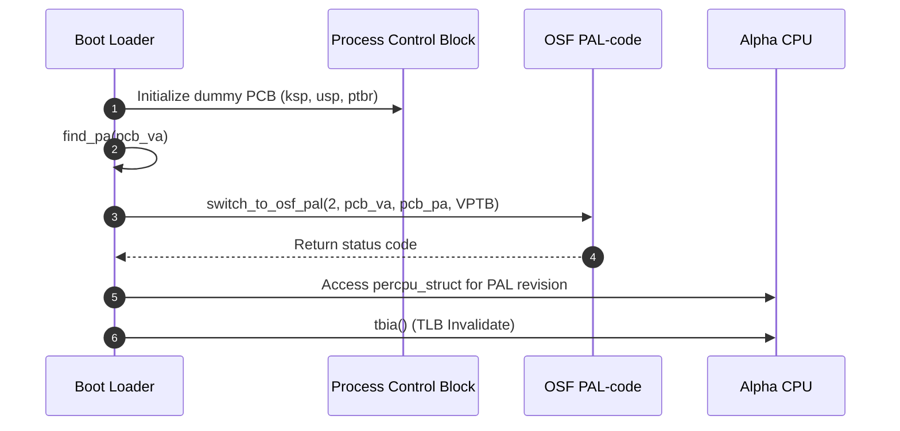

# Processor Architecture Support

This section provides a detailed technical analysis of the architecture-specific implementations for the Alpha processor within the Linux kernel, focusing on the boot sequence, PALcode initialization, and low-level assembly interfaces.

## Alpha Boot Sequence Analysis

The Alpha architecture implements two primary BOOTP loader paths: one for uncompressed kernels (`bootp.c`) and one for compressed kernels (`bootpz.c`). Both paths share a common goal of transitioning the system from the SRM console environment to the execution of the Linux kernel.

### Boot Process Workflow

The following flowchart illustrates the decision path and execution flow for both the uncompressed and compressed boot loaders.



### Uncompressed Boot Implementation (`bootp.c`)

The uncompressed boot sequence focuses on validating the Hardware Working Page Table (HWRPB) and safely relocating the kernel image to avoid memory overlaps.

1.  **Validation**: Checks that `INIT_HWRPB->pagesize` is 8kB and the virtual page table base (`vptb`) matches the expected `VPTB` address (`0x200000000`).
2.  **Stack Relocation**: Calls `move_stack()` to shift the stack to a safe area (near the `initrd_start`) to prevent the kernel image from overwriting the current execution stack.
3.  **Image Loading**: Employs a "double move" hack to handle consoles where virtual memory overlaps physical memory:
    *   Moves kernel to `START_ADDR + (4 * KERNEL_SIZE)`.
    *   Moves it again to `START_ADDR`.
4.  **Kernel Handover**: Populates the `ZERO_PGE` (the zero page) with environment variables and INITRD parameters before jumping to the kernel entry point.

### Compressed Boot Implementation (`bootpz.c`)

The compressed boot loader adds complexity by managing decompression and strictly detecting physical memory overlaps.

#### Memory Overlap Detection
The `check_range` function is used to ensure that the virtual addresses occupied by the BOOTP image do not overlap the physical addresses where the decompressed kernel will reside.

```c
int check_range(unsigned long vstart, unsigned long vend,
                unsigned long kstart, unsigned long kend)
{
    // ... loop through virtual pages ...
    kaddr = (find_pa(vaddr) | PAGE_OFFSET);
    if (kaddr >= kstart && kaddr <= kend) {
        return 1; // Overlap detected
    }
    // ...
}
```

If an overlap is detected, the loader decompresses the kernel into a temporary copy area (`K_COPY_IMAGE_START`) before moving it to its final destination.

## PALcode Initialization

The Platform Architecture Level (PAL) code is essential for Alpha processors to handle low-level hardware tasks. The `pal_init()` function, implemented in both `bootp.c` and `bootpz.c`, transitions the system into OSF PAL-code.

### PAL Initialization Sequence



### PCB Configuration
The Process Control Block (PCB) is configured with specific flags and pointers to ensure the PALcode can return control to the kernel:

| Field | Value/Source | Description |
| :--- | :--- | :--- |
| `ptbr` | `L1[1] >> 32` | Page Table Base Register |
| `flags` | `1` | Initialization flag |
| `asn` | `0` | Address Space Number |
| `unique` | `0` | Unique processor identifier |

## Low-Level Assembly Interfaces

The Alpha architecture requires specific assembly implementations for mathematical operations not natively supported in a single instruction or requiring specific register handling.

### Arithmetic Prototypes (`asm-prototypes.h`)

The kernel defines external assembly interfaces for division and remainder operations. These are categorized by operand size (Long vs. Quad) and signedness.

| Prototype | Operation | Type |
| :--- | :--- | :--- |
| `__divl` / `__reml` | Divide / Remainder | Signed Long |
| `__divlu` / `__remlu` | Divide / Remainder | Unsigned Long |
| `__divq` / `__remq` | Divide / Remainder | Signed Quad |
| `__divqu` / `__remqu` | Divide / Remainder | Unsigned Quad |
| `__udiv_qrnnd` | Unsigned Divide | Complex/Specialized |

## Boot-time I/O Support

Since the full kernel `printk` system is not available during the boot phase, `stdio.c` provides a minimal implementation of `sprintf` and `vsprintf` specifically for the SRM console (`srm_printk`).

### Formatting Capabilities
The `vsprintf` implementation in `stdio.c` supports the following conversion specifiers:

*   **Characters/Strings**: `%c` (char), `%s` (string).
*   **Pointers**: `%p` (formatted as hex via `number()` function).
*   **Integers**: 
    *   `%d`, `%i` (signed decimal).
    *   `%u` (unsigned decimal).
    *   `%o` (octal).
    *   `%x`, `%X` (hexadecimal, lowercase/uppercase).
*   **Modifiers**: Supports field width, precision, and qualifiers (`h` for short, `l` for long, `L`/`q` for quad/long long).

### Example: Integer-to-String Conversion
The `number()` function handles the actual conversion of numeric values to their string representations based on the requested base (2-36):

```c
static char * number(char * str, unsigned long long num, int base, int size, int precision, int type)
{
    const char *digits = "0123456789abcdefghijklmnopqrstuvwxyz";
    // ... handles signs, padding, and base conversion ...
    while (num != 0) {
        tmp[i++] = digits[do_div(num, base)];
    }
    // ... returns formatted string pointer ...
}