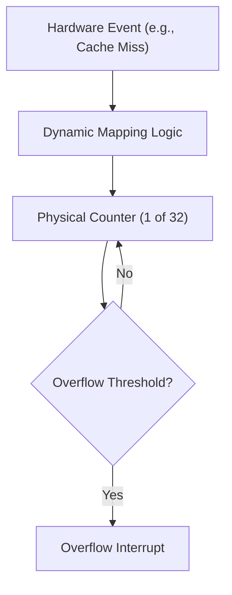

# ARC Architecture Bindings

The ARC architecture bindings define the device tree specifications for hardware components implemented within the ARC processor ecosystem. This section focuses on the Performance Counter Timer (PCT) implementations used for system profiling and performance analysis.

## ARC HS Performance Counters

The ARC HS Performance Counters provide a sophisticated pipeline performance monitor used to track CPU and cache events. This subsystem allows developers to monitor hardware-level events—such as cache hits and misses—to optimize software execution and identify bottlenecks.

### Hardware Overview

The performance monitor is designed with high flexibility, supporting a wide array of hardware conditions that can be dynamically mapped to a limited set of physical counters.

- **Event Mapping**: Over 100 hardware conditions can be tracked.
- **Counter Capacity**: Up to 32 physical counters are available for mapping these conditions.
- **Interrupts**: Supports overflow interrupts to trigger system events when a counter reaches its maximum value.

### Data Flow Architecture

The following diagram illustrates the logical flow from a hardware event to the system interrupt:



### Device Tree Binding: `snps,archs-pct`

The `snps,archs-pct` compatible string is used to describe the Performance Counter Timer instance in the device tree.

#### Properties

| Property | Type | Required | Description |
| :--- | :--- | :--- | :--- |
| `compatible` | `string` | Yes | Must be set to `"snps,archs-pct"`. |
| `reg` | `uint64-array` | Yes | The base address and size of the PCT register space. Maximum 1 entry. |
| `clocks` | `phandle-array` | Yes | The clock source providing the timing for the counters. Maximum 1 entry. |

#### Example Usage

```dts
pct: performance-counters@12000000 {
    compatible = "snps,archs-pct";
    reg = <0x12000000 0x1000>;
    clocks = <&sys_clk>;
};