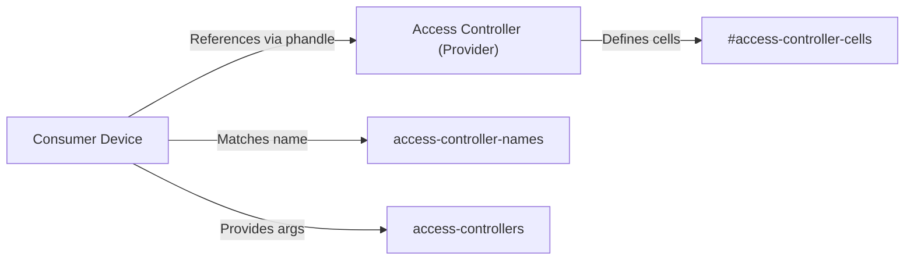

# Device Tree and Hardware Bindings

The Device Tree (DT) system is used by the Linux kernel to describe the hardware topology of a system. By using YAML-based bindings, the kernel defines the relationship between hardware components, their configuration parameters, and their dependencies, allowing the kernel to remain agnostic of specific board layouts while still supporting a vast array of hardware.

## Generic Domain Access Controllers

Access controllers are responsible for defining which compartments (such as CPU clusters, address ranges, or groups of hardware blocks) are permitted to access specific hardware blocks within a designated domain.

### Provider-Consumer Model

The access control system operates on a provider-consumer relationship:
- **Provider**: The access controller node, which manages permissions for a set of resources.
- **Consumer**: A device node that requires specific permissions to be configured by the provider.

A consumer node can be associated with multiple access controllers. The relationship is established using phandles and a set of arguments defined by the provider.

### Access Controller Properties

The following properties are used to define and link access controllers in the device tree:

| Property | Type | Description |
| :--- | :--- | :--- |
| `#access-controller-cells` | Integer | Defines the number of cells in the access-controller specifier for the provider. |
| `access-controller-names` | String Array | A list of names corresponding to the entries in `access-controllers`, used by drivers for matching. |
| `access-controllers` | Phandle Array | A list of specifiers pointing to the provider access controllers. |

### Logical Relationship Diagram



### Configuration Example

The following snippet demonstrates a UART device acting as a consumer for both a clock controller and a bus controller:

```devicetree
clock_controller: access-controllers@50000 {
    reg = <0x50000 0x400>;
    #access-controller-cells = <2>;
};

bus_controller: bus@60000 {
    reg = <0x60000 0x10000>;
    #address-cells = <1>;
    #size-cells = <1>;
    ranges;
    #access-controller-cells = <3>;

    uart4: serial@60100 {
        reg = <0x60100 0x400>;
        clocks = <&clk_serial>;
        access-controllers = <&clock_controller 1 2>,
                             <&bus_controller 1 3 5>;
        access-controller-names = "clock", "bus";
    };
};
```

## Architecture-Specific Bindings

### ARC HS Performance Counters

The `snps,archs-pct` binding describes the pipeline performance monitor for ARC HS processors. This system counts CPU and cache events (e.g., cache hits and misses) by mapping over 100 hardware conditions to up to 32 counters.

**Required Properties:**

| Property | Constraints | Description |
| :--- | :--- | :--- |
| `compatible` | `const: snps,archs-pct` | Identifies the hardware as an ARC HS Performance Counter. |
| `reg` | `maxItems: 1` | The register address of the counter block. |
| `clocks` | `maxItems: 1` | The clock source for the performance counters. |

The system also supports overflow interrupts to notify the kernel when a counter reaches its limit.

### ARM Platform Bindings

ARM-based platforms utilize the root node (`/`) to define SoC and board compatibility.

#### Actions Semi Platforms
The Actions Semi bindings cover several SoC generations, primarily Cortex-A9 and Cortex-A53 based systems.

| SoC | Architecture | Example Boards |
| :--- | :--- | :--- |
| **S500** | Quad-core ARM Cortex-A9 | Allo Sparky, CubieBoard6, RoseapplePi, Labrador Core v2 |
| **S700** | Quad-core ARM Cortex-A53 | Labrador Core v3, CubieBoard7 |
| **S900** | Quad-core ARM Cortex-A53 | uCRobotics Bubblegum-96 |

#### Airoha SoC Platforms
Airoha platforms are defined by their specific SoC identifiers at the root node.

- **Airoha EN7523**: Supports `airoha,en7523` and `airoha,en7523-evb`.
- **Airoha EN7581**: Supports `airoha,en7581` and `airoha,en7581-evb`.

## Hardware Mapping Summary

The following flow illustrates how a YAML binding translates to a physical hardware resource in the kernel.

```mermaid
sequenceDiagram
    autonumber
    participant YAML as "YAML Binding"
    participant DT as "Device Tree Binary (DTB)"
    participant K as "Kernel Driver"
    participant HW as "Physical Hardware"

    YAML ->> DT: Defines properties (compatible, reg, clocks)
    DT ->> K: Passes hardware topology via phandles
    K ->> K: Matches 'compatible' string to driver
    K ->> HW: Maps registers and configures clocks