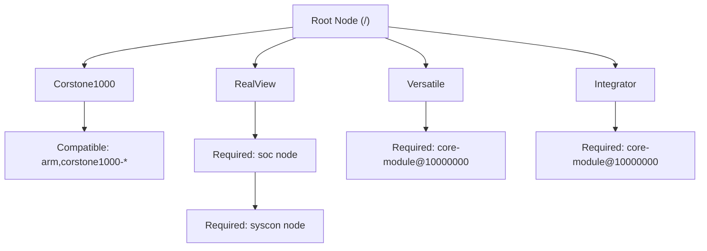

# ARM Platform Infrastructure

The ARM Platform Infrastructure defines the base hardware definitions and DeviceTree (DT) bindings required to boot and manage various ARM-based reference platforms, evaluation boards, and virtual platforms. This infrastructure ensures that the Linux kernel can correctly identify the system-on-chip (SoC), CPU cores, and essential system controllers across different generations of ARM hardware.

## Platform Overview

The Linux kernel supports a wide array of ARM platforms, ranging from legacy modular prototyping boards to modern, secure-by-design compute subsystems. These are primarily categorized by their intended use: evaluation, reference design, or production-ready subsystems.

### Modern Compute Subsystems: Corstone1000
The **Corstone1000** represents the modern approach to ARM platform design, utilizing the Corstone SSE-710 subsystem. It provides a hybrid compute architecture combining Cortex-A (Application) and Cortex-M (Microcontroller) processors.

- **Core Support**: Cortex-A32, A35, A53, and A320.
- **Security**: Includes an Integrated Secure Enclave for Hardware Root of Trust (RoT) and optional CryptoCell-312 acceleration.
- **Implementations**:
  - `arm,corstone1000-mps3`: FPGA implementation on the MPS3 board.
  - `arm,corstone1000-fvp`: Fixed Virtual Platform.
  - `arm,corstone1000-a320-fvp`: FVP featuring Cortex-A320 and Ethos-U85 NPU.

### Reference Designs: RealView
The **RealView** series served as the primary reference for exploring advanced CPU features such as TrustZone and multicore (MPCore) capabilities.

- **CPU Support**: Arm11, Cortex-A8, and Cortex-A9.
- **Required Structure**: All RealView boards must define a `soc` node in the root of the DeviceTree, which must further contain a `syscon` system controller node.
- **Key Variants**: `arm,realview-eb` (Emulation), `arm,realview-pb1176`, `arm,realview-pb11mp` (SMP), `arm,realview-pba8`, and `arm,realview-pbx`.

### Evaluation Boards: Versatile
The **Versatile** platforms are specialized evaluation boards for the ARM926EJ-S core.

- **Architecture**: Primarily focused on ARM926EJ-S.
- **Hardware Requirement**: A `core-module` child node must exist at the physical address `0x10000000`.
- **Variants**:
  - `arm,versatile-ab`: Application Baseboard.
  - `arm,versatile-pb`: Platform Baseboard (includes PCI host controller).

### Modular Prototyping: Integrator
The **Integrator** boards were the earliest officially supported ARM platforms, utilizing a modular "core tile" approach to support various ARMv4, v5, and v6 cores.

- **Design**: Modular system where different CPU tiles (core modules) can be swapped.
- **Hardware Requirement**: Requires a `core-module@10000000` node.
- **Variants**: `arm,integrator-ap` (Application Platform), `arm,integrator-cp` (Compact Platform), and `arm,integrator-sp` (Standard Development Board).

## DeviceTree Hierarchy

The following diagram illustrates the structural requirements for the root node across different ARM platform types.

## Technical Comparison Summary

| Platform | Primary CPU Target | Key Requirement | Use Case |
| :--- | :--- | :--- | :--- |
| **Corstone1000** | Cortex-A32/35/53/320 | Root compatible | Secure IoT / Hybrid Compute |
| **RealView** | Arm11 / Cortex-A8/A9 | `soc` $\rightarrow$ `syscon` | Feature Exploration (TrustZone) |
| **Versatile** | ARM926EJ-S | `core-module@10000000` | CPU Evaluation |
| **Integrator** | ARMv4 / v5 / v6 | `core-module@10000000` | Modular Prototyping |