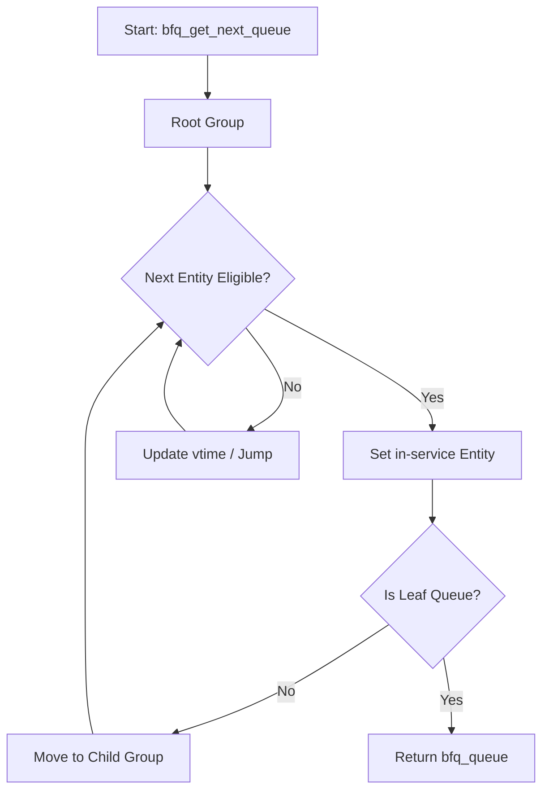

# Block I/O Subsystem

The Block I/O subsystem provides the abstraction layer between the Linux kernel's file systems and the physical storage hardware. It manages block devices, optimizes I/O request ordering through scheduling algorithms, and ensures data integrity through metadata extensions and bad-block management.

## Block Device Management

Block device management is primarily handled in `block/bdev.c`. The kernel represents block devices using `struct block_device`, which links a physical `gendisk` to a VFS inode via a pseudo-filesystem (`bdev`).

### Device Lifecycle and Access Control

The kernel implements strict controls over how block devices are opened and claimed to prevent data corruption, especially when multiple holders (e.g., a filesystem and a partition tool) attempt to access the same device.

| Function | Description | Key Context |
| :--- | :--- | :--- |
| `bdev_open()` | Opens a block device, handles exclusive access via holders, and manages `gendisk` state. | `disk->open_mutex` |
| `bdev_release()` | Releases the device, syncs dirty mappings, and updates opener counts. | `disk->open_mutex` |
| `bdev_freeze()` | Locks a filesystem into a consistent state for snapshots. | `bd_fsfreeze_mutex` |
| `bdev_thaw()` | Unlocks a previously frozen filesystem. | `bd_fsfreeze_mutex` |
| `bdev_alloc()` | Allocates a `block_device` structure and associates it with a `gendisk`. | `blockdev_superblock` |

### Block Device Mapping and VFS Integration

Block devices are integrated into the VFS using a pseudo-filesystem. Each `block_device` is associated with a `bdev_inode`, allowing the kernel to use the standard page cache mechanism (`address_space`) for block I/O.

```c
struct bdev_inode {
    struct block_device bdev;
    struct inode vfs_inode;
};
```

The kernel provides utilities to manage the block size and cache consistency:
- **`invalidate_bdev()`**: Invalidates clean unused buffers and page cache.
- **`sync_blockdev()`**: Writes out and waits upon all dirty data associated with the device mapping.
- **`truncate_bdev_range()`**: Discards the buffer cache for a specific range, provided the caller holds an exclusive handle.

## I/O Scheduling: Budget Fair Queueing (BFQ)

BFQ is a proportional-share I/O scheduler implemented in `block/bfq-iosched.c` and `block/bfq-wf2q.c`. Unlike traditional schedulers that use time slices, BFQ assigns **budgets** (measured in sectors) to processes.

### Design Philosophy

BFQ aims to distribute device throughput proportionally to the weights of the requesting processes while providing low-latency guarantees for interactive and soft real-time applications.

1.  **Budget-Based Service**: A process is granted the device until it exhausts its assigned sector budget, mitigating throughput fluctuations and internal device queuing.
2.  **Low-Latency Heuristics**: 
    *   **Interactive Detection**: Queues that are non-empty for limited intervals and then become empty are deemed interactive and receive "weight-raising."
    *   **Soft Real-Time**: BFQ privileges queues that exhibit isochronous arrival patterns.
3.  **Burst Management**: BFQ detects "large bursts" of queue creations (e.g., `systemd` boot or `git grep`). Queues created in large bursts are denied weight-raising and device idling to maximize aggregate throughput.

### B-WF2Q+ Scheduling Engine

The core of BFQ is the B-WF2Q+ (Hierarchical Budget Worst-case Fair Weighted Fair Queueing) algorithm. It manages `bfq_entity` objects in a hierarchical tree (cgroups).

#### Tree Structure and Virtual Time
B-WF2Q+ uses two primary red-black trees to manage entities:
- **Active Tree**: Contains entities eligible for service, ordered by their virtual finish time.
- **Idle Tree**: Contains entities that have no pending requests but are kept for potential bandwidth recovery.

The scheduler tracks **Virtual Time** (`vtime`), which advances as service is delivered:
$$\text{Virtual Delta} = \frac{\text{Service} \times 2^{22}}{\text{Weight Sum}}$$

#### Next Queue Selection Process
The function `bfq_get_next_queue()` traverses the hierarchy from the root group to the leaf `bfq_queue`:



## Data Integrity and Bio Extensions

The kernel extends the `bio` (Block I/O) structure to support data integrity metadata (e.g., T10-PI), implemented in `block/bio-integrity.c`.

### Bio Integrity Payloads
Integrity metadata is stored in a `bio_integrity_payload` (`bip`), which contains a set of `bio_vec` elements pointing to the checksums or guards.

| Feature | Implementation Detail |
| :--- | :--- |
| **Allocation** | `bio_integrity_alloc()` allocates a `bio_integrity_alloc` structure containing the `bip` and associated `bvecs`. |
| **User Mapping** | `bio_integrity_map_user()` extracts pages from a user-space iterator and attaches them as integrity metadata. |
| **Offloading** | `bi_offload_capable()` determines if metadata size equals the PI tuple size, allowing hardware offloading. |
| **Cloning** | `bio_integrity_clone()` ensures that cloned bios maintain the same integrity metadata seeds and flags. |

## Bad Block Management

`block/badblocks.c` provides a mechanism to track and avoid sectors known to be defective.

### Bad Block Table Operations
The kernel maintains a table of bad block ranges, where each entry consists of a start LBA, length, and an "Acknowledged" flag.

- **`badblocks_set()`**: Adds a range to the table. It performs complex merging logic:
    - **Front Merge**: If the new range is adjacent to an existing range and they share the same acknowledgment status.
    - **Overwrite**: An acknowledged range can overwrite an unacknowledged range.
- **`badblocks_clear()`**: Removes or shrinks a bad block range. If a clear request hits the middle of a range, the kernel splits the existing range into two.
- **`badblocks_check()`**: Binary searches the table to determine if a given sector range contains bad blocks.

## Data Flow: Bio Request Path

The following sequence diagram illustrates the path of a `bio` request from the upper layers through the integrity and scheduling layers to the driver.

```mermaid
sequenceDiagram
    autonumber
    participant VFS as "VFS / File System"
    participant BI as "Bio Integrity"
    participant BFQ as "BFQ Scheduler"
    participant BB as "Badblocks Table"
    participant DRV as "Hardware Driver"

    VFS ->> BI: bio_integrity_map_user()
    activate BI
    Note over BI: Allocate/Map Metadata
    BI -->> VFS: bio ready
    deactivate BI

    VFS ->> BB: badblocks_check()
    activate BB
    Note over BB: Binary Search LBA Range
    BB -->> VFS: Status (Clear/Acked/Unacked)
    deactivate BB

    VFS ->> BFQ: submit_bio()
    activate BFQ
    Note over BFQ: Assign to bfq_queue
    BFQ ->> BFQ: B-WF2Q+ Selection
    Note over BFQ: Budget Check & Weight Raising
    BFQ ->> DRV: dispatch_request()
    deactivate BFQ
    
    DRV ->> DRV: DMA Transfer
    DRV -->> VFS: bio_end_io()