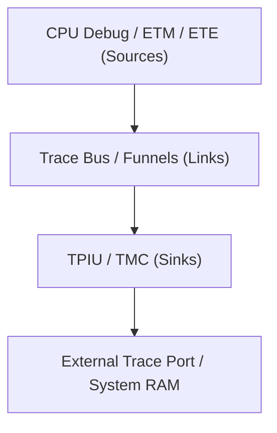

# ARM CoreSight and Debugging

The ARM CoreSight architecture provides a comprehensive framework for debugging and tracing the execution of ARM-based systems. CoreSight components are typically categorized as **sources** (generating trace data), **links** (routing trace data), and **sinks** (consuming or exporting trace data).

## Architecture Overview

Trace data originates from CPU-bound components (like ETM or ETE), travels through a series of interconnects (such as Funnels), and is eventually routed to a sink (such as a TPIU for external export or a TMC for memory buffering).



---

## Component Bindings

### 1. CPU Debug Component
The CoreSight CPU debug component implements the ARMv8 architecture's external debug module. It supports both self-hosted and external debug modes and provides sample-based profiling for CPU program counters, secure states, and exception levels.

**Binding:** `arm,coresight-cpu-debug`

| Property | Type | Required | Description |
| :--- | :--- | :--- | :--- |
| `compatible` | string | Yes | `arm,coresight-cpu-debug`, `arm,primecell` |
| `reg` | uint64 | Yes | MMIO register range. |
| `clocks` | phandle | Yes | Clock reference for the debug module. |
| `clock-names` | string | Yes | Typically `apb_pclk`. |
| `cpu` | phandle | Yes | Reference to the CPU being debugged. |
| `power-domains` | phandle | No | Dedicated power domain for debug logic. |

**Example:**
```dts
debug@f6590000 {
    compatible = "arm,coresight-cpu-debug", "arm,primecell";
    reg = <0xf6590000 0x1000>;
    clocks = <&sys_ctrl 1>;
    clock-names = "apb_pclk";
    cpu = <&cpu0>;
};
```

---

### 2. Embedded Trace Macrocell (ETM)
The ETM is a real-time trace source that provides instruction and data tracing of a processor. It can be accessed via memory-mapped I/O or exclusively through system registers.

**Binding:** `arm,coresight-etm`

| Property | Type | Required | Description |
| :--- | :--- | :--- | :--- |
| `compatible` | string | Yes | `arm,coresight-etm3x`, `arm,coresight-etm4x`, or `arm,coresight-etm4x-sysreg` |
| `reg` | uint64 | Cond. | Required unless using `etm4x-sysreg`. |
| `cpu` | phandle | Yes | Reference to the CPU being traced. |
| `out-ports` | graph | Yes | Connection to the CoreSight Trace bus. |
| `arm,cp14` | boolean | No | Access via co-processor 14. |
| `arm,coresight-loses-context-with-cpu` | boolean | No | Context is lost on CPU power down. |

**Example:**
```dts
ptm@2201c000 {
    compatible = "arm,coresight-etm3x", "arm,primecell";
    reg = <0x2201c000 0x1000>;
    cpu = <&cpu0>;
    clocks = <&oscclk6a>;
    clock-names = "apb_pclk";
    out-ports {
        port {
            ptm0_out_port: endpoint {
                remote-endpoint = <&funnel_in_port0>;
            };
        };
    };
};
```

---

### 3. Trace Port Interface Unit (TPIU)
The TPIU acts as a sink, capturing trace data from the internal trace bus and formatting it for output to an external hardware trace port.

**Binding:** `arm,coresight-tpiu`

| Property | Type | Required | Description |
| :--- | :--- | :--- | :--- |
| `compatible` | string | Yes | `arm,coresight-tpiu`, `arm,primecell` |
| `reg` | uint64 | Yes | MMIO register range. |
| `in-ports` | graph | Yes | Input connection from the Trace bus. |
| `clocks` | phandle | Yes | Clock reference (`apb_pclk`, `atclk`). |

**Example:**
```dts
tpiu@e3c05000 {
    compatible = "arm,coresight-tpiu", "arm,primecell";
    reg = <0xe3c05000 0x1000>;
    clocks = <&clk_375m>;
    clock-names = "apb_pclk";
    in-ports {
        port {
            tpiu_in_port: endpoint {
                remote-endpoint = <&funnel4_out_port0>;
            };
        };
    };
};
```

---

### 4. Embedded Trace Extension (ETE)
The ETE is a modern per-CPU trace component that extends the ETMv4 architecture. It is designed to support future architecture changes and can route trace data either through legacy CoreSight components or via the Arm Trace Buffer Extension (TRBE).

**Binding:** `arm,embedded-trace-extension`

| Property | Type | Required | Description |
| :--- | :--- | :--- | :--- |
| `compatible` | string | Yes | `arm,embedded-trace-extension` |
| `cpu` | phandle | Yes | Reference to the bound CPU. |
| `out-ports` | graph | No | Optional connection to legacy CoreSight bus. |
| `power-domains` | phandle | No | Power domain reference. |

**Example (with legacy connection):**
```dts
ete-1 {
    compatible = "arm,embedded-trace-extension";
    cpu = <&cpu_1>;

    out-ports {
        port {
            ete1_out_port: endpoint {
                remote-endpoint = <&funnel_in_port0>;
            };
        };
    };
};