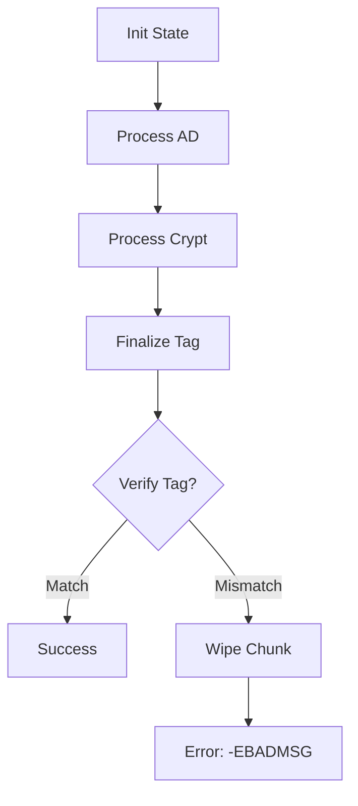
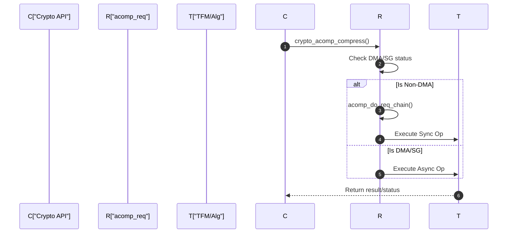

# Cryptographic Framework

The Linux kernel's cryptographic framework provides a standardized API for implementing and utilizing various cryptographic primitives, including symmetric/asymmetric ciphers and compression algorithms. It abstracts hardware acceleration and software implementations, allowing the kernel to select the most efficient provider based on priority and availability.

## AEAD (Authenticated Encryption with Associated Data)

The AEAD framework supports algorithms that simultaneously provide confidentiality, integrity, and authenticity. This is achieved by encrypting the plaintext and generating an authentication tag based on both the ciphertext and optional associated data (AD).

### AEAD Pipeline Flow
The following diagram represents the state transition and data flow for an AEAD operation (e.g., AEGIS-128) from initialization to final tag verification.



### AEAD API Core Functions
The kernel provides a set of common wrappers for AEAD operations, ensuring that keys are properly aligned and requested sizes are within limits.

| Function | Description | Key Source File |
| :--- | :--- | :--- |
| `crypto_aead_setkey()` | Sets the encryption key, handling unaligned buffers if necessary. | `crypto/aead.c` |
| `crypto_aead_setauthsize()` | Sets the size of the authentication tag. | `crypto/aead.c` |
| `crypto_aead_encrypt()` | Executes the encryption process on an `aead_request`. | `crypto/aead.c` |
| `crypto_aead_decrypt()` | Executes decryption and verifies the authentication tag. | `crypto/aead.c` |

### Implementation Example: AEGIS-128
AEGIS-128 is a high-performance AEAD algorithm implemented in the kernel with both generic and SIMD-optimized paths.

- **State Management**: Uses `struct aegis_state` containing 5 blocks of 16 bytes each.
- **Processing**: 
    - Associated data is processed via `crypto_aegis128_process_ad`.
    - Plaintext/Ciphertext is processed via `crypto_aegis128_process_crypt`.
- **SIMD Optimization**: When `CONFIG_CRYPTO_AEGIS128_SIMD` is enabled, the kernel uses `crypto_aegis128_update_simd` and `crypto_aegis128_final_simd` for increased throughput.

```c
// Core AEGIS-128 State structure
struct aegis_state {
	union aegis_block blocks[AEGIS128_STATE_BLOCKS];
};
```

## Compression Framework

The kernel supports both synchronous (`scomp`) and asynchronous (`acomp`) compression interfaces.

### Asynchronous Compression (`acomp`)
The `acomp` framework allows compression operations to be offloaded to hardware or handled in a non-blocking manner. It utilizes a request-chaining mechanism and scatter-gather lists to handle fragmented memory.

#### Request Processing Logic
Asynchronous requests can be processed via DMA or non-DMA paths. If a request is non-DMA, it is handled through a internal chain.



#### Key `acomp` Components
- **`acomp_walk`**: A utility used to iterate through source and destination buffers, supporting both linear (virtual) and scatterlist-based memory.
- **`crypto_acomp_streams`**: Manages per-CPU contexts to avoid lock contention during high-frequency compression.

### Synchronous Compression (`scomp`)
Synchronous compression is used for operations that must complete immediately. An example is the **842 software compression algorithm**.

**Implementation Details of 842:**
- **Purpose**: A software reference implementation of the 842 format.
- **Performance**: Noted in source as "very, very slow" compared to other software compressors; intended primarily for compatibility.
- **Registration**: Registered via `crypto_register_scomp` with a priority of 100.

```c
static struct scomp_alg scomp = {
	.streams = {
		.alloc_ctx = crypto842_alloc_ctx,
		.free_ctx = crypto842_free_ctx,
	},
	.compress = crypto842_scompress,
	.decompress = crypto842_sdecompress,
	.base = {
		.cra_name = "842",
		.cra_driver_name = "842-scomp",
		.cra_priority = 100,
		.cra_module = THIS_MODULE,
	}
};
```

## Summary of Framework Interfaces

| Framework | Type | Primary Data Structure | Key File |
| :--- | :--- | :--- | :--- |
| **AEAD** | Symmetric | `struct crypto_aead` | `crypto/aead.c` |
| **ACOMP** | Compression | `struct crypto_acomp` | `crypto/acompress.c` |
| **SCOMP** | Compression | `struct crypto_scomp` | `crypto/842.c` |
| **AEGIS** | AEAD Alg | `struct aegis_state` | `crypto/aegis128-core.c` |