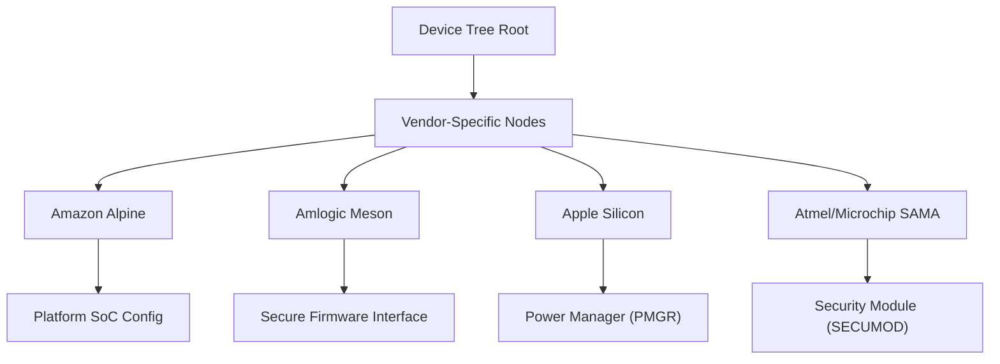

# ARM Vendor-Specific Implementations

This section documents the hardware-specific Device Tree bindings for ARM System-on-Chips (SoCs) provided by various vendors. These bindings define how the Linux kernel interacts with proprietary hardware blocks, power management controllers, and security modules.

## Overview

Vendor-specific implementations allow the kernel to support a wide array of ARM-based hardware by defining the register maps and properties required for driver initialization. Most of these implementations leverage the `syscon` (System Controller) framework to manage register access.



---

## Amazon Annapurna Labs

The Alpine platform bindings provide support for the Annapurna Labs SoC generations. These bindings are primarily used for platform-level identification.

### Alpine Platform (`amazon,al`)

| SoC Version | Compatible Strings |
| :--- | :--- |
| **Alpine V1** | `al,alpine` |
| **Alpine V2** | `al,alpine-v2-evp`, `al,alpine-v2` |
| **Alpine V3** | `amazon,al-alpine-v3-evp`, `amazon,al-alpine-v3` |

---

## Amlogic

Amlogic implementations focus on the interface between the Linux kernel and the secure firmware residing on the SoC.

### Meson Firmware Interface (`amlogic,meson-gx-ao-secure`)

This binding defines a register bank shared with secure firmware for status and data exchange.

- **Key Properties**:
  - `reg`: Register base address and size.
  - `amlogic,has-chip-id`: Boolean flag indicating if the firmware provides SoC type, package, and revision information.
- **Compatibility**: Works in conjunction with `syscon`.

**Example Configuration:**
```devicetree
ao-secure@140 {
    compatible = "amlogic,meson-gx-ao-secure", "syscon";
    reg = <0x140 0x140>;
    amlogic,has-chip-id;
};
```

---

## Apple Silicon

Apple's ARM implementations are highly modular, specifically regarding power and clock management.

### Power Manager (`apple,pmgr`)

The PMGR (Power Manager) is a complex block responsible for clocks, resets, and power states. It is implemented as a `syscon` and a `simple-mfd` (Multi-Function Device), containing sub-nodes for individual power controllers.

- **Architecture**:
  - **Root Node**: `apple,pmgr` handles the primary memory-mapped region.
  - **Sub-nodes**: `apple,pmgr-pwrstate` represents individual power domains.
- **Hierarchical Dependencies**: Power controllers can depend on other controllers via the `power-domains` property, creating a dependency tree (e.g., `uart0` $\rightarrow$ `uart_p` $\rightarrow$ `sio`).

**Example Hierarchy:**
```devicetree
power-management@23b700000 {
    compatible = "apple,t8103-pmgr", "apple,pmgr", "syscon", "simple-mfd";
    reg = <0x2 0x3b700000 0x0 0x14000>;

    ps_sio: power-controller@1c0 {
        compatible = "apple,t8103-pmgr-pwrstate", "apple,pmgr-pwrstate";
        reg = <0x1c0 8>;
        label = "sio";
    };

    ps_uart_p: power-controller@220 {
        compatible = "apple,t8103-pmgr-pwrstate", "apple,pmgr-pwrstate";
        reg = <0x220 8>;
        power-domains = <&ps_sio>;
    };
};
```

---

## Atmel / Microchip

Microchip's ARM implementations include specialized security and I/O modules for the SAMA series.

### Security Module (`atmel,sama5d2-secumod`)

The SECUMOD provides security features and manages PIOBU pins that function as GPIOs, maintaining voltage during backup or self-refresh modes.

- **Functionality**:
  - **Security**: Hardware-level security management.
  - **GPIO**: Acts as a `gpio-controller` with `#gpio-cells = <2>`.
- **Compatibility**: Supports `atmel,sama5d2-secumod` and `microchip,sama7` variants.

**Example Configuration:**
```devicetree
security-module@fc040000 {
    compatible = "atmel,sama5d2-secumod", "syscon";
    reg = <0xfc040000 0x100>;
    gpio-controller;
    #gpio-cells = <2>;
};