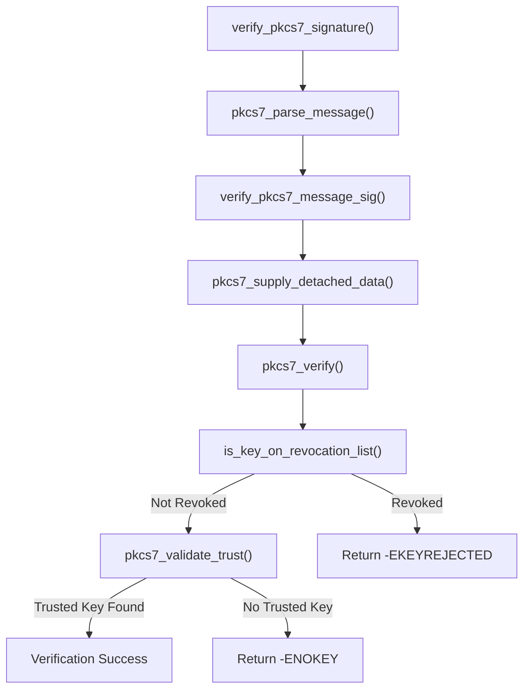

# Security and Certificate Management

The Linux kernel implements a robust framework for managing trusted keys and certificates to ensure the integrity of signed modules and system data. This system revolves around a hierarchy of trusted keyrings and a dedicated blacklist mechanism to revoke compromised certificates or specific binary hashes.

## System Keyring Hierarchy

The kernel maintains several specialized keyrings to establish a chain of trust. These keyrings are initialized during the boot process and use restricted linking to ensure that only authorized keys are added.

### Trusted Keyring Types

| Keyring | Identifier | Description | Trust Source |
| :--- | :--- | :--- | :--- |
| **Built-in Trusted** | `.builtin_trusted_keys` | The primary root of trust containing certificates compiled into the kernel image. | Compiled-in X.509 certificates |
| **Secondary Trusted** | `.secondary_trusted_keys` | A keyring that can be updated at runtime. | Vouched for by Built-in, Machine, or Secondary keys |
| **Machine Trusted** | `.machine_trusted_keys` | Architecture or platform-specific trusted keys. | Linked to the Secondary keyring |
| **Platform Trusted** | `.platform_trusted_keys` | Keys specific to the hardware platform. | Platform-specific initialization |

### Trust Restriction Logic
To prevent unauthorized keys from entering the trust chain, the kernel uses `key_restriction` structures. For example, `restrict_link_by_builtin_trusted` ensures that any new key added to a keyring must be signed by a key already present in the built-in trusted keyring.

## Certificate Verification Process

The kernel provides a standardized API for verifying PKCS#7 signatures on system data. The verification process ensures that the data is untampered and that the signing key is neither revoked nor untrusted.

### Verification Workflow



### Core Verification APIs

| Function | Description |
| :--- | :--- |
| `verify_pkcs7_signature()` | High-level entry point; parses the raw PKCS#7 message and initiates verification. |
| `verify_pkcs7_message_sig()` | Internal logic that checks the signature against the revocation list and validates trust against a specified keyring. |
| `pkcs7_validate_trust()` | Checks if the certificate used for the signature is present in the provided trusted keyring. |

## Hash Blacklisting and Revocation

The kernel maintains a system blacklist to explicitly reject specific certificates or binary blobs, even if they are otherwise signed by a trusted CA.

### The Blacklist Keyring
The `.blacklist` keyring stores forbidden hashes and revocation certificates. It is initialized via `blacklist_init()` and is critical for security; failure to allocate this keyring results in a kernel panic.

#### Supported Blacklist Types
Hashes are stored in the description of the blacklist key using specific prefixes:

*   **TBS (To-Be-Signed):** Prefixed with `tbs:`. Used for X.509 certificate TBS fields.
*   **Binary:** Prefixed with `bin:`. Used for raw binary blobs.

#### Blacklist Validation Rules
The function `blacklist_vet_description` enforces strict formatting for blacklist entries:
1. Must start with a valid prefix (`tbs:` or `bin:`).
2. Must contain an even number of hexadecimal characters.
3. Must not exceed `MAX_HASH_LEN` (128 characters).
4. Must use lowercase hexadecimal digits.

### Revocation List Implementation
If `CONFIG_SYSTEM_REVOCATION_LIST` is enabled, the kernel loads a compiled-in list of revocation X.509 certificates via `load_revocation_certificate_list()`.

```c
int is_key_on_revocation_list(struct pkcs7_message *pkcs7)
{
	int ret;

	ret = pkcs7_validate_trust(pkcs7, blacklist_keyring);

	if (ret == 0)
		return -EKEYREJECTED;

	return -ENOKEY;
}
```

## Certificate Extraction Tool

The `extract-cert` utility is a userspace tool used during the kernel build process to convert certificates into the DER form required by the kernel.

### Supported Input Formats
*   **PEM:** Standard Privacy-Enhanced Mail format.
*   **PKCS#11:** Hardware security modules (HSM) or smart cards via the `pkcs11:` URI scheme.

### Operational Flow
1. **Input Analysis:** The tool checks if the source is a `pkcs11:` URI or a standard file path.
2. **Extraction:**
    *   For PEM: Uses `PEM_read_bio_X509` to read certificates.
    *   For PKCS#11: Uses `OSSL_STORE` (OpenSSL 3+) or the `pkcs11` ENGINE to load the certificate.
3. **Output:** Writes the extracted certificate in DER format to the destination file using `i2d_X509_bio`.