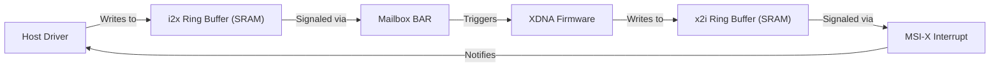
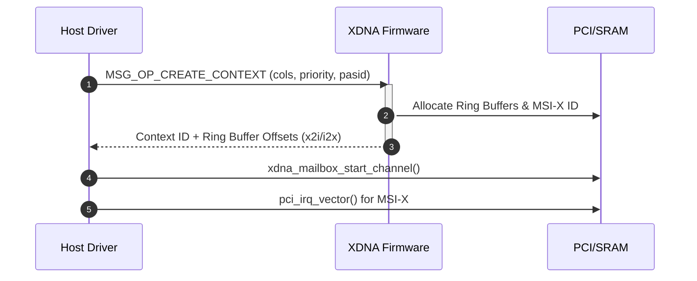

# Hardware Accelerators (AMD XDNA)

The AMD XDNA AI Engine (AIE) driver provides a kernel-level interface for managing and executing workloads on the XDNA hardware accelerator. The implementation focuses on a mailbox-based communication protocol, rigorous memory mapping via PCI Base Address Registers (BARs), and a structured power management system.

## Hardware Interface and PCI Communication

The XDNA device is interfaced as a PCI device. The driver maps several critical memory regions (BARs) to facilitate communication between the host CPU and the AI Engine.

### BAR Memory Mapping
The driver identifies and maps the following resources during the `aie2_init` phase:

| BAR Resource | Purpose | Access Method |
| :--- | :--- | :--- |
| **SRAM BAR** | Ring buffers and management channel info | `pcim_iomap` $\rightarrow$ `ndev->sram_base` |
| **Mailbox BAR** | Command submission and signaling | `pcim_iomap` $\rightarrow$ `ndev->mbox_base` |
| **PSP BARs** | Platform Security Processor communication | `PSP_REG_BAR` offsets |
| **SMU BARs** | System Management Unit (Power/Thermal) | `SMU_REG_BAR` offsets |

### PCI Communication Flow
Communication is primarily handled via a mailbox mechanism where the host and firmware exchange messages through ring buffers located in the SRAM BAR.

## Mailbox Communication Framework

The XDNA driver utilizes a dual-channel mailbox system for both management and execution tasks.

### Management Channel Initialization
The management channel is allocated by the firmware. The driver discovers this channel by polling the `FW_ALIVE_OFF` offset in the SRAM BAR. Once the firmware is alive, it writes the `mgmt_mbox_chann_info` structure to the SRAM, which contains:
- **x2i/i2x tail and head pointers**: Registers used to track ring buffer progress.
- **Buffer addresses and sizes**: The physical location of the ring buffers in SRAM.
- **Protocol versions**: Major and minor versions to ensure driver-firmware compatibility via `aie_check_protocol`.

### Message Dispatch
The core communication primitive is `aie_send_mgmt_msg_wait`, which ensures synchronous command execution:
1. Validates the management channel exists.
2. Calls `xdna_send_msg_wait` to submit the message.
3. If a timeout (`-ETIME`) occurs, it destroys the corrupted channel.
4. Checks the status handle for firmware-reported errors.

## AI Engine (AIE) Lifecycle Management

### Hardware Context (hwctx) Creation
Workloads are executed within hardware contexts. The process of creating a context involves a handshake with the firmware:

### Command Execution Pipeline
The driver supports several execution paths depending on the operation type:
- **Single Buffer Execution**: `aie2_execbuf` sends a direct command request.
- **Command Chain Execution**: `aie2_cmdlist_multi_execbuf` aggregates multiple commands into a single chain. It maps the command buffer via `amdxdna_gem_vmap` and flushes caches using `drm_clflush_virt_range` before submission.
- **NPU-specific Ops**: The driver toggles between `legacy_exec_message_ops` and `npu_exec_message_ops` based on the `AIE2_NPU_COMMAND` feature flag.

## Memory Mapping and Buffer Management

### Message Buffer Allocation
For telemetry and status queries, the driver uses `amdxdna_alloc_msg_buffer`. This ensures memory is accessible to the device:
- **IOMMU Path**: If `amdxdna_iova_on` is true, it uses `amdxdna_iommu_alloc`.
- **Non-Coherent Path**: Otherwise, it uses `dma_alloc_noncoherent` with `DMA_FROM_DEVICE` and `GFP_KERNEL`.

### Host Buffer Mapping
To allow the AIE to access host memory, the driver implements `aie2_map_host_buf`. Because the device has a maximum memory chunk size (`dev_mem_size`), the driver splits large buffers into multiple requests:
1. The first chunk is sent with `MSG_OP_MAP_HOST_BUFFER`.
2. Subsequent chunks are sent using `MSG_OP_ADD_HOST_BUFFER` in a loop.

## Power and Performance Management

The driver implements a Dynamic Power Management (DPM) system through `aie2_pm.c`.

### Power Modes
The driver maps high-level power modes to specific DPM levels and clock gating configurations:

| Power Mode | DPM Level | Clock Gating | Constraints |
| :--- | :--- | :--- | :--- |
| `POWER_MODE_TURBO` | Max Level | Disabled | No active `hwctx` allowed |
| `POWER_MODE_HIGH` | Max Level | Enabled | - |
| `POWER_MODE_MEDIUM` | Max / 2 | Enabled | - |
| `POWER_MODE_DEFAULT` | Default Level | Enabled | - |
| `POWER_MODE_LOW` | 0 | Enabled | - |

### Clock Gating and DPM
Clock gating is controlled via `aie2_set_runtime_cfg` using the `AIE2_RT_CFG_CLK_GATING` type. DPM levels are updated via `ndev->priv->hw_ops->set_dpm`, ensuring the hardware operates within the desired performance and thermal envelope.