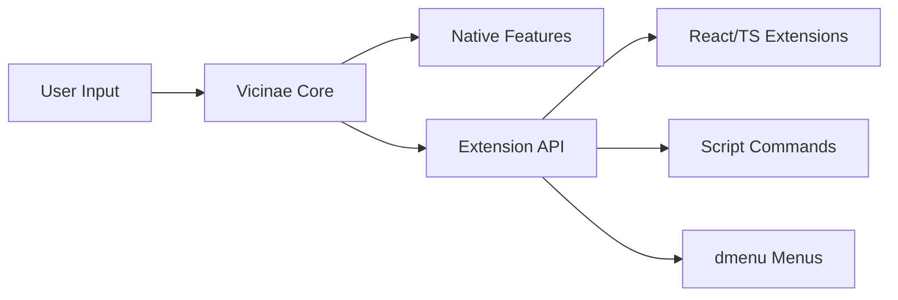
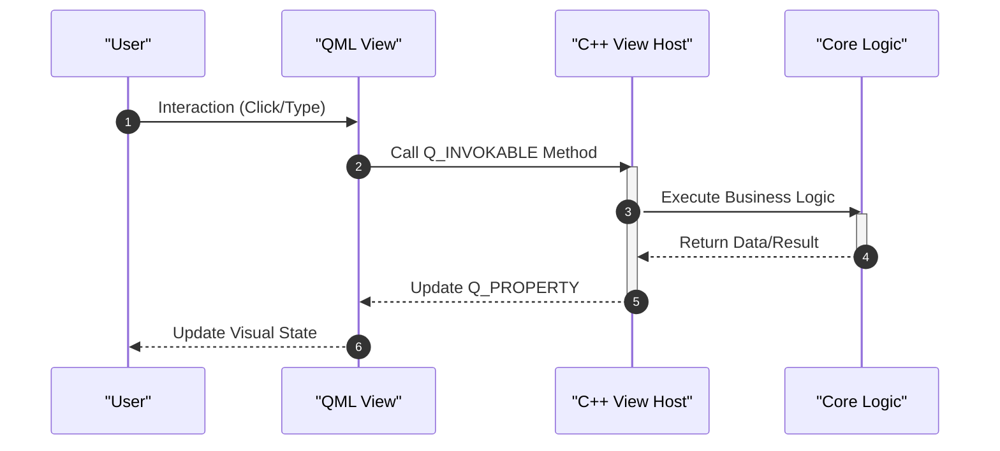

# Project Overview

Vicinae (pronounced *"vee-CHEE-nay"*) is a high-performance, native command palette and focused launcher designed for the desktop. It serves as a centralized hub for system operations, combining native speed with an extensible architecture to streamline workflow efficiency.

## Core Functionality

Vicinae provides a comprehensive suite of out-of-the-box tools that transform the desktop experience into a command-driven interface.

### Built-in Features

| Category | Features |
| :--- | :--- |
| **System Navigation** | App search, Window switcher, File search |
| **Productivity** | Clipboard history, Text expander (snippets), Calculator |
| **Utilities** | Emoji picker, Font browser, Volume controller |
| **Integration** | Browser tab switcher |

## Extensibility Model

Beyond its native capabilities, Vicinae is designed to be highly extensible, allowing users and developers to add custom functionality through three primary methods:

1.  **React/TypeScript Extensions**: Full-featured extensions compatible with the Raycast ecosystem. These are integrated via the Vicinae store and the Raycast store.
2.  **Script Commands**: Lightweight commands compatible with Raycast, featuring specific Vicinae enhancements.
3.  **dmenu-style Menus**: Minimalist menu creation following the Linux `dmenu` philosophy.

## Technical Architecture

Vicinae employs a strict separation of concerns to ensure high performance and maintainability, utilizing a hybrid tech stack.

### The Presentation Bridge
The project uses **QtQuick (QML)** for the user interface and **C++23** for the business logic. To maintain a clean boundary, Vicinae implements a **Bridge Pattern**:

*   **View Host (C++)**: A C++ class exposes data and actions using `Q_PROPERTY` and `Q_INVOKABLE`.
*   **QML Component**: The presentation layer binds to these properties and invokes these methods, ensuring that no business logic resides within the QML files.

### Technology Stack

| Layer | Technology | Purpose |
| :--- | :--- | :--- |
| **Logic/Core** | C++23 | High-performance business logic, native API interaction |
| **UI/Presentation** | QML / QtQuick | Fluid, declarative user interface |
| **Extension SDK** | React / TypeScript | Third-party plugin development |
| **Build System** | Nix / Make | Reproducible builds and automation |

## Engineering Principles

The development of Vicinae is guided by several core architectural mandates:

*   **Performance First**: Use of modern C++23 features, `constexpr`/`consteval` for compile-time evaluation, and non-owning containers (`std::span`, `std::string_view`) to minimize implicit copies.
*   **Cross-Platform Native**: Designed for Linux, macOS, and Windows. The project prioritizes native APIs over "hacks" to ensure the application behaves as intended on each target OS.
*   **Fuzzy Search**: Search functionality is centered around a fuzzy trait system, specializing the `FuzzySearchable` template to ensure intuitive result retrieval.
*   **Memory Safety**: Strict adherence to Qt's ownership model, utilizing `deleteLater()` for `QObject` destruction to prevent memory corruption.