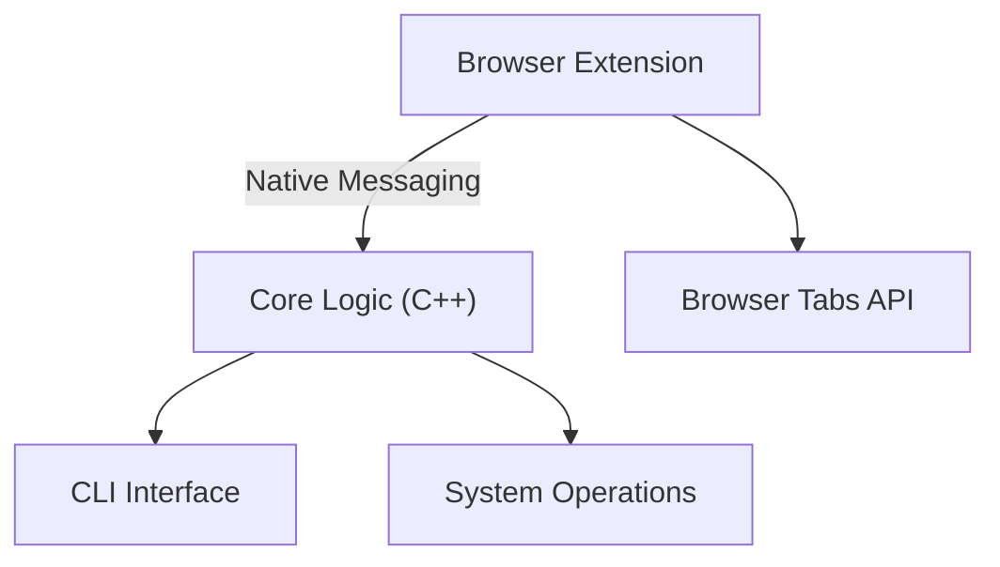
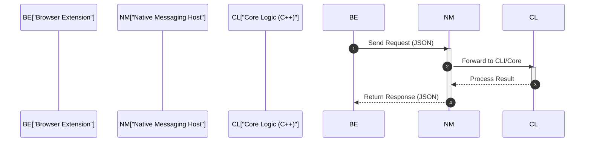

# System Architecture

The Vicinae system is designed as a multi-component utility that bridges the gap between local system operations and browser-based tab management. The architecture consists of a native C++ core providing a Command Line Interface (CLI) and a browser extension that facilitates integration with the web browser.

## High-Level Component Relationship

The system utilizes a decoupled architecture where the browser extension acts as a frontend bridge, communicating with the native C++ implementation via native messaging.



## Component Analysis

### Native CLI Implementation
The native component is written in C++ and serves as the primary execution engine. The entry point is defined in `src/cli/src/main.cpp`, which delegates all command-line processing to the `CommandLineInterface` class.

**Entry Point Implementation:**
```cpp
#include "cli.hpp"

int main(int ac, char **av) { 
    return CommandLineInterface::execute(ac, av); 
}
```

### Browser Extension Integration
The browser extension allows users to search and manage tabs directly from the Vicinae launcher. It is built using Manifest V3 and relies on specific browser permissions to interact with both the browser's internal state and the local system.

**Extension Configuration Summary:**

| Property | Value | Description |
| :--- | :--- | :--- |
| **Manifest Version** | 3 | Latest Chrome extension standard |
| **Key Permissions** | `nativeMessaging`, `tabs` | Allows communication with C++ core and tab manipulation |
| **Background Script** | `background.js` | Handles service worker logic and event listening |
| **User Interface** | `popup.html` | Provides the primary interaction popup |

## Inter-Process Communication (IPC)

The connection between the Browser Extension and the Native Core is established through the `nativeMessaging` permission. This allows the browser to launch the native C++ application as a subprocess and exchange JSON-formatted messages over standard input and output.



## Versioning and Release Management

The project uses a centralized `manifest.yaml` file to manage release metadata. This ensures that versioning and commit hashes are consistent across the build process, allowing for the injection of tags and short revision hashes during the CMake configuration step.

**Current Release Metadata:**

| Field | Value |
| :--- | :--- |
| **Release Tag** | `v0.22.0` |
| **Full Revision** | `5d5a50db0f0315f5f1b1290896f04ae7336d0684` |
| **Short Revision** | `5d5a50db0` |