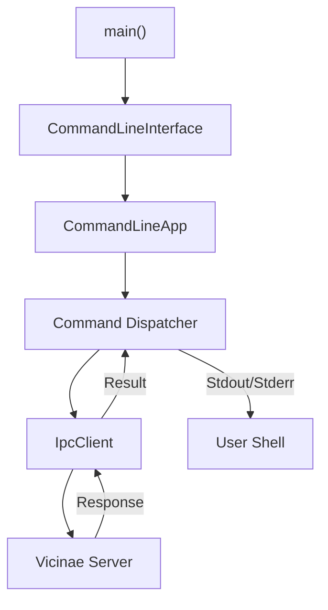
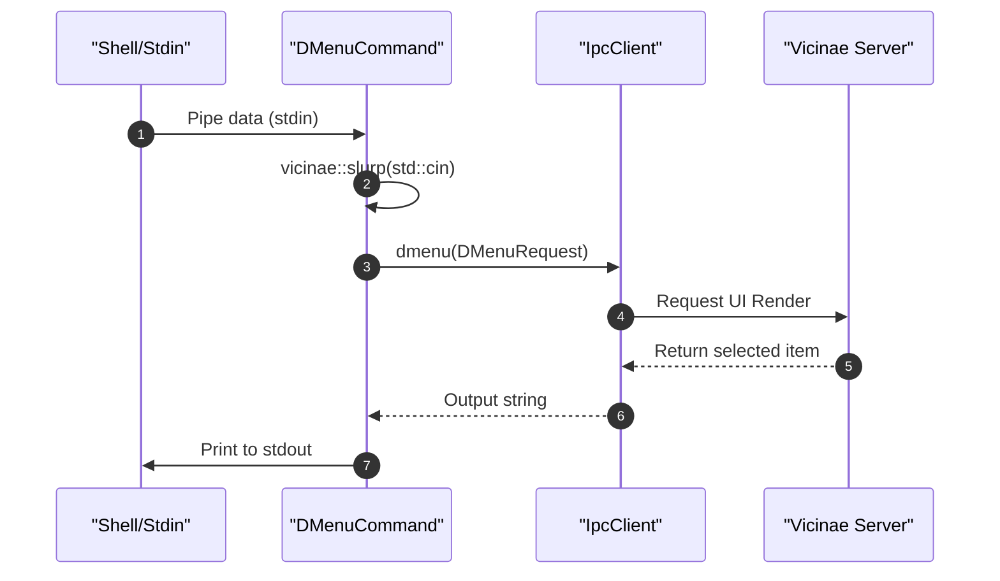

# CLI Tooling

The Vicinae CLI is a high-performance C++ command-line interface that serves as the primary entry point for interacting with the Vicinae server. It allows users to control the application window, launch system applications, query indexed files, and integrate Vicinae into other shell scripts via `stdin` and `stdout`.

## Architecture Overview

The CLI is designed as a modular command-dispatcher. The `CommandLineInterface` class registers a suite of `AbstractCommandLineCommand` implementations, which are then parsed and executed by the `CommandLineApp` using a structured command-pattern.

Most CLI operations do not perform logic locally but act as an IPC (Inter-Process Communication) client, sending requests to the background Vicinae server.



## Command Reference

### System & Window Management
These commands control the visibility and state of the Vicinae main window.

| Command | Alias | Description | Key Options |
| :--- | :--- | :--- | :--- |
| `open` | - | Opens the Vicinae window | `-q, --query`: Initial search query |
| `toggle` | - | Toggles the window visibility | `-q, --query`: Initial search query |
| `close` | - | Closes the Vicinae window | N/A |
| `ping` | - | Verifies server connectivity | N/A |

### Application Control
The `app` command group handles interaction with system-level applications.

#### `app launch`
Launches or focuses a specific application.
- **Usage**: `vicinae app launch <app_id> [args] [--new]`
- **Arguments**:
    - `app_id`: The unique identifier of the application.
    - `args`: Optional arguments to pass to the application.
- **Flags**:
    - `--new`: Forces the launch of a new instance instead of focusing an existing window.

### Filesystem Operations
The `FileSearchCommand` provides a programmatic way to access the server's file index.

#### `query` (Alias: `q`)
Returns a list of indexed files matching a fuzzy search query.
- **Constraints**: The query must be at least 3 characters long.
- **Options**:
    - `-n, --limit`: Limits results (Default: 100, Max: 10,000).
    - `-c, --category`: Filters by category. Valid categories: `image`, `video`, `audio`, `document`, `archive`, `application`, `directory`, `other`.
    - `-j, --json`: Outputs results in JSON format using the `glaze` library.

### Integration & Utility
These commands allow Vicinae to act as a utility for other CLI tools.

#### `dmenu`
Renders a list view from `stdin`, allowing the user to select an item via the Vicinae UI.



**Configuration Options for `dmenu`**:
- `-n, --navigation-title`: Set navigation title.
- `-s, --section-title`: Set main section title (supports `{count}` placeholder).
- `-p, --placeholder`: Search bar placeholder text.
- `-q, --query`: Initial search query.
- `-W, --width` / `-H, --height`: Window dimensions in pixels.
- `--no-section`: Suppress section heading.
- `--no-quick-look`: Disable quick look preview.
- `--no-metadata`: Hide metadata in quick look.
- `--no-footer`: Hide the status bar footer.

#### Other Utilities
- `version` (Alias: `ver`): Displays the current git tag, commit hash, build info, and provenance.
- `deeplink` (Alias: `link`): Executes a specific deeplink (e.g., `vicinae://...`).

## Technical Implementation Details

### Deeplink Handling
The CLI supports direct deeplink execution. If the CLI is called with exactly one argument and that argument starts with a recognized scheme, it bypasses the subcommand parser and sends the link directly to the server.

**Supported Schemes**:
- `vicinae://`
- `raycast://`
- `com.raycast://`

### Help Formatting
To ensure a professional terminal experience, the CLI implements a custom `CLI::Formatter`. This formatter uses ANSI escape codes (via `rang`) to provide color-coded help output:
- **Bold**: Usage and headers.
- **Bright Green**: Option flags.
- **Yellow**: Subcommand names.
- **Blue/Cyan**: External documentation and community links.

### Code Snippets

**Entry Point (`main.cpp`)**:
```cpp
int main(int ac, char **av) { 
    return CommandLineInterface::execute(ac, av); 
}
```

**Query Execution (`fs.cpp`)**:
```cpp
auto results = client->fsQuery(m_query, m_limit, m_category).value();

if (json) {
    std::string buf;
    std::ignore = glz::write_json(results, buf);
    std::cout << glz::prettify_json(buf);
} else {
    for (const auto &result : results) {
        std::cout << result.path << "\n";
    }
}