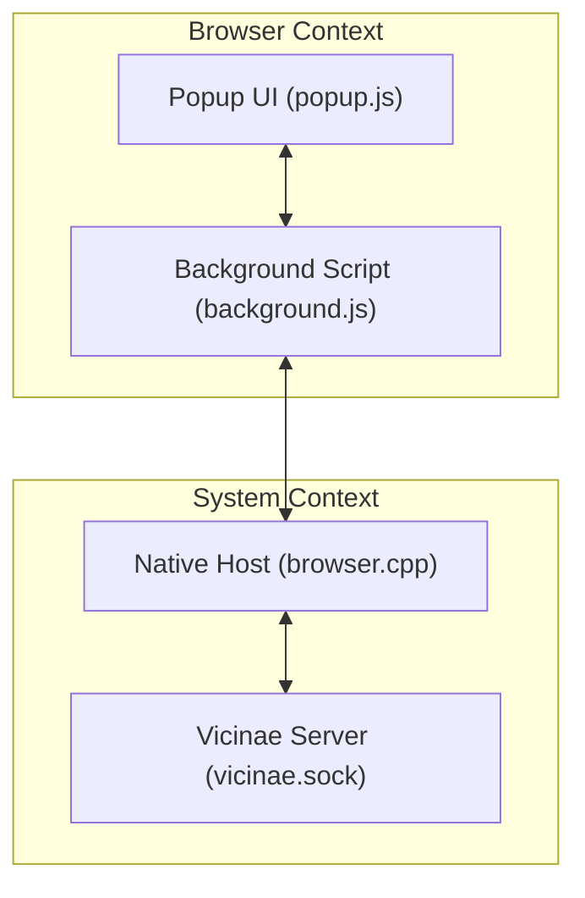
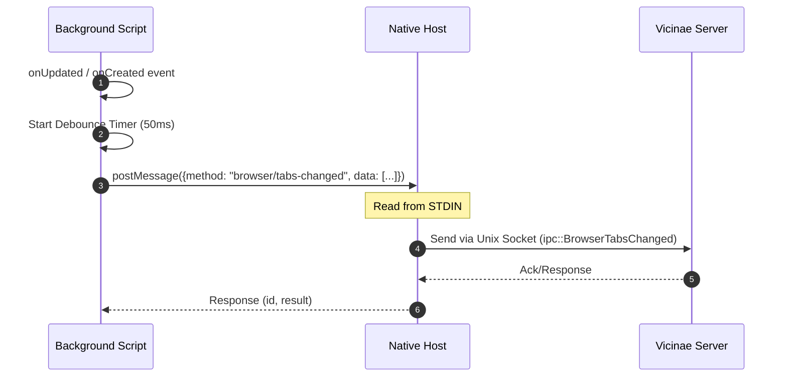
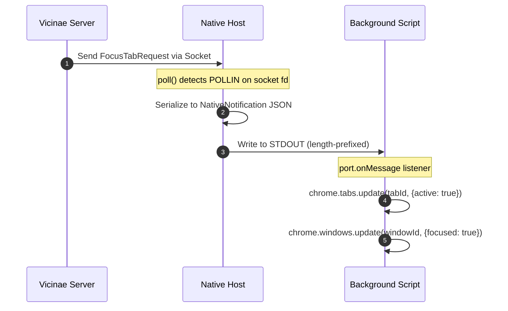

# Browser Extension Architecture

The Vicinae browser extension serves as a bridge between the web browser and the Vicinae desktop application. It enables the desktop application to monitor open tabs and programmatically control the browser (e.g., switching focus or closing tabs), allowing users to manage their browser state directly from the Vicinae launcher.

## System Design Overview

The architecture follows a three-tier communication model: the **Browser Extension** (JavaScript), the **Native Messaging Host** (C++), and the **Vicinae Server** (C++). 

Because browser extensions cannot communicate directly with system sockets or the filesystem for security reasons, the Native Messaging Host acts as a proxy. It translates the browser's standard I/O-based native messaging protocol into the Unix Domain Socket (UDS) protocol used by the Vicinae server.



## Extension Components

### Background Script (`background.js`)
The background script is the central orchestrator of the extension. It maintains the persistent connection to the native host and manages the state of the integration.

*   **Connection Management**: Implements an exponential backoff retry mechanism (from `RETRY_INITIAL_MS` to `RETRY_MAX_MS`) to ensure the native host is available.
*   **State Tracking**: Tracks connection states (`disconnected`, `connecting`, `connected`, `error`) and broadcasts these updates to the popup UI via `chrome.runtime.sendMessage`.
*   **Tab Monitoring**: Listens to browser tab events (`onCreated`, `onUpdated`, `onRemoved`, `onActivated`). It uses a debounce timer (`TAB_DEBOUNCE_MS`) to prevent flooding the native host with updates during rapid tab changes.
*   **Request/Response Handling**: Maintains a `requestMap` and a `serial` counter to pair asynchronous responses from the native host with their original requests.

### Popup UI (`popup.js`)
The popup provides a lightweight management interface for the user to monitor and control the connection.

*   **Status Visualization**: Displays the current connection state using visual cues (status pins and text).
*   **Manual Control**: Allows users to manually trigger a reconnection or disconnect the extension, which signals the background script to stop retry attempts.

### Manifest and Permissions (`manifest.firefox.json`)
The extension requires specific privileges to function:
*   `nativeMessaging`: Required to establish the connection to the C++ native host.
*   `tabs`: Required to query tab metadata (URLs, titles) and manipulate tab state (focus, remove).

## Native Messaging Host (`browser.cpp`)

The native host is a standalone C++ executable that manages two concurrent I/O streams using a `poll()` loop.

### I/O Handling
1.  **Standard I/O (Extension $\leftrightarrow$ Host)**: The browser communicates with the host via `stdin` and `stdout`. Messages are length-prefixed with a 4-byte integer indicating the size of the following JSON payload.
2.  **Unix Domain Socket (Host $\leftrightarrow$ Server)**: The host connects to the Vicinae server at `$XDG_RUNTIME_DIR/vicinae/vicinae.sock` using a `SocketTransport`.

### Message Routing
The host performs bidirectional translation of messages:

| Direction | Event/Method | Description |
| :--- | :--- | :--- |
| **Ext $\rightarrow$ Srv** | `browser/init` | Initializes the browser session with user agent and engine info. |
| **Ext $\rightarrow$ Srv** | `browser/tabs-changed` | Sends a full list of current open tabs and their metadata. |
| **Srv $\rightarrow$ Ext** | `browser/focus-tab` | Requests the browser to make a specific tab active and focus the window. |
| **Srv $\rightarrow$ Ext** | `browser/close-tab` | Requests the browser to close a specific tab by ID. |

## Data Flow Analysis

### Tab Synchronization Flow
When a user opens a new tab, the following sequence occurs to keep the Vicinae server updated:



### Remote Control Flow
When a user selects a browser tab from the Vicinae desktop launcher:



## Technical Implementation Details

### Message Framing
The C++ implementation uses a `Frame` class to handle the fragmentation of TCP/Pipe streams. It reads data into a buffer and extracts messages based on the leading 4-byte size header:

```cpp
if (size == 0 && data.size() >= sizeof(size)) {
    size = *reinterpret_cast<decltype(size) *>(data.data());
    data.erase(data.begin(), data.begin() + sizeof(size));
}
```

### Error Handling and Reliability
*   **Native Host**: If the connection to the Vicinae server breaks, the host prints an error to `stderr` and exits, which triggers the `onDisconnect` listener in `background.js`.
*   **Background Script**: Upon disconnect, the script enters a retry loop, updating the browser action badge to reflect the error state (red for error, amber for connecting).