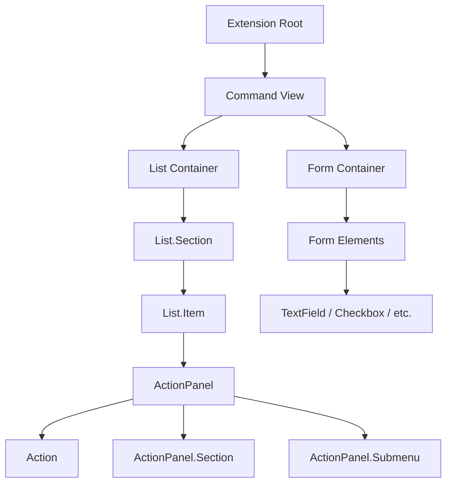

# Extension Development Boilerplate

The Extension Development Boilerplate provides a standardized React and TypeScript foundation for building extensions for the Vicinae ecosystem. It leverages the `@vicinae/api` to provide a declarative way to build user interfaces that integrate deeply with the system.

## Project Configuration

The extension's behavior, metadata, and entry points are defined in the `package.json` file. This file acts as the manifest for the extension.

### Manifest Metadata
The boilerplate uses a specific schema to define extension properties:

| Field | Description | Example |
| :--- | :--- | :--- |
| `name` | Internal identifier for the extension | `"template"` |
| `title` | Display name shown in the UI | `"Template"` |
| `description` | Short summary of the extension's purpose | `"A collection of command templates..."` |
| `categories` | Array of tags for organization | `["Applications", "Productivity"]` |
| `icon` | Path to the extension icon file | `"icon.png"` |

### Command Definitions
Commands are the primary entry points for users. Each command is mapped to a specific mode and functionality.

| Mode | Description | Usage Example |
| :--- | :--- | :--- |
| `view` | Renders a React component as the primary UI | `list`, `form`, `app-utils` |
| `no-view` | Performs a background action without a UI | `no-view`, `desktop-notif-interval` |

Some commands can include an `interval` (e.g., `"30s"`) and a `disabledByDefault` flag for background tasks.

## Component Hierarchy

Vicinae extensions follow a hierarchical structure where high-level containers manage the layout and child components handle specific data and interactions.



## UI Component Guide

### Lists and Items
The `List` component is the most common view. It supports searchability and categorized content.

- **`List`**: The top-level container. Can accept `searchText` and `onSearchTextChange` for controlled searching.
- **`List.Section`**: Groups items under a specific title.
- **`List.Item`**: Individual entries containing a `title`, `subtitle`, and `icon`.
- **`List.EmptyView`**: Rendered when no results match the search query.

### Action Panels and Actions
`ActionPanel` provides a context-aware menu for `List.Item` components, allowing users to perform operations on selected items.

- **`Action`**: A clickable menu item. Supports `title`, `icon`, and an `onAction` callback.
- **`Action.Push`**: Navigates to a new view by pushing a target component onto the navigation stack.
- **`Action.Open`**: Opens a specific application with a target.
- **`Action.SubmitForm`**: Triggers the submission logic for a `Form` component.
- **`ActionPanel.Submenu`**: Creates nested menu levels for complex action sets.

### Forms
The `Form` component is used for data entry. It includes a variety of specialized input fields.

| Component | Purpose | Key Props |
| :--- | :--- | :--- |
| `Form.TextField` | Single line text input | `id`, `title`, `value`, `onChange` |
| `Form.PasswordField` | Obscured text input | `id`, `title` |
| `Form.TextArea` | Multi-line text input | `id`, `title`, `value`, `onChange` |
| `Form.Checkbox` | Boolean toggle | `id`, `title`, `label`, `value`, `onChange` |
| `Form.DatePicker` | Date/Time selection | `id`, `type` (Date or DateTime) |
| `Form.Dropdown` | Single selection from list | `id`, `defaultValue`, `onChange` |
| `Form.TagPicker` | Multiple selection of tags | `id`, `defaultValue` |
| `Form.FilePicker` | File or Directory selection | `allowMultipleSelection`, `canChooseDirectories` |

## API and Utility Functions

The `@vicinae/api` provides essential functions for interacting with the host system.

### Application Management
Extensions can query and launch applications using the following utilities:

- `getApplications(target)`: Returns a list of applications capable of handling the specified target.
- `getDefaultApplication(target)`: Retrieves the system's default application for a target.
- `open(app, target)`: Launches a specific application.

### System Integration
For advanced automation, the API provides direct system access:

```typescript
// Example: Running a command in the terminal
runInTerminal([shell, "-c", searchText], { hold: true });

// Example: Closing the main extension window
closeMainWindow();
```

### User Feedback
Toasts are used for non-blocking notifications:

```typescript
showToast(Toast.Style.Success, "submitted!");
```

## Development Workflow

The boilerplate includes a set of scripts for maintaining code quality and building the extension.

| Script | Command | Description |
| :--- | :--- | :--- |
| `dev` | `vici develop` | Starts the development environment with hot-reloading. |
| `build` | `vici build` | Compiles the TypeScript source into a production bundle. |
| `format` | `biome format --write src` | Standardizes code formatting using Biome. |
| `lint` | `vici lint` | Performs static analysis to find potential bugs. |