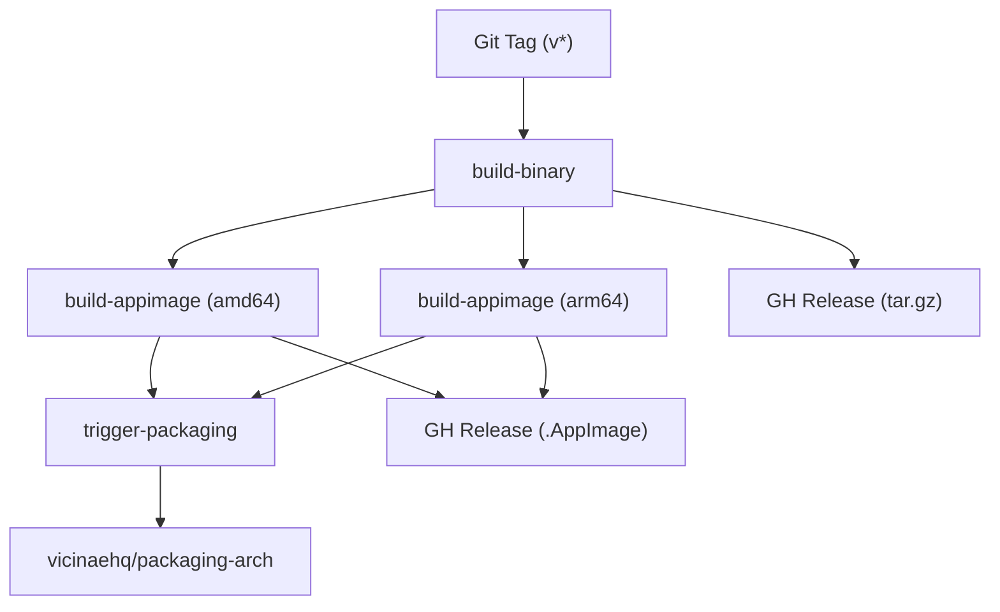
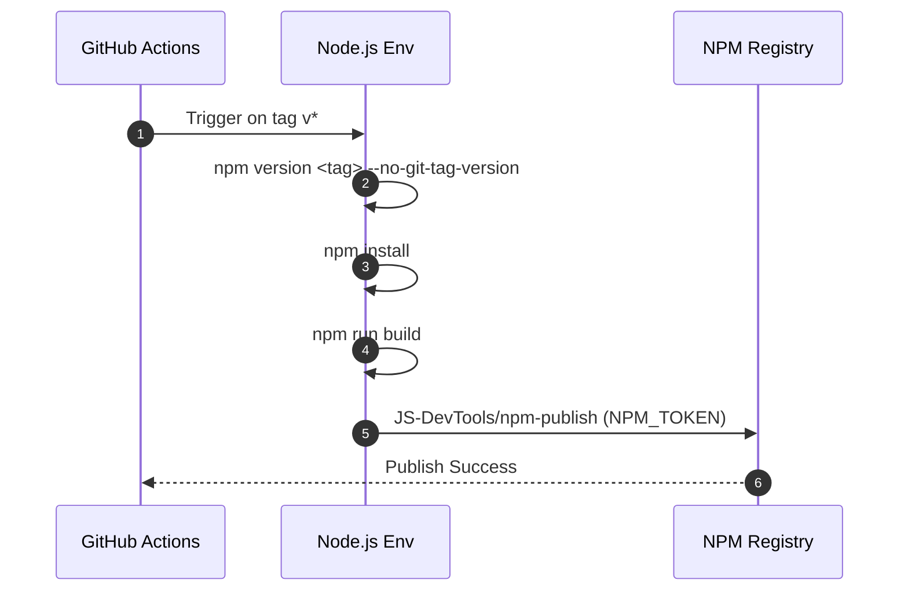

# Build System and CI/CD

The Vicinae build system is designed for reproducibility and multi-platform distribution, utilizing a combination of Nix for development environment consistency and GitHub Actions for automated testing and release orchestration.

## Nix Integration

Vicinae leverages Nix to ensure that the development environment and build dependencies are identical across different machines.

### Continuous Integration and Caching
The project uses **Cachix** to cache Nix derivations, significantly reducing build times across the CI pipeline. The `nix build` workflow is executed on multiple architectures to ensure cross-platform compatibility.

**Build Matrix:**
| Runner | Architecture | OS |
| :--- | :--- | :--- |
| `depot-ubuntu-24.04-16` | x86_64 | Ubuntu 24.04 |
| `depot-ubuntu-24.04-arm-16` | ARM64 | Ubuntu 24.04 |
| `depot-macos-26` | x86_64/ARM64 | macOS |

The CI process follows these steps:
1. **Environment Setup**: Installs Nix using `cachix/install-nix-action`.
2. **Evaluation Caching**: Caches the Nix evaluation based on the `flake.lock` hash.
3. **Binary Cache**: Authenticates with Cachix for the `vicinae` namespace to pull/push pre-built binaries.
4. **Validation**: Runs `nix build -L` and validates the development shell via `nix develop --command echo OK`.

### Code Formatting
To maintain a consistent codebase, the project employs `alejandra` for Nix expression formatting. The `nix-format` workflow runs on every push and pull request to the `main` branch, executing:
```bash
nix run nixpkgs#alejandra -- --check .
```

## Release Pipeline

The release process is triggered by Git tags matching the `v*` pattern or via manual `workflow_dispatch`. It is split into three primary phases: binary distribution, AppImage creation, and downstream packaging.

### Process Workflow Diagram



### Binary and AppImage Build Details

The build uses CMake with the Ninja generator. The system differentiates between a standard binary release and an AppImage release via the `VICINAE_PROVENANCE` flag.

**Build Configuration Comparison:**

| Feature | Binary Release (`build-binary`) | AppImage Release (`build-appimage`) |
| :--- | :--- | :--- |
| **Provenance Flag** | `binary_release` | `appimage` |
| **LTO** | Enabled (`ON`) | Enabled (`ON`) |
| **Tests** | Executed via `make test` | Not executed in this stage |
| **Artifact** | `.tar.gz` (Install directory) | `.AppImage` |
| **Tooling** | CMake $\rightarrow$ Ninja $\rightarrow$ Tar | CMake $\rightarrow$ Ninja $\rightarrow$ `mkappimage.sh` |

The `build-binary` job serves as the primary validation gate. Once it completes successfully, it provides the tag and artifact metadata required by the `build-appimage` matrix.

## API Publishing

Separate from the C++ core, the TypeScript API is published to the NPM registry. This ensures that consumers of the Vicinae API have version-locked type definitions and utilities.

### API Release Sequence



**API Workflow Specifications:**
- **Runtime**: Node.js 22.
- **Working Directory**: `./src/typescript/api`.
- **Version Sync**: The NPM package version is dynamically set to match the GitHub release tag.
- **Authentication**: Uses `NPM_TOKEN` secret for registry access.

## Summary of CI/CD Workflows

| Workflow | Trigger | Key Responsibility | Primary Tooling |
| :--- | :--- | :--- | :--- |
| `Nix build` | Push/PR to `main` | Cross-platform build validation | Nix, Cachix |
| `nix format` | Push/PR to `main` | Linting Nix expressions | Alejandra |
| `Release` | Tag `v*` | C++ Binary & AppImage distribution | CMake, Ninja, Depot |
| `API Publish` | Tag `v*` | TypeScript API distribution | Node.js, NPM |