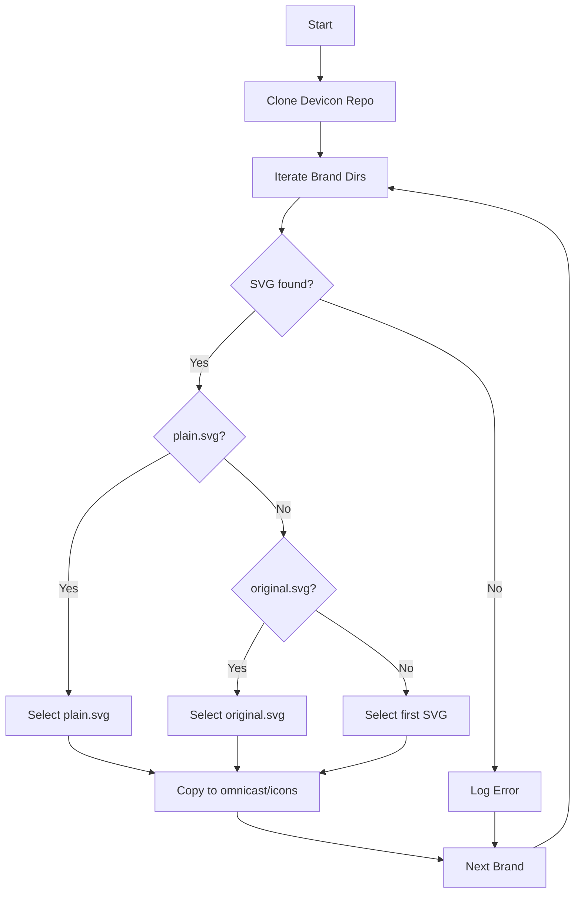
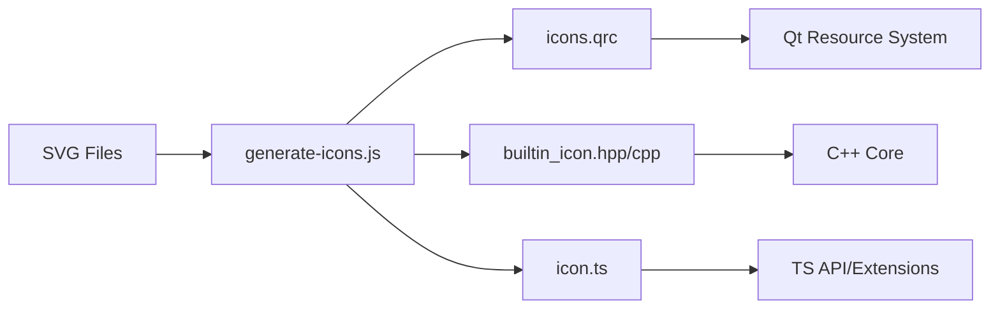

# Automation Scripts

This section provides a technical reference for the JavaScript utility scripts located in the `scripts/` directory. These tools automate the acquisition of assets, the generation of Qt Resource files, and the synchronization of icon identifiers between the C++ core and TypeScript API.

## Icon Database Generation

The `gen-devicon-db.js` script is responsible for populating the local icon database by fetching assets from the external Devicon repository.

### Process Workflow

The script automates the selection of the best available SVG for each brand based on a specific priority hierarchy.

### Implementation Details

- **Source Repository**: `https://github.com/devicons/devicon`
- **Target Directory**: `../omnicast/icons`
- **Selection Logic**: The script prioritizes `plain.svg`, then `original.svg`, and finally falls back to the first `.svg` file discovered in the brand directory.
- **Output**: Files are renamed to `{brand}.svg` in the destination folder.

## Icon Code Generation

The `generate-icons.js` script serves as a codegen tool that ensures the C++ backend and TypeScript frontend share a unified set of icon identifiers. It reads the SVG files in the `vicinae/icons` directory and generates the necessary source code.

### Codegen Pipeline

The script transforms filesystem state into three distinct target formats:

### Generated Artifacts

| Artifact | Language | Purpose |
| :--- | :--- | :--- |
| `icons.qrc` | XML | Defines the Qt resource prefix `/icons` and lists all included SVG files. |
| `builtin_icon.hpp` | C++ | Declares `BuiltinIcon` enum and `BuiltinIconService` for mapping. |
| `builtin_icon.cpp` | C++ | Implements the `unordered_map` relating `BuiltinIcon` enums to filenames. |
| `icon.ts` | TypeScript | Exports a TypeScript `enum Icon` for use in browser extensions. |

### Naming Convention
The script uses a `toEnumType` helper to convert filenames (e.g., `my-icon.svg`) into PascalCase identifiers (e.g., `MyIcon`) used in both the C++ enum and the TypeScript enum.

## Qt Resource Builder

The `qrc-builder.js` module provides a `QrcBuilder` class that allows for the programmatic creation of `.qrc` files. This utility is designed to work in both Node.js and browser environments.

### API Reference

| Method | Description | Parameters |
| :--- | :--- | :--- |
| `addResource(prefix, { lang })` | Initializes a resource section. | `prefix` (string), `lang` (optional string) |
| `addFile(filePath, { prefix, alias })` | Adds a file to a specific prefix. | `filePath` (string), `opts` (prefix, alias) |
| `removeFile(filePath, { prefix, alias })` | Removes a specific file entry. | `filePath` (string), `opts` (prefix, alias) |
| `setLang(prefix, lang)` | Updates the language for a prefix. | `prefix` (string), `lang` (string) |
| `toXML({ pretty, newline })` | Generates the XML string. | `opts` (pretty: boolean, newline: string) |
| `saveTo(filePath)` | Writes the XML to disk (Node.js only). | `filePath` (string) |

### Technical Characteristics
- **Deterministic Ordering**: Files are sorted case-insensitively by alias (if present) or path to ensure consistent build outputs.
- **Path Normalization**: Automatically converts backslashes to forward slashes for POSIX compatibility within the `.qrc` file.
- **XML Safety**: Implements an `#esc` helper to escape characters (`&`, `<`, `>`, `"`, `'`) to prevent XML injection.

## Project Dependencies

The automation suite is managed via a local `package.json` with the following dependency structure:

- **Dev Dependencies**: 
    - `@types/node`: Type definitions for Node.js environment.
- **Production Dependencies**:
    - `@omnicast/api`: Local file dependency (`../api/omnicast-api-1.0.0.tgz`).
    - `@omnicast/utils`: Local file dependency (`../api-utils/omnicast-utils-1.0.0.tgz`).