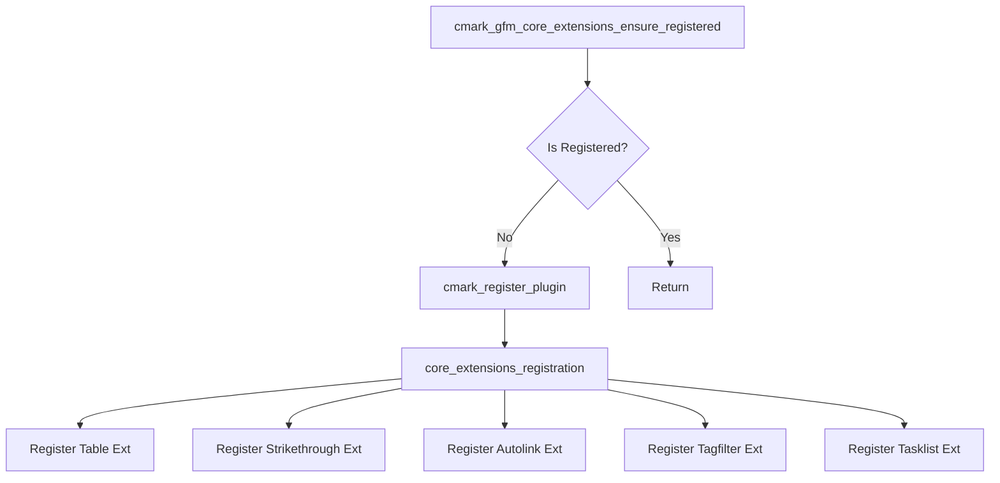
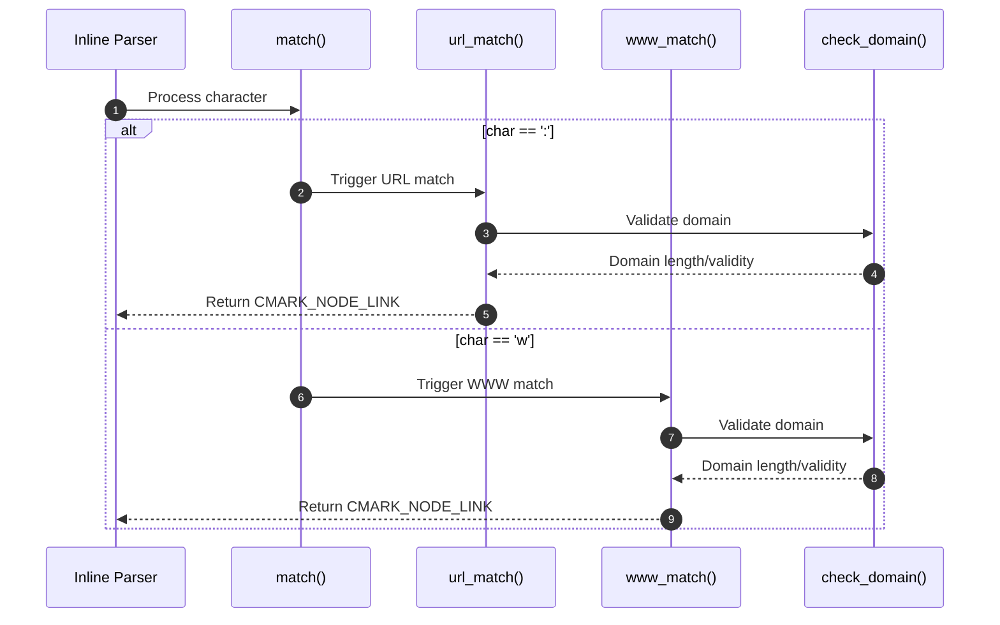

# Internal Libraries and Vendor Code

This section provides a technical overview of the third-party libraries vendored within the Vicinae project. Currently, the primary vendored dependency is `cmark-gfm`, a high-performance Markdown parsing library.

## cmark-gfm Overview

`cmark-gfm` is an extended version of the C reference implementation of CommonMark. It incorporates GitHub Flavored Markdown (GFM) extensions into the upstream implementation to provide a rationalized Markdown syntax with specific GFM capabilities.

### Vendoring Status

The library is vendored to ensure build reproducibility and to allow for project-specific modifications.

| Attribute | Detail |
| :--- | :--- |
| **Upstream Source** | `https://github.com/github/cmark-gfm` |
| **Version** | `0.29.0.gfm.13` |
| **License** | BSD2 |
| **Local Modifications** | `cmake_minimum_required` bumped to 3.16; removed `man`, `test`, `api_test`, and `fuzz` subdirectories. |

### Core Characteristics

The library is designed for production environments with the following architectural advantages:

*   **Portable:** Written in standard C99 with no external dependencies.
*   **High Performance:** Capable of rendering large documents (e.g., *War and Peace*) in approximately 127 milliseconds.
*   **Robustness:** Extensively fuzz-tested using American Fuzzy Lop (AFL) and libFuzzer to handle pathological cases like deeply nested block quotes.
*   **Flexibility:** Parses input into an Abstract Syntax Tree (AST) which can be manipulated programmatically before rendering.
*   **Multi-format Rendering:** Supports output in HTML, groff man, LaTeX, CommonMark, and a custom XML representation.

## GFM Extensions Architecture

`cmark-gfm` utilizes a plugin-based architecture to implement GFM-specific syntax. These extensions are registered via a core registration function that ensures all required GFM features are active.

### Registered Core Extensions

The following extensions are registered through `cmark_gfm_core_extensions_ensure_registered()` in `core-extensions.c`:

| Extension | Purpose |
| :--- | :--- |
| **Table** | Support for GFM-style tables. |
| **Strikethrough** | Support for `~~text~~` syntax. |
| **Autolink** | Automatic conversion of URLs and emails to links. |
| **Tagfilter** | Filtering of specific HTML tags. |
| **Tasklist** | Support for GFM task list checkboxes. |

### Extension Registration Flow



## Technical Deep Dive: Autolink Extension

The autolink extension (`autolink.c`) provides complex logic for identifying and converting plain text URLs and email addresses into `CMARK_NODE_LINK` nodes.

### Parsing Logic

The extension hooks into the inline parser using a `match` function that triggers based on specific "special characters" (`:` and `w`).



### Key Implementation Details

1.  **Domain Validation:** The `check_domain` function ensures that URLs are valid and prevents Denial of Service (DoS) attacks by rejecting certain underscore patterns in the last two segments of a domain unless the URL is exceptionally long (> 10 segments).
2.  **Protocol Safety:** Only specific protocols are considered safe for autolinking:
    *   `http://`
    *   `https://`
    *   `ftp://`
3.  **Post-processing:** The `postprocess` function iterates through the generated AST to identify and convert email addresses. It specifically handles:
    *   Standard email formats.
    *   `mailto:` protocols.
    *   `xmpp:` protocols.

### Code Snippet: Autolink Matching

The following snippet demonstrates how the extension identifies the start of a potential link:

```c
static cmark_node *match(cmark_syntax_extension *ext, cmark_parser *parser,
                         cmark_node *parent, unsigned char c,
                         cmark_inline_parser *inline_parser) {
  if (cmark_inline_parser_in_bracket(inline_parser, false) ||
      cmark_inline_parser_in_bracket(inline_parser, true))
    return NULL;

  if (c == ':')
    return url_match(parser, parent, inline_parser);

  if (c == 'w')
    return www_match(parser, parent, inline_parser);

  return NULL;
}
```

## Security Considerations

By default, the vendored `libcmark` library scrubs raw HTML and potentially dangerous links (such as `javascript:`, `vbscript:`, `data:`, and `file:`). To bypass this scrubbing, the `CMARK_OPT_UNSAFE` option must be used, which requires an external HTML sanitizer to prevent Cross-Site Scripting (XSS) attacks.